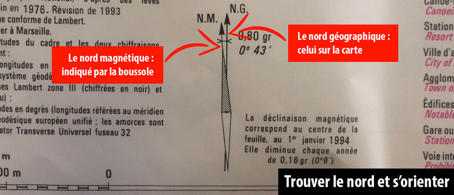
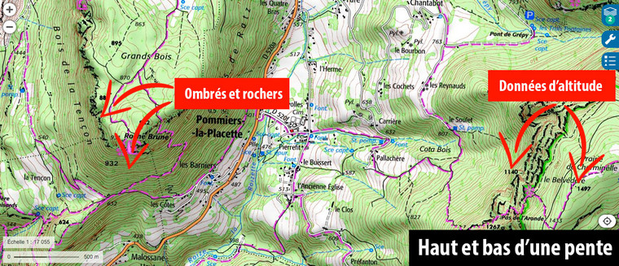
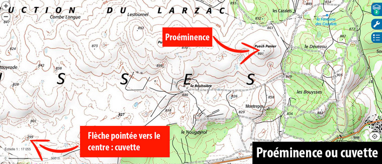
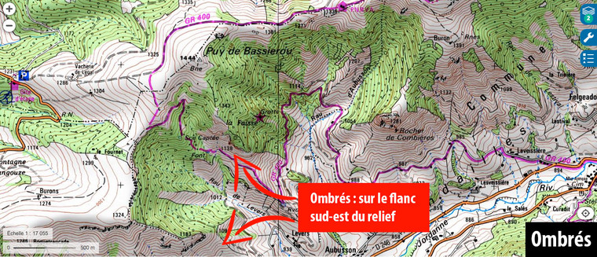
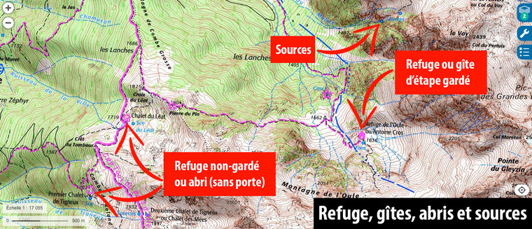
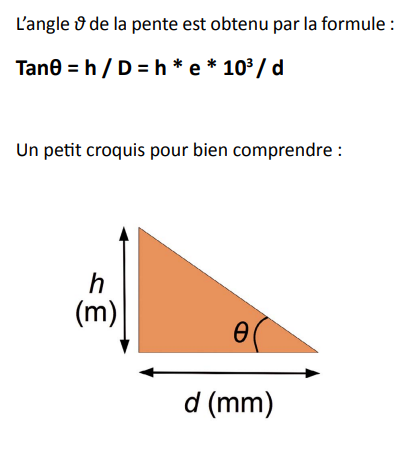

# ELEMENTS DE CARTOGRAPHIE

## Généralités

* Echelle: 1:25000 => 1 cm = 250m
* Trouver le nord sur une carte

* Comment déterminer le haut d'une pente: Plusieurs indicateurs vont vous permettre de distinguer le haut du bas d’un relief. Tout d'abord, les altitudes mentionnées sur les points de la carte mais aussi sur certaines courbes de niveau vous permettront de "voir" le sens de la pente. Avec un peu de pratique, l'éclairage, les ombrés, les zones rocheuses ou les rivières vous permettront de visualiser le terrain en 3D à la simple lecture d'une carte.

* Cuvette ou proéminence: Des courbes de niveau concentriques représentent un "mamelon", généralement avec une indication d'altitude sommitale. Pour distinguer cette situation de celle où le relief présente la forme d'un entonnoir ou d'une cuvette, également représentés par des courbes de niveau concentriques, on notera la présence d'une flèche orange.

* Ombrés: Comprendre comment fonctionnent des ombrés permet de voir le terrain en trois dimensions. L’intensité des ombrés matérialise le caractère de la pente, ainsi plus il est foncé, plus cette dernière sera raide. À noter que les ombrés sont toujours représentés sur le flanc sud-est d’un sommet, comme si l'éclairage du soleil parvenait du nord-ouest (en haut à gauche). Ces ombrés permettent de procurer une vision en trois dimensions indispensable pour comprendre la topographie globale du terrain.

* Refuges gardés / non-gardés:
 

## Comment calculer une pente

$tan(\theta) = \frac{\Delta altitude}{\Delta distance}$

Sur carte IGN 1/25000e, les courbes de niveau sont espacés de 10m (trait fin) ou de 50m (trait épais). 

| Angle   | tan(angle) | Pourcentage pente | Elévation sur 100m | Ecart courbes équivalentes 10m | Ecart courbes équivalentes 50m |
|----------|:-------------:|:-------------:|:-------------:|:-------------:|------:|
| 25° | 0.5 | ~50% | ~50 m | 0.9 mm / 22.5 m | 4.5 mm |
| 30° | 0.6 | ~60% | ~60 m | 0.7 mm / 17.5 m | 3.5 mm |
| 35° | 0.7 | ~70% | ~70 m | 0.6 mm / 15 m | 2.9 mm |
| 40° | 0.8 | ~80% | ~80 m | 0.5 mm / 12.5 m | 2.4 mm |
| 45° | 1 | 100% | 100 m | 0.4 mm / 10 m | 2 mm |
