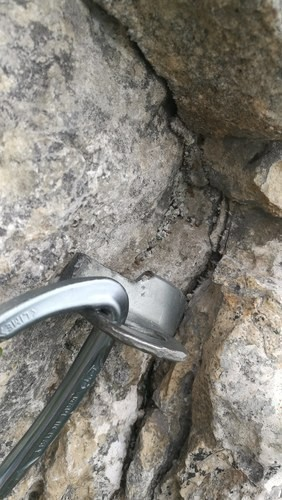
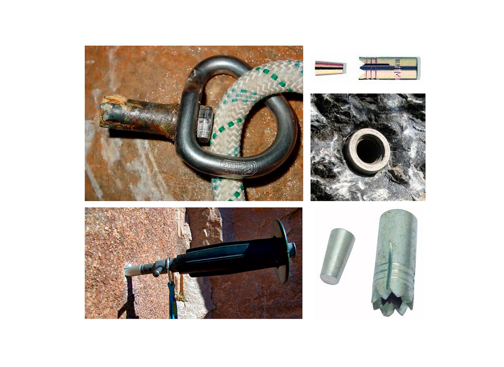
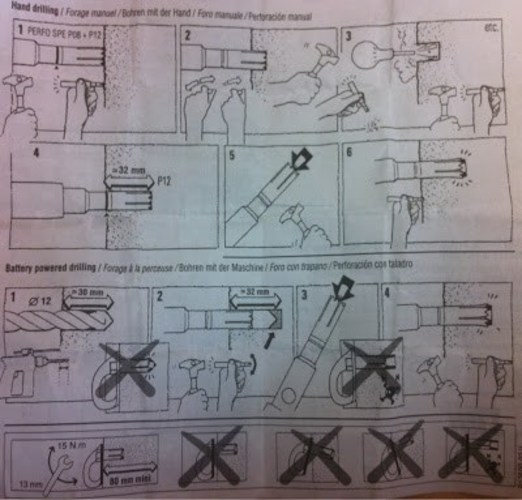
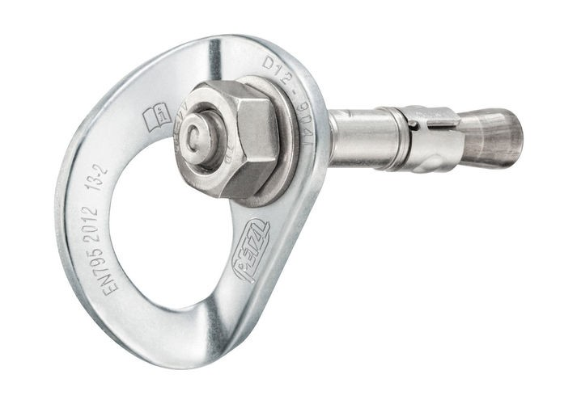
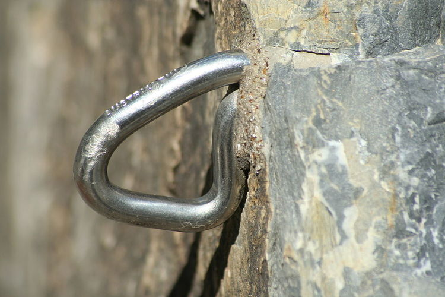
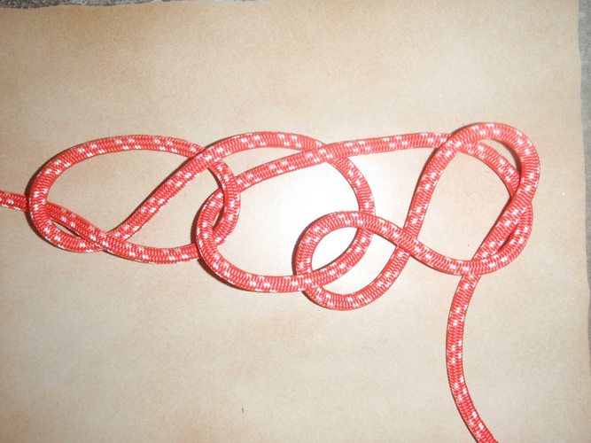

# Matériel

- [Matériel](#Mat%C3%A9riel)
  - [1 - Checklist matériel](#1---Checklist-mat%C3%A9riel)
    - [Matériel de base - pour TOUTE SORTIE](#Mat%C3%A9riel-de-base---pour-TOUTE-SORTIE)
    - [GRANDE VOIE ROCHER](#GRANDE-VOIE-ROCHER)
    - [Course sur NEIGE](#Course-sur-NEIGE)
    - [Course sur GLACIER](#Course-sur-GLACIER)
  - [Piton, spit, goujon, broche scellée](#Piton-spit-goujon-broche-scell%C3%A9e)
  - [2 - Considérations générales sur le matériel](#2---Consid%C3%A9rations-g%C3%A9n%C3%A9rales-sur-le-mat%C3%A9riel)
    - [Vêtements](#V%C3%AAtements)
    - [Bonnet & Casquette](#Bonnet--Casquette)
    - [Gants](#Gants)
    - [Chaussures](#Chaussures)
    - [Lunettes de soleil](#Lunettes-de-soleil)
    - [Sac à dos](#Sac-%C3%A0-dos)
    - [Piolet](#Piolet)
    - [Crampons](#Crampons)
    - [Corde](#Corde)
      - [La classique](#La-classique)
      - [Autres combinaisons](#Autres-combinaisons)
    - [Nombre de pitons, cordelette et sangle en vrac](#Nombre-de-pitons-cordelette-et-sangle-en-vrac)
    - [Les maillons rapides](#Les-maillons-rapides)
    - [Trousse de secours](#Trousse-de-secours)

## 1 - Checklist matériel

### Matériel de base - pour TOUTE SORTIE

* trousse de premiers secours:
    * pansements de taille diverse
    * Strap
* un ou deux pitons
* cordelette
* grand sac poubelle en cas de bivouac improvisé
* boussole
* altimètre
* carte au 1/25000e
* Nourriture
* Corde (traitement hydrophobe)

### GRANDE VOIE ROCHER

### Course sur NEIGE

* Pour chacun :
    * Un pantalon de montagne (de type soft-Shell épais et solide) resserré en bas des jambes (pour éviter de tricoter avec les crampons),
    * une fourrure polaire,
    * un sous-vêtement respirant,
    * un gilet matelassé,
    * une veste gore-tex légère
    * un mouchoir
    * les papiers (protégés de l'humidité par un sac congélation avec lien) et les clefs bien accrochées en sécurité dans une poche du sac à dos qu'on n'ouvrira pas
    * une paire de stop-tout ou de guêtres très ajustées et très simples, dépourvues de câbles (trop de risque d'enfiler la pointe avant entre le câble et la chaussure de l'autre pied)
    * une paire de chaussures d'alpinisme légères avec débord arrière (de type Trango de LaSportiva)
    * une paire de chaussettes chaudes en fourrure polaire (qui sèchent vite)
    * un baudrier d'escalade léger (300g maxi)
    * unepaire de crampons 12 pointes semi-automatiques (talonnière automatique et sangles àl'avant),
    * un piolet classique
    * une paire de lunettes de glacier
    * une paire de gants de ski bon marché car on les égare facilement,
    * 4 mousquetons simples
    * deux mousquetons à vis HMS
    * une broche à glace (plus tard en saison, avec des crevasses plus ouvertes et une glace recouverte de moins de neige, deux broches par personne peuvent être utiles),
    * un crochet à abalakov
    * un anneau pour Prusik de 60cm, un anneau pour Prusik de 120cm
    * une petite poulie et un petit bloqueur (tibloc ou ropeman) ou une poulie autobloquante (micro-traction de Petzl),
    * un sac plastique robuste pour confectionner un corps mort qui peut servir à emballer les crampons
    * un petit canif bien affûté capable de couper la cordelette,
    * une grande sangle,
    * une petite sangle
    * une gourde
    * des vivres de course (barres de céréales et chocolatées, fruits secs, fromage...)
    * un sifflet
    * un bâton télescopique
    * une lampe frontale avec piles neuves
    * du papier toilette
    * une brosse à dent
    * une casquette chaude ou un bonnet ou un casque si la voie est fréquentée ou emprunte un couloir qui peut canaliser les pierres ou chemine sous une arête de rocher qui peut en envoyer. On peut se passer du casque dans certaines courses de neige faciles, quand on a le ciel au-dessus de la tête pendant la totalité de la course.
* Pour la cordée :
    * 1 brin de 50 mètres de corde à double (il s'agit d'enrayer ici des glissades et non des chutes),
    * 5 mètres de cordelette de 6 ou 7 mm de diamètre pour poser un rappel au cas où
    * une trousse de secours (pansements, Strappal, Elastoplaste suffisant pour un strapping du genou, éosine, aspirine pour le MAM, Codoliprane, strips adhésifs de suture (Stéristrips) , compresses, Valium, épingles à nourrice)
    * une petite paire de gants de secours (en laine ou en fourrure polaire),
    * une montre-altimètre,
    * une petite boussole,
    * un morceau de la carte au 1/25000ème
    * la photocopie du topo,
    * une couverture de survie
    * un tube de dentifrice très entamé et un morceau de savon (qui resteront au refuge)
    * un appareil photo
    * un téléphone portable

### Course sur GLACIER 

* Matériel minimum glacier (pour pouvoir se sortir d'une crevasse ou réaliser un relais + mouflage)
  * une ou deux broches à glace
  * deux anneaux de cordelettes (fermés par un double nœud de pêcheur) en 6mm, l'un de 60cm de long, l'autre de 120cm,
  * Sangle de 60cm et une sangle de 120cm.
  * 2 (3) mousquetons à vis
  * 4 (2) mousquetons simples.
  * Vache courte (corde 7mm) avec mousqueton pour se vacher sur piolet
  * anneau 5 mm servant de dragonne si nécessaire
  * Options:
    * On peut y ajouter une petite poulie.
    * Poignée jumar, minitraction et tibloc pour remontée sur corde ou mouflage facile (en complément des deux cordelettes)

* CORDE - un brin de corde à double de 50 mètres
  * on peut utiliser un seul brin d'une corde à double car il s'agit d'enrayer une glissade plus que de stopper une véritable chute.
  * L'idéal est d'avoir un brin de 50 mètres de façon à disposer d'une quinzaine de mètres entre les grimpeurs. Si la corde est plus courte, on privilégie la longueur de l'encordement par rapport à la réserve de corde, qui sera alors plus courte. L'encordement n'est donc plus rigoureusement au tiers.

## Piton, spit, goujon, broche scellée

* Un piton à expansion (aussi appelé spit, gollot[1], goujon, ou cheville), est un système d'ancrage permanent constitué d'une tige expansive, sur laquelle est généralement vissée une plaquette.
 * Au sens strict, un piton a la forme d'une lame qui est coincée dans une fissure.

 * Spit ou Cheville à expansion Spit ou cheville autoforeuse: se coince dans le trou foré par percussion de la cheville sur son cône placé au fond de l'orifice. La cheville Spit se perce à 12 mm. de diamètre sur 40mm, et finition au tamponnoir pour avoir un fond plat de façon que le cône ne s'enfonce pas dans le cône fait par la mèche de perforateur.
   * Les spits sont femelles. On peut donc enlever l'écrou pour retirer la plaquette
   * Ne nécessite pas de perforateur pour la pose.
   * On utilise un "tamponoir", sorte de burin fini par un filetage au bout duquel on vis le spit. 
   * Ensuite on tape sur le tamponnoir avec un marteau en faisant tourner la cheville. 
   * Lorsque l'on a foré le trou, on souffle pour vider toutes les poussières puis on introduit un "cône d'expansion" dans la cheville dans la cheville et on martelle la cheville.
   * Le cône appuie au fond du trou et donc écarte la cheville qui est alors posée à demeure.
   * Une fois le tamponoir dévissé on visse une plaquette dans le filetage.

 * Goujon: par vissage et expansion sur une forme oblongue, d'une collerette (en diamètre de vis de 8 mm.). Les goujons sont mâles. On utilise une perceuse pour faire un trou puis insérer le goujon.

 * La cheville HKD8, Hilti, demande 35mm. de forage pour 10mm de diamètres, et possède un cône en son intérieur qu'il suffit de tamponner avec un outil idoine.
  
* Dans les trois techniques, le module de résistance dépendant du volume foré (diamètres respectivement de 12mm (Spit), 10mm (Hilti) et 8 mm pour les goujons ; et de la profondeur, selon les caractéristiques de roches on obtient des résistances à l'ancrage très différentes / le calcul de résistance pouvant se faire à partir du volume occupé par le système d'ancrage dans la roche : surface de forage et profondeur.
  
* Broche scellée: tige métallique avec un anneau, scellée dans un trou percé dans la roche par une résine époxy, une résine polyester, ou du ciment.
 * Cette solution est réputée plus durable que le piton à expansion et est moins dépendante de la solidité intrinsèque de la roche, mais le recours à la résine la rend moins aisée à mettre en œuvre.

## 2 - Considérations générales sur le matériel

### Vêtements

On s'habille selon le fameux système multi-couche, qui doit permettre de concilier :
* l'évacuation de l'humidité
* l'isolation thermique
* la protection contre le vent et la pluie

Les trois couches classiques de vêtements:
* sous-vêtement en matériau synthétique et non en coton qui doit éloigner l'humidité de la peau
* fourrure polaire qui apporte la chaleur par la couche d'air qu'elle emprisonne
* veste gore-tex ou équivalent qui n'empêche pas l'évacuation finale de l'humidité.

Le pantalon idéal est près du corps, élastique, robuste, chaud, protège du vent et est imperméable.
On peut ajouter un surpantalon léger en gore-tex pour la montée au refuge ou au bivouac sous la pluie, ou choisir un poncho descendant bas.

En conditions froides, la veste en duvet est toujours incontournable. Déconseillée en bushcraft car fragile et ne supportant pas l'humidité, en altitude, l'air sec et l'absence de pluie (remplacée par la neige) rendent inoffensifs ses principaux inconvénients. Il faut la choisir  avec une capuche pour pouvoir l'utiliser en bivouac quand on ne s'est pas encombré d'un sac de couchage.

### Bonnet & Casquette

Les bonnets fins doivent pouvoir être portés sous le casque. Les tours-de-cou et les cagoules en fourrure polaire apportent un supplément de chaleur pour un poids négligeable.

Une casquette améliore la protection oculaire. Un chapeau à large bord protège en plus la nuque et les oreilles du soleil. Ils sont utiles pendant une longue montée au refuge ou au bivouac en plein soleil, mais on se contente souvent du casque, ce qui évite de le porter dans le sac.

### Gants

Une paire de gants de ski plus une paire de gants en fourrure polaire en rechange conviennent pour la plupart des courses d'été.

### Chaussures

Les Italiens demeurent les spécialistes du produit. Les deux marques incontournables sont actuellement Scarpa et La Sportiva. Pour bien grimper, on choisit une pointure plus ajustée que pour la randonnée. Ceci implique qu'on aura mal au bout du gros orteil dans les très longues descentes et qu'on sera plus précocement sensible au froid. Souvent, les alpinistes finissent par posséder plusieurs paires, de différents modèles, plus ou moins chauds, plus ou moins lourds et plus ou moins ajustés. Et ils choisissent en fonction de la course projetée. En conditions très froides, on évite la pointure trop petite qui favorise les gelures.

* Une bonne chaussure d'alpinisme est rigide en semelle pour plusieurs raisons:
    * pouvoir imprimer des encoches dans la neige « bout de pied » et non pas rouler dessus en se déformant,
    * éviter le déchaussage intempestif des crampons,
    * tenir sur les petites prises de pieds en rocher.
* Elle est souple en tige pour pouvoir pratiquer le cramponnage dix pointes (pieds à plat) et rester utilisable en adhérence sur le rocher.
* Le décrochement du talon est un élément essentiel : c'est cette « marche inversée » qui bloque les pierres roulant sous la chaussure.
* Un talon peu marqué (et un crantage de toute la semelle moins profond) est le prix à payer des chaussures d'alpinisme légères de type Trango qui ont nettement moins d'accroche que des modèles plus traditionnels (Jorasses de Scarpa par exemple).
* L'absence de talon explique pourquoi on se casse facilement la figure en descente raide sur une terre dure caillouteuse avec des chaussures d'approche, jusqu'à ce qu'on admette que la glissade est impossible à empêcher avec ce genre de chaussures, et que donc il faut davantage porter son poids sur l'avant du pied pour accompagner le surf en conservant son équilibre.

### Lunettes de soleil

Il est classique de recommander pour la haute-montagne le port de lunettes de catégorie 4 filtrant bien sûr 100% des UV, et de formes bien enveloppantes ou munies de caches extérieurs pour stopper les rayonnements latéraux. Un choix idéal serait de posséder une paire de catégorie 4 pour les courses de neige, et une paire de catégorie 3 pour les courses de rocher.

### Sac à dos

Un sac montagne de 40 à 45 litres, léger (moins d'1,200 kg), pas trop étroit, dont la ceinture ventrale est escamotable, dénué de poche extérieure à crampons pour éviter qu'elle ne s'accroche au rocher pendant le hissage, et dont le tissu paraît robuste, notamment celui du rabat qui prend les coups, et celui du dos. Les crampons sont rangés pointes inférieures contre pointes inférieures, emballés dans un sac plastique épais tourné autour, et on interpose entre les pointes avant et le tissu du sac la grosse paire de gants. Oubliez la pochette à crampons : trop lourde. Réparation des petites déchirures avec du Seam Grip de Mac Nett.

### Piolet

Le premier achat sera le piolet à lame classique et à manche droit ou légèrement cintré. Acheter un piolet très léger à manche droit très long serait
confortable en neige facile mais peu efficace en glace : trop léger et lame trop épaisse pour ancrer dans un matériau dur.
Inversement, choisir un piolet très court, équipé d'une lame banane très fine, serait un handicap en neige molle et profonde. La lame rayerait la neige sans freiner, ce qui peut rendre une réchappe inefficace. Le petit manche planté jusqu'à la garde serait encore insuffisant pour atteindre la neige moins ramollie sous la surface.
Le premier piolet classique doit être un compromis entre ces deux écueils : 60 ou 70 cm de long selon sa stature, relativement lourd, à lame d'épaisseur intermédiaire très bien affûtée pour pouvoir ancrer dans la glace et retenir dans la neige.
Un bout de manche coupé en biais en guise de pique est inefficace en glace. Une véritable pique est indispensable.

On achètera aussi un marteau équipé d'un bec à dépitonner pas trop agressif pour éviter de se blesser en cas de chute. Ce sera le marteau des escalades difficiles, compact, avec le poids bien en tête. Puis on s'équipera d'un petit marteau-piolet de type 3ème main, qui pourra remplacer les deux outil précédents dans un grand nombre de courses rocheuses à l'approche glaciaire débonnaire. Gain de poids assuré. A peine plus encombrant que le marteau, on le porte au baudrier. Comme le marteau, on l'équipe d'une cordelette de 4mm en bout de manche pour l'attacher au porte-matériel. On règle la longueur de façon à pouvoir tendre le bras en complète extension du côté opposé à la hanche qui soutient le marteau. A la désescalade, on se prend souvent un genou dans cette cordelette : il suffit de la réduire par un nœud de vache peu serré pour qu'elle ne gêne plus.

On finira par acquérir une paire de piolets-tractions pour la cascade de glace, l'un équipé d'un marteau, l'autre d'une panne, ces accessoires étant démontables. Ne pas hésiter à choisir un manche très cintré, mais en évitant tout de même les modèles spécifiques au dry-tooling.

Dragonnes et longes des piolets-tractions:

* En cascade de glace, on a cherché à grimper le plus possible sans dragonne pour libérer sa gestuelle. Mais on se fatigue un peu plus car on serre davantage le manche.
* En montagne, le mieux est d'emporter ses dragonnes au cas où et de ne les mousquetonner à son piolet que si on en éprouve le besoin en cours d'ascension. Il faut choisir des dragonnes détachables par un mousqueton ou une attache rapide. Si son piolet en est dépourvu, on installe une cordelette 5mm depuis le trou de la tête du piolet jusqu'au milieu du manche où elle est maintenue par un ruban adhésif. La dragonne comporte un mousqueton porte-matériel qui se clippe dans cette cordelette.
* En glace, pouvoir se vacher très vite en tension sur son piolet est très confortable. On peut donc se confectionner avec une cordelette 7mm une vache courte équipée d'un mousqueton capable de passer dans le trou du bas du manche. Elle est nouée en permanence au baudrier mais clippée sur un porte-matériel. Elle permet de se vacher rapidement en tension au piolet pour brocher confortablement dans un pas vertical difficile bien pourvu en glace.
 
### Crampons

Un modèle douze pointes en acier avec fixation automatique à l'arrière et sangle ou bride plastique à l'avant est incontournable. Si on choisit un étrier à l'avant, on se prive de la possibilité d'acheter à l'avenir des chaussures dépourvues de débord avant, ce qui limite énormément le choix. Les deux pointes avant peuvent être verticales, ce qui les rend plus efficaces en glace. Il faut éviter les modèles typés cascade de glace trop spécifiques. Si on peut s'accommoder d'une mono-pointe avant, l'absence des pointes intermédiaires situées au milieu du pied et placées perpendiculaires à la marche est plus gênante. Ces pointes ont disparu de certains crampons cascade pour pouvoir mieux utiliser les pointes orientées vers l'arrière qui servent à griffer les colonnettes. Mais ce sont les pointes de retenue utilisées à la descente en cramponnage classique. Les antibotts sont maintenant livrés montés sur la plupart des modèles. En l'absence, il faut impérativement les commander ou bien, faute de mieux, s'en fabriquer avec du ruban adhésif large et solide.

### Corde

#### La classique

* Deux brins de couleurs différentes de 50 m d'une corde de rappel d'un poids intermédiaire et relativement rustique. Avec 42 g par mètre, on porte 4,200 kg de corde.
* Pour les courses de neige F et PD, où il n'y aura ni risque de chute avec un choc important, ni long rappel, on emportera un seul brin.
* Pour les courses de rocher, on prendra les deux brins.

Le mousquetonnage d'un seul brin à la fois permet de réduire le tirage et d'obtenir une force de choc bien inférieure à celle d'une corde à simple. Ceci laisse aux coinceurs et broches à glace plus de chances de résister.

Critères de choix:

* Poids: entre un poids de 36 g par mètre et un autre de 49 g, la différence dans le sac à dos sera énorme : 1,300 kg,
* Diamètre: une corde très fine (7,3mm) oblige l'emploi d'un frein spécialement adapté aux petits diamètres (microjul d'Elderid par exemple), beaucoup de vigilance pendant l'assurage et le rappel, un serrage moins sûr des nœuds autobloquants pour remontées ou mouflages, et un assurage au corps très difficile. Déconseillé à l'amateur bien décidé à se comporter comme celui qui essaie, et voulant avoir une corde capable de tout faire, et surtout de pardonner toutes les bêtises.
* Résistance de la gaine: dépend du nombre de fuseaux constituant cette gaine (de 32 à 48, un faible nombre donnant une corde plus résistante à l'abrasion mais moins élastique), du pourcentage de fibres constituant la gaine par rapport au total des fibres de la gaine et de l'âme (de 35 à 45%, un pourcentage élevé donnant une corde plus résistante à l'abrasion) et du mode de tressage de la gaine autour de l'âme (tressage tri-axial, 1 fil, 2 fils, plus ou moins serré). On se fait une bonne idée de la résistance de la gaine en pliant la corde. Une corde résistante à l'abrasion se laisse plier moins facilement. Elle tient donc moins bien les nœuds mais ceux-ci sont plus faciles à défaire après tension. Elle a moins tendance à faire un paquet de nœud inextricable au lancer d'un rappel sur un terrain peu incliné. Avoir une corde résistante à l'abrasion permet de remonter un rappel coincé sans trop de crainte pour la portion de corde qui s'appuie tout là-haut sur le rocher saillant, de ne pas devoir la changer au moindre coup de crampon malheureux, de ne pas être effrayé dans ce parcours d'arête rocheuse au point d'envisager de s'encorder en double. C'est un véritable confort que de posséder ce genre de corde rustique, même si elle est un peu plus lourde.

#### Autres combinaisons

* Le rappel 2 x 60 mètres: Regarder le topo, car nécessaire sur certaines courses
* Un brin de corde à simple de 50 mètres et un brin de rappel de la corde qui sert aussi au hissage du sac.
  * Les diamètres peuvent être très différents, afin d'obtenir le poids le plus faible possible. On utilise alors pour le brin de rappel de la corde une cordelette en dyneema statique, comme la trail line 7,3mm dyneema de Beal qui pèse 30 g par mètre, ou un diamètre plus faible encore (5,5mm en dyneema). Le descendeur se place uniquement sur la corde à simple, l'autre brin ne servant qu'à rappeler la corde.
    * On laisse un maillon rapide étroit et court pour que le nœud d'aboutement s'appuie dessus. Ce nœud est un nœud d'aboutement classique en huit, bien serré. Utilisé en appui contre le maillon, le nœud de huit est classé dans l'industrie parmi les nœuds d'arrêt ; on conseille pour cette utilisation dans l'industrie de laisser dépasser 50 cm de corde libre.
    * Le premier inconvénient de la technique est d'être obligé d'emporter autant de maillons rapides que de rappels prévus. Or, on sait rarement à l'avance leur nombre exact.
    * Le second inconvénient en cas de coincement est que la cordelette de rappel, souvent un brin de 7mm statique ou semi-statique, ne permet pas de s'assurer en premier de cordée pour aller récupérer la corde à simple coincée. Le troisième inconvénient est dans le lancer d'une cordelette légère en terrain peu raide : nouilles assurées. Pour cette raison, les anciens, qui utilisaient déjà ce système avec une cordelette en nylon de 5 mm quand un long rappel unique était prévu, préparaient leur cordelette en la portant, dans le sac ou dans une poche banane, nouée en chaînette. Celle-ci se détricotait d'elle-même au fur et à mesure de la descente le long de la corde à simple.

    

  * Les deux diamètres peuvent être proches. On peut alors descendre classiquement (sans utiliser un maillon rapide), mais le compagnon resté au relais vérifie quand même qu'une corde ne coulisse pas plus vite que l'autre, en haut comme en bas du rappel. On peut installer d'avance le descendeur du second afin de bloquer la corde, puis nouer le bas du rappel avec une queue de vache au relais pour plus de sûreté. 
  
### Nombre de pitons, cordelette et sangle en vrac

On prend peu de pitons quand on est sûr de sortir par le haut ou que la course se réalise normalement en aller-retour avec un ou deux rappels maximum. Quand la course est plus ambitieuse, la descente se réalise généralement par la voie normale. La conséquence est que la voie de montée n'est pas équipée pour descendre en rappel. Sur un rocher bien pourvu en becquets, il suffira de sangle et de cordelette en vrac pour équiper les rappels. Mais dans une face plus difficile, donc plus lisse, on va consommer beaucoup plus de pitons. Si on en veut deux à chaque rappel, et qu'on se contente de rappels de trente mètres pour ne pas coincer, il va falloir un certain nombre de pitons. Il est confortable de pouvoir envisager une réchappe en rappel d'au moins les deux tiers de la hauteur d'une voie de rocher inconnue avec l'ensemble du matériel (sangles en vrac ou cousues, cordelettes, coinceurs, pitons) et compte tenu des possibilités de désescalade. S'il ne reste plus qu'un tiers de la voie, on peut estimer qu'on va sortir par le haut.

Si le bulletin météo indique « risque d'averse en fin d'après-midi », emporter plus de cordelette et de pitons est une bonne idée. Dans les courses où on finirait par se charger excessivement, on diminue le diamètre de la cordelette pour pouvoir en emporter davantage. On réserve plutôt la 5mm pour relier des pitons, la sangle pour des becquets non coupants, la cordelette 7mm convenant partout. Si on est obligé de poser un anneau de rappel en 5mm sur un rocher agressif, on n'hésite pas à l'émousser soigneusement au marteau.

Le matériel conseillé dans les livres qui décrivent des courses sélectionnées est à comprendre comme le minimum syndical quand tout va bien. Mais être autonome consiste à pouvoir faire face quand tout va mal. Dans une face importante, emporter une douzaine de pitons variés n'a rien de ridicule. Dans une course de rocher classique - D, 500m – prendre un ou deux pitons va vous servir à quoi ? En tout cas pas à une réchappe sous la pluie alors que vous avez déjà grimpé deux ressauts... Il est probable que l'essentiel de vos pitons restera dans le sac. Ils doivent être considérés comme un billet de retour.

### Les maillons rapides

Les maillons destinés à l'escalade sont maintenant des EPI (Équipement de Protection Individuelle) devant répondre à la norme EN 12275 qui prévoit une résistance à la traction selon le grand axe du maillon de 25 kN, et une résistance transversale de 10 kN, maillon vissé.

### Trousse de secours

Une trousse de secours trop fournie aura toutes les chances de rester à la maison au moindre prétexte : course facile, de courte durée, dans un endroit fréquenté. Au contraire, la réduire à une boîte de pansements la rend peu utile.

La trousse standard doit permettre de stopper le saignement et de protéger une plaie, de placer un strapping sur une articulation, de fabriquer une contention de fortune pour une entorse ou une fracture, d'atténuer la douleur, de désinfecter grossièrement une plaie, de laver un œil, de calmer une céphalée due au MAM, d'alerter les secours.

Trousse de base:
  
* 1 petit flacon de liquide de désinfectant des mains (lotion hydro-alcoolique ou ammonium quaternaire)
* 1 paire de gants d'examen en latex/vinyl non stériles (les gants en latex sont précis)
* 2 unidoses de sérum physiologique (pour laver une plaie ou un œil)
* 2 unidoses d'éosine (pour désinfecter et assécher une plaie)
* nombreuses compresses tissées non stériles (mais propres!)
* 1 rouleau entier d'Elastoplaste de 6cm de largeur (pour maintenir des pansements, des compresses, et pour placer un strapping)
* 1 boîte de stéri-strips (bandes autocollantes pour « suturer » les plaies)
* 1 boîte de pansements divers de bonne qualité, résistant à l'eau (ils doivent tenir malgré la neige)
* 2 pansements hydrocolloïdes 15x15cm type Algoplaque, pour les plaies larges et en surface suite à une forte abrasion de la peau lors d'une chute
* 2 bandes extensibles non collantes, type Velpeau ou Nylex (pour maintenir un pansement en place, une compression, une contention)
* plusieurs épingles à nourrice (pour arrêter les bandes, pour réparer les vêtements déchirés pendant la chute, pour soutenir un bras avec la manche piquée au tissu de la poitrine)
* 1 attelle d'urgence, déformable et ajustable, de type Sam Splint
* 6 comprimés de Codoliprane (association paracétamol et codéine, antalgique périphérique, 2c. en cas de douleur intense, espacer les prises de 4 heures minimum (contre-indiqué en cas d'allergie à un constituant, en cas d'asthme, d'insuffisance hépatique ou respiratoire, et chez la femme enceinte)
* 4 comprimés de Nurofène 400 (ibuprofène, anti-inflammatoire à visée antalgique, 1c. en cas de douleur, espacer les prises de 6 heures minimum, alternance possible avec le Codoliprane, contre-indiqué en cas d'allergie, d'insuffisance hépatique ou rénale, d'ulcère, et chez la femme enceinte)
* 6 comprimés d'Aspirine 500 (acide acétylsalicylique, 1 ou 2 comprimés en cas de céphalée due au MAM, espacer les prises de 4 heures minimum ; contre-indiqué en cas d'allergie, d'asthme à l'aspirine, de risque hémorragique, d'insuffisance hépatique ou rénale, de prise d'anticoagulants, chez la femme enceinte)
* 4 comprimés de Coramine Glucose (glucose, 4 c.par jour en cas de fatigue brutale, conte-indiqué en cas d'allergie, d'hypertension artérielle,d'épilepsie, et chez la femme enceinte)
* 4 comprimés de Valium 5mg (diazépam, anxiolytique, 1 comprimé en cas d'anxiété suite à un traumatisme ou en cas de contractures musculaires suite à une forte contusion, demander l'avis du médecin traitant)
* 4 comprimés de Guronsan (glucoronamide, vitamine C et caféine, 1c.le matin et 1c.à midi en cas de fatigue, contre-indiqué en cas d'allergie ou de calculs rénaux)
* 1 canif à petite lame ou un multitool avec ciseaux (pour découper les compresses, les pansements, les bandes diverses)
* 1 petit morceau de savon (pour un lavage plus sérieux en cas d'eau courante)
* 1 miroir de signalisation
* 1 sifflet
* 1 couverture de survie
* 1 téléphone portable
* 1 crème écran total pour peau et lèvres
* 1 paire de lunettes de glacier de secours.