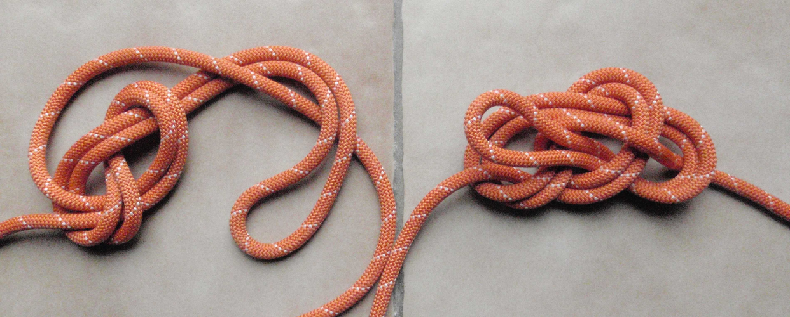
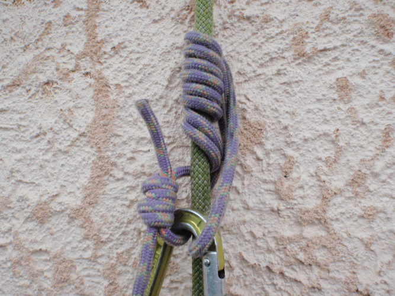

# Noeuds & Mouflages

- [Noeuds & Mouflages](#Noeuds--Mouflages)
  - [Noeuds](#Noeuds)
    - [Noeud de huit](#Noeud-de-huit)
    - [Noeud de chaise](#Noeud-de-chaise)
  - [Noeud d'aboutement](#Noeud-daboutement)
    - [Nœuds sur mousquetons](#N%C5%93uds-sur-mousquetons)
    - [Autres noeuds utiles (alouette, mule, tour mort et deux demi-clés, noeud de freinage)](#Autres-noeuds-utiles-alouette-mule-tour-mort-et-deux-demi-cl%C3%A9s-noeud-de-freinage)
    - [Noeuds autobloquants](#Noeuds-autobloquants)

## Noeuds

### Noeud de huit

* Nœud de huit est le nœud d'encordement le plus courant car très résistant et facile à contrôler, une erreur se détectant au premier coup d’œil.
* Pour être tranquille toute une journée de montagne, il est préférable de réaliser son nœud de huit sans croiser. Il a donc l'aspect d'une boule, en
trois dimensions, et non d'un huit à plat.

Nœud passable pour une couenne à gauche ; nœud plus durable pour une journée à droite.

### Noeud de chaise
    
* Avantage principal d'être moins volumineux, ce qui se justifie surtout quand on s'encorde en cours de corde pour l'encordement en N puisqu'on traite deux brins à la fois.
* Un nœud de chaise sous tension constante est très résistant même sans nœud d'arrêt quand on tire sur le dormant, c'est à dire la corde allant à l'autre grimpeur.En alpinisme, on est obligé de bloquer ce nœud de chaise par un double nœud d'arrêt serré contre lui pour deux raisons :
    1. Le nœud de chaise seul glisse pour des valeurs très faibles quand on tire sur la boucle d'encordement elle-même (la ganse) comme si on voulait l'agrandir. Ce cas de traction se produit quand, pour l'encordement montagne classique, on a choisi de repasser la boucle venant des anneaux de buste dans la boucle d'encordement.
    2. Un nœud d'encordement n'est pas en tension constante et peut donc facilement se desserrer. Or, un nœud de chaise qui se desserre peut également se retourner et se transformer en nœud coulant, S'il se retourne, il lâche.

    

    
    
    

* Noeud de chaise en cours de corde (pour l'encordement en N par exemple)
  

* Noeud de chaise clef Yosémite (encombrement minimal!)

## Noeud d'aboutement 

Pour réunir les deux brins d'un rappel, soit pour fermer un anneau de cordelette ou de sangle):

  * nœud de jonction en huit pour le rappel
  * double nœud de pêcheur
  * triple nœud de pêcheur indiqué pour les cordelettes en dyneema
  * nœud de sangle préconisé pour les sangles.
  
  
  
  
### Nœuds sur mousquetons

* nœud de cabestan
* nœud de demi cabestan
  

### Autres noeuds utiles (alouette, mule, tour mort et deux demi-clés, noeud de freinage)

* Nœud en tête d'alouette pour assujettir un anneau de cordelette ou de sangle

  
* Nœud de mule, pour bloquer un demi-cabestan par exemple. Ce nœud est bien sûr serré, puis sécurisé par un nœud d'arrêt en nouant la boucle autour de la corde allant au grimpeur. Pour réaliser ce nœud de mule, tirer la petite croix marquée sur la corde en suivant le crayon.
  

  
* Tour mort et deux demi-clefs. 

* Noeud de freinage
  
 : un nœud de huit pour commencer, puis piéger un brin avec la boucle qui repart dans le nœud

### Noeuds autobloquants

* Les noeuds autobloquants Chap. 1: voir la [vidéo Points de chute Chap1](https://www.youtube.com/watch?v=_1RG-CSgGpc) et la [vidéo Points de Chute Chap 2](https://www.youtube.com/watch?v=Lj9wNgbDs1s)  

* Nœud de Prussik. Aux USA, on le réalise souvent avec six spires.

* Nœud de Machard.

* Autobloquant français, dit parfois Machard français. Ne bloque que dans un sens.

* Nœud de cœur, très facile à réaliser. Utilisé pour assurer un second de cordée ou réaliser un autobloquant lors d’une remontée sur corde fixe.

* Machard sur mousqueton, très agréable à faire coulisser. Attention, en s'agrippant au mousqueton on desserre l'autobloquant.

* Machard tressé sur sangle. Éviter la sangle en dyneema pour cette utilisation (fusion facile).

