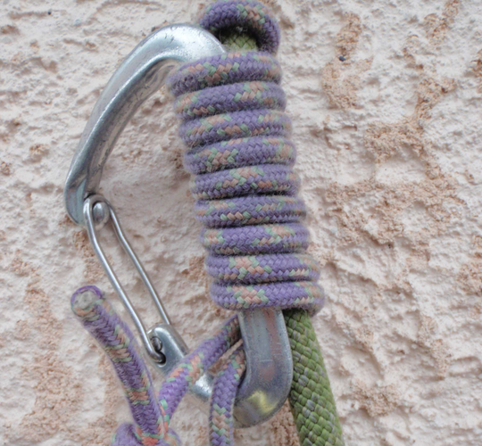
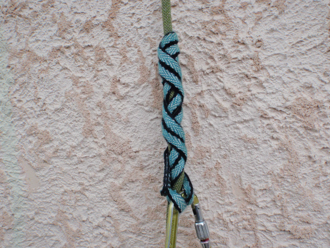

# Noeuds & Mouflages

- [Noeuds & Mouflages](#noeuds--mouflages)
  - [Noeuds](#noeuds)
    - [Noeud de huit / Figure Eight Loop](#noeud-de-huit--figure-eight-loop)
    - [Noeud de chaise](#noeud-de-chaise)
  - [Noeud d'aboutement](#noeud-daboutement)
    - [Nœuds sur mousquetons: Cabestan (Clove Hitch) + Demi-cabestan (Munter Hitch)](#n%c5%93uds-sur-mousquetons-cabestan-clove-hitch--demi-cabestan-munter-hitch)
    - [Autres noeuds utiles (alouette, mule, tour mort et deux demi-clés, noeud de freinage)](#autres-noeuds-utiles-alouette-mule-tour-mort-et-deux-demi-cl%c3%a9s-noeud-de-freinage)
    - [Noeuds autobloquants](#noeuds-autobloquants)

## Noeuds

### Noeud de huit / Figure Eight Loop

* Nœud de huit est le nœud d'encordement le plus courant car très résistant et facile à contrôler, une erreur se détectant au premier coup d’œil.
* Pour être tranquille toute une journée de montagne, il est préférable de réaliser son nœud de huit sans croiser. Il a donc l'aspect d'une boule, en
trois dimensions, et non d'un huit à plat.

Nœud passable pour une couenne à gauche ; nœud plus durable pour une journée à droite.

### Noeud de chaise
    
* Avantage principal d'être moins volumineux, ce qui se justifie surtout quand on s'encorde en cours de corde pour l'encordement en N puisqu'on traite deux brins à la fois.
* Un nœud de chaise sous tension constante est très résistant même sans nœud d'arrêt quand on tire sur le dormant, c'est à dire la corde allant à l'autre grimpeur.En alpinisme, on est obligé de bloquer ce nœud de chaise par un double nœud d'arrêt serré contre lui pour deux raisons :
    1. Le nœud de chaise seul glisse pour des valeurs très faibles quand on tire sur la boucle d'encordement elle-même (la ganse) comme si on voulait l'agrandir. Ce cas de traction se produit quand, pour l'encordement montagne classique, on a choisi de repasser la boucle venant des anneaux de buste dans la boucle d'encordement.
    2. Un nœud d'encordement n'est pas en tension constante et peut donc facilement se desserrer. Or, un nœud de chaise qui se desserre peut également se retourner et se transformer en nœud coulant, S'il se retourne, il lâche.

    

    
    
    

* Noeud de chaise en cours de corde (pour l'encordement en N par exemple)
  

* Noeud de chaise clef Yosémite (encombrement minimal!)

* Au relais, le grimpeur a besoin d’un point central dans lequel passer le mousqueton pour se vacher et assurer son partenaire. Le nœud de chaise peut servir de point central. Le nœud de chaise est doublé et il exerce peu de pression sur la sangle. Il possède une très grande résistance et ne se resserre pas sous l’effet de la charge. En général, la longe est préparée avant la course en utilisant une sangle de 120 cm avec un nœud de chaise. Pendant l’ascension, il est gardé à portée de main avec deux mousquetons à verrouillage.

## Noeud d'aboutement 

Pour réunir les deux brins d'un rappel, soit pour fermer un anneau de cordelette ou de sangle):

  * nœud de jonction en huit pour le rappel
  * double nœud de pêcheur
  * triple nœud de pêcheur indiqué pour les cordelettes en dyneema
  * nœud de sangle préconisé pour les sangles.
  
  

  
  
Noeud de point / overhand knot: Le nœud de poing est un nœud de jonction. Il permet de rabouter les deux brins de corde et il est surtout utilisé lorsque la charge est faible, de l’ordre du poids du corps (descente en rappel, pour faire un prussik) ou pour des nœuds qui doivent être faits à partir de la position d'escalade (lunule, corde à nœud). Bien que ce nœud ait une résistance générale plutôt faible, lorsque le bout est long il suffit pour ce type de charge. Il a l'avantage de se tourner vers l'extérieur lorsque la corde passe sur une arête.

### Nœuds sur mousquetons: Cabestan (Clove Hitch) + Demi-cabestan (Munter Hitch)

* nœud de demi cabestan / Munter Hitch: Le demi-cabestan fait partie des nœuds d’assurage et n’est pas un nœud à proprement parler mais plutôt une boucle qui permet le freinage. Il sert à assurer en tête et en second, ainsi qu’à descendre en rappel son partenaire de cordée. C’est sur un mousqueton en forme de poire spécifiquement fait pour l’assurage (mousqueton HMS) qu’il „fonctionne“ le mieux. 

* nœud de cabestan / Clove Hitch: Le cabestan fait partie des nœuds d’assurage et constitue le nœud idéal pour s’auto-assurer au relais. Il est attaché sur le point central du relais à l’aide d’un mousqueton à verrouillage. La longueur du nœud de cabestan peut être ajustée avec précision et rapidement : il suffit de tirer sur le milieu du nœud et de déplacer la corde dans la direction souhaitée. Il évite les nœuds compliqués à délier ou le risque d’ouverture involontaire.

### Autres noeuds utiles (alouette, mule, tour mort et deux demi-clés, noeud de freinage)

* Nœud en tête d'alouette pour assujettir un anneau de cordelette ou de sangle: La tête d'alouette est un nœud simple et rapide à faire pour relier des sangles. Le nœud de tête d'alouette permet aussi de fixer des sangles à un arbre ou de rajouter une sangle d'auto-assurage sur le harnais et dans le mousqueton.

Attention: Les nœuds de jonction comme la tête d’alouette sont fragiles lorsqu'ils reposent sur la roche sous charge et subissent des frottements, par ex. si on l’utilise comme extension pour une moulinette sur une arête de rocher. Le matériau de la boucle peut ainsi être endommagé rapidement!

  
* Nœud de mule, pour bloquer un demi-cabestan par exemple. Ce nœud est bien sûr serré, puis sécurisé par un nœud d'arrêt en nouant la boucle autour de la corde allant au grimpeur. Pour réaliser ce nœud de mule, tirer la petite croix marquée sur la corde en suivant le crayon.
  

  
* Tour mort et deux demi-clefs. 

* Noeud de freinage
  
 : un nœud de huit pour commencer, puis piéger un brin avec la boucle qui repart dans le nœud

### Noeuds autobloquants

* Les noeuds autobloquants Chap. 1: voir la [vidéo Points de chute Chap1](https://www.youtube.com/watch?v=_1RG-CSgGpc) et la [vidéo Points de Chute Chap 2](https://www.youtube.com/watch?v=Lj9wNgbDs1s)  

* Nœud de Prussik. Aux USA, on le réalise souvent avec six spires.

* Nœud de Machard: Le nœud de Machard est une alternative au prussik qui cependant ne tient bien que dans une direction et peut être déplacé dans l’autre. Il est particulièrement indiqué pour une sangle car il permet de bloquer même des boucles fines.

* Autobloquant français, dit parfois Machard français. Ne bloque que dans un sens.

* Nœud de cœur, très facile à réaliser. Utilisé pour assurer un second de cordée ou réaliser un autobloquant lors d’une remontée sur corde fixe.

* Machard sur mousqueton, très agréable à faire coulisser. Attention, en s'agrippant au mousqueton on desserre l'autobloquant.

* Machard tressé sur sangle. Éviter la sangle en dyneema pour cette utilisation (fusion facile).

