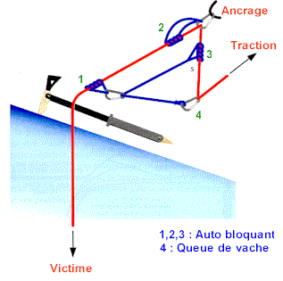

# Noeuds & Mouflages

- [Noeuds & Mouflages](#noeuds--mouflages)
  - [Noeuds](#noeuds)
    - [Noeud de huit](#noeud-de-huit)
    - [Noeud de chaise](#noeud-de-chaise)
  - [Noeud d'aboutement](#noeud-daboutement)
    - [Nœuds sur mousquetons:](#n%C5%93uds-sur-mousquetons)
    - [Autres noeuds utiles (alouette, mule, tour mort et deux demi-clés, noeud de freinage)](#autres-noeuds-utiles-alouette-mule-tour-mort-et-deux-demi-cl%C3%A9s-noeud-de-freinage)
    - [Noeuds autobloquants](#noeuds-autobloquants)
  - [Mouflages (simple, simple de surface, Mariner)](#mouflages-simple-simple-de-surface-mariner)

## Noeuds

### Noeud de huit

* Nœud de huit est le nœud d'encordement le plus courant car très résistant et facile à contrôler, une erreur se détectant au premier coup d’œil.
* Pour être tranquille toute une journée de montagne, il est préférable de réaliser son nœud de huit sans croiser. Il a donc l'aspect d'une boule, en
trois dimensions, et non d'un huit à plat.

Nœud passable pour une couenne à gauche ; nœud plus durable pour une journée à droite.

### Noeud de chaise
    
* Avantage principal d'être moins volumineux, ce qui se justifie surtout quand on s'encorde en cours de corde pour l'encordement en N puisqu'on traite deux brins à la fois.
* Un nœud de chaise sous tension constante est très résistant même sans nœud d'arrêt quand on tire sur le dormant, c'est à dire la corde allant à l'autre grimpeur.En alpinisme, on est obligé de bloquer ce nœud de chaise par un double nœud d'arrêt serré contre lui pour deux raisons :
    1. Le nœud de chaise seul glisse pour des valeurs très faibles quand on tire sur la boucle d'encordement elle-même (la ganse) comme si on voulait l'agrandir. Ce cas de traction se produit quand, pour l'encordement montagne classique, on a choisi de repasser la boucle venant des anneaux de buste dans la boucle d'encordement.
    2. Un nœud d'encordement n'est pas en tension constante et peut donc facilement se desserrer. Or, un nœud de chaise qui se desserre peut également se retourner et se transformer en nœud coulant, S'il se retourne, il lâche.

    
    ATTENTION : nœud de chaise mal fait en haut à gauche.

    
    

    Confection d'un noeud de chaise avec noeud d'arrêt
    
    

* Noeud de chaise en cours de corde (pour l'encordement en N par exemple)
  

* Noeud de chaise clef Yosémite (encombrement minimal!)

## Noeud d'aboutement 

Pour réunir les deux brins d'un rappel, soit pour fermer un anneau de cordelette ou de sangle)
* nœud de jonction en huit pour le rappel
* double nœud de pêcheur
* triple nœud de pêcheur indiqué pour les cordelettes en dyneema
* nœud de sangle préconisé pour les sangles.
  
  
  
### Nœuds sur mousquetons:
* nœud de cabestan
* nœud de demi cabestan

* nœud de cœur

### Autres noeuds utiles (alouette, mule, tour mort et deux demi-clés, noeud de freinage)

* Nœud en tête d'alouette pour assujettir un anneau de cordelette ou de sangle
  
  
* Nœud de mule, pour bloquer un demi-cabestan par exemple. Ce nœud est bien sûr serré, puis sécurisé par un nœud d'arrêt en nouant la boucle autour de la corde allant au grimpeur. Pour réaliser ce nœud de mule, tirer la petite croix marquée sur la corde en suivant le crayon.
  
  

  

  
  
* Tour mort et deux demi-clefs. 
* 
  

* Noeud de freinage
 : un nœud de huit pour commencer, puis piéger un brin avec la boucle qui repart dans le nœud

### Noeuds autobloquants

* Les noeuds autobloquants Chap. 1:

  

* Les noeuds autobloquants Chap. 2 - Ficelou Monobrin:

  

* Nœud de Prusik. Aux USA, on le réalise souvent avec six spires.

  

* Nœud de Machard.

  

* Autobloquant français, dit parfois Machard français. Ne bloque que dans un sens.



* Nœud de cœur, très facile à réaliser. Utilisé pour assurer un second de cordée ou réaliser un auto
bloquant lors d’une remontée sur corde fixe .

  

  

* Machard sur mousqueton, très agréable à faire coulisser. Attention, en s'agrippant au mousqueton on desserre l'autobloquant.

  

* Vous avez égaré votre anneau de cordelette ? Ne perdez pas espoir, et utilisez le machard tressé sur sangle. Éviter la sangle en dyneema pour cette utilisation (fusion facile).

  

## Mouflages (simple, simple de surface, Mariner)

Dans les trois cas, la tête de mouflage est une poulie autobloquante ou son équivalent : poulie plus autobloquant de type tibloc par exemple.
* Mouflage simple (gauche): La corde de réserve a une longueur suffisante et il est possible d'envoyer une boucle au mouflé. Celui-ci passe un mousqueton à son baudrier, ou mieux un mousqueton équipé d'une poulie, et y passe la boucle. On tire à plusieurs, ou bien il s'agit juste d'une aide pour un mouflé qui participe à son sauvetage.
* Mouflage simple de surface (milieu): La corde de réserve a une longueur insuffisante, ou l'accès au mouflé ne permet pas de lui envoyer la corde. On installe un autobloquant, nœud ou autobloquant mécanique sur la corde. Le renvoi est fait sur un mousqueton, ou mieux sur une poulie.
* Mouflage mariner (à droite) On a mouflé le mouflage à l'aide d'une cordelette auxiliaire accrochée en haut au relais. La démultiplication permet de tirer seul, si on a bien géré les frottements : poulies, objet dur sur la lèvre de la crevasse, etc.

Mouflage simple, simple de surface, mariner

* Etapes du Mouflage Mariner double
  * Passer le brin mou de la corde dans le mousqueton de l’amarrage.
  * Poser un 2ème autobloquant (B) sur le brin en tension et le raccorder sur son baudrier.
  * Aller, de manière auto assuré voir la victime et placer un piolet au niveau de la lèvre afin d’éviter qu’elle ne soit cisaillée par la corde.
  * Revenir à la tête de mouflage.
  * Poser un 3ème autobloquant (C) sur le brin mou, à l’opposé du 1er autobloquant
  * Prendre une cordelette (5-7 mètres de cordelette de 7mm avec 1 nœud de vache et 1 mousqueton à chaque extrémité).
  * Mettre le mousqueton avec la cordelette dans l’anneau du 3ème autobloquant (C).
  * Placer un mousqueton sur le 2ème autobloquant (B) et passer la cordelette dedans ( système de poulie).
  * prendre le dernier bout de cordelette avec son mousqueton et passer la corde dedans ( système de 2ème poulie).
  * Tirer sur la corde jusqu’ à ce que les 2 autobloquants (B) et (C) soient cote à cote , ensuite les déplacer pour retendre la cordelette et retirer sur la corde.
  * Répéter le point précédent jusqu’à la sortie de la crevasse. 
  
Mouflage Mariner simple:

Mouflage Mariner double:

Lors de la traction, l'autobloquant 2 vient contre1, tandis que 4 et 3 se rapprochent. L'autobloquant 1 prend le blessé en charge, et le sauveteur peut replacer 2 et 3 pour poursuivre la manoeuvre:

