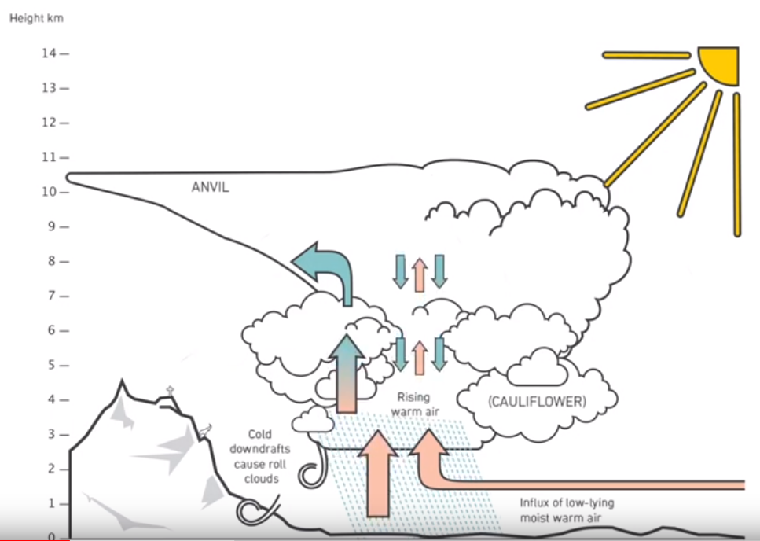
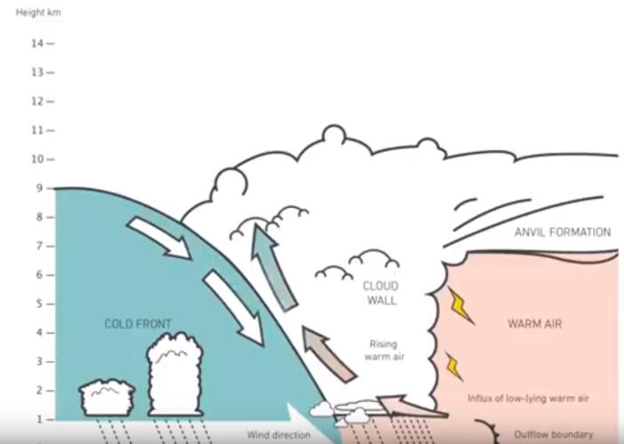
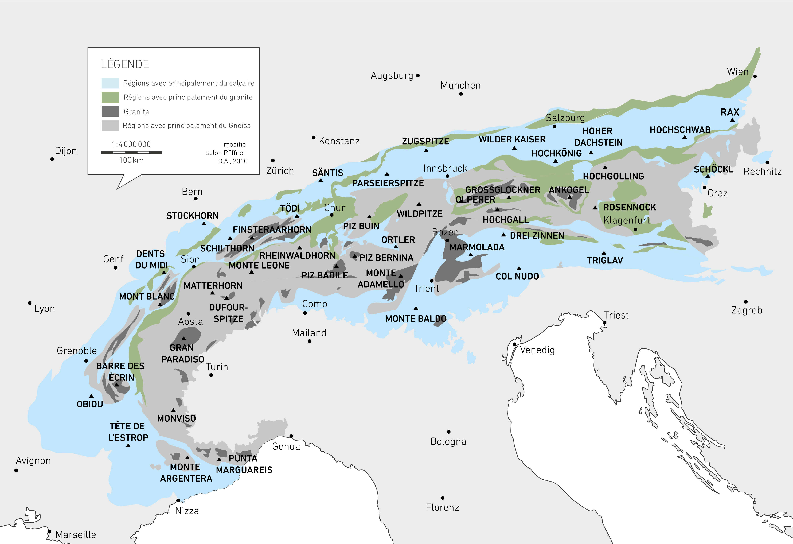
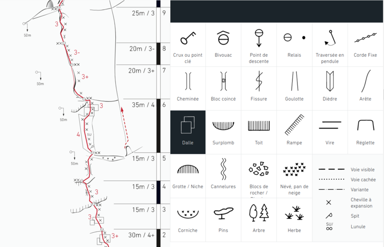
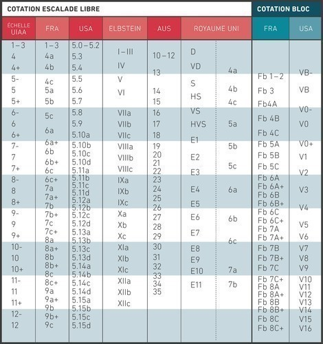
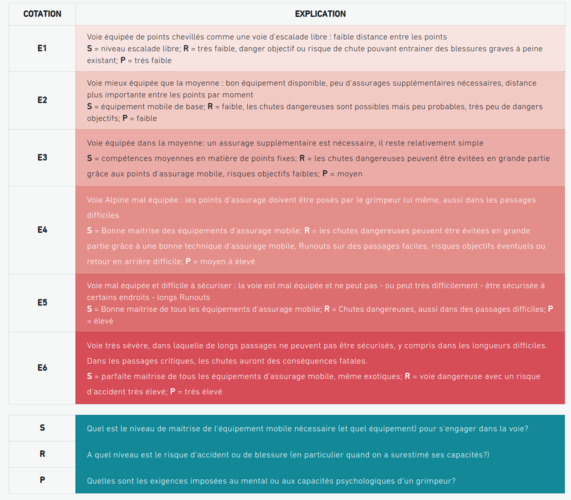

# ORTOVOX SAFETY ACADEMY

* Link: https://www.ortovox.com/fr/safety-academy-lab-rock/

## Connaissances de base Alpinisme

### Dangers objectifs:

* Les dangers objectifs sont ceux qui sont liés à la nature ou à l'environnement naturel. Le grimpeur n'a en général aucune influence sur eux

#### Météo - Orage
        
* 2 types d'orage-
    * Orage de chaleur: phénomène météorologique localisé, reconnaissable par les cumulus qui se forment et ressemblent à des tours
        * Généralement de mai à octobre
        * L'air au niveau du sol est fortement chauffé par les rayons du soleil et, au-dessus d'une certaine température, il s'élève sous forme d'air chaud et humide car il est plus chaud et plus léger que l'air ambiant. Lorsqu’il arrive en haut dans un environnement plus froid, l'air ascendant se refroidit et se condense.
        * Des orages d’origine thermique peuvent ainsi se produire dans une atmosphère humide et instable.
        * Des orages de chaleur peuvent survenir même dans des conditions anticycloniques stables
        * SIGNES ANNONCIATEURS D'UN ORAGE DE CHALEUR:
            * Pas ou peu de rosée le matin
            * Air chaud et vent faible
            * Nuages aux bords très marqués et fort gonflement (Castellanus) dès le matin
            * Observer la formation des nuages qui mène à un orage : des cumulus (nuages isolés, denses et aux bords clairement délimités) aux Castellanus (gonflement partiel et aspect crénelé) jusqu’au cumulonimbus (nuage d'orage, le plus souvent en forme d'enclume)

            

    * Orage de front: mettent souvent fin à une période de beau temps par une perturbation météorologique forte, sous la forme d'une soudaine chute de température.
        * peuvent arriver toute l'année
        * Ils se produisent lorsque deux fronts météorologiques opposés se rencontrent, faisant ainsi glisser une masse d'air sous une autre. Ce phénomène est particulièrement visible sur les fronts froids (voir schéma): Les masses d'air froid et dense se glissent sous les couches d'air plus chaudes au niveau du sol. Ces couches sont alors obligées de monter, créant des vents forts.
        * À une certaine hauteur, l'air se condense et il se forme des nuages qui, dans certaines conditions, se transforment en nuages orageux
        * SIGNES ANNONCIATEURS D'UN ORAGE DE FRONT
            * Formation d’un mur de nuages foncés 
            * Détérioration prolongée des conditions météorologiques
            * Accompagné le plus souvent d’une chute des températures (Givre, chute de neige en altitude)

            

* Que faire si l'on est pris dans un orage?
    * Retirer tous les objets métalliques et les éloigner (dégaines, crampons ...)
    * Trouver un abri et s'assoir sur son sac, les pieds sur la corde posée au sol afin de s'isoler au sol, au moins 30 minutes

    
#### Chute de rochers

* Type de rochers:

    

    * Roche primaire:
        * Granite: principalement dans les Alpes occidentales.
            
            
            
            * Excellente roche, très stable, excellente adhérence
            * Parcouru de fissures et arêtes, permet donc de bien s'autoassurer (trad)
            * Type d'escalade: bonnes propriétés d’adhérence, prises doigts et pieds minimalistes, prises en opposition, fissures, arêtes et intersections, épaules et bandes horizontales 
        * Gneiss: roche la plus commune de la crête principale des Alpes

            

            * C'est un granite remodelé qui ne se grimpe donc pas très différement
            * Il y a cependant des variations dans la qualité de la roche, peut être très fragile
            * Structure en "lits" ou feuillets caractéristiques

    * Roche sédimentaire:
        * Calcaire (Limestone): des Préalpes aux Alpes du Nord mais aussi Alpes du Sud
            * Roche très compacte avec une structure très fine, caractérisé par de très petits éléments comme des fissures, surplombs, cheminées.
            * Forme des parois et surplombs très escarpés
            * pas aussi solide que granite mais assure bonne sécurisation pour le trad. Dans le calcaire on trouve souvent des points d’assurage naturels tels que lunules ou têtes de rocher. Les coinceurs peuvent généralement bien être placés dans le calcaire. 
            * Type d'escalade: petites structures, fissures, surplombs, dalles, goulottes en retrait, trous, corniches, colonnes effritées, prises angulaires ou rugueuses. 
            * prend le plus de temps à sécher
            * Lorsque la roche comporte une proportion non négligeable d'argile, on parle plutôt de marne.

### Dangers subjectifs

* Correspondants à la perception du grimpeur (niveau, peur, ...)

## Matériel

* Casque ne doit pas être plus vieux que 5 ans (voir label à l'intérieur)
* Textile (corde, harnais, sangles, ...) ne doivent pas avoir plus de 10 ans même s'ils ne sont pas utilisés.
* Selon la voie, le grimpeur a trois longueurs de dégaines à la ceinture, ainsi que quatre anneaux ouverts en longueurs 2 x 60, 90 cm et 120 cm pour les lunules et têtes de rocher.
* Coinceurs mécaniques:
    * Coinceurs à Cames (Camalot), qui sont composés de trois ou quatre segments avec un ou deux axes. Cela leur permet de se rétracter davantage et de couvrir une plus grande largeur de fissure que les systèmes uni-axiaux à taille égale. 
    * Les systèmes à cames avec un seul axe sur lequel se trouvent les quatre segments sont généralement appelés friends.
* Coinceurs:
    * dispositifs non réglables en forme de coin (conique) qui servent de protection supplémentaire et peuvent absorber les charges verticales.
    * Contrairement aux coinceurs à came, ils se bloquent passivement dans les fissures – alors que les coinceurs mécaniques, eux, s’écartent pour fonctionner aussi dans des fissures horizontales.  
    * Les coinceurs peuvent avoir différentes formes: les Stopper, les hexagonaux et les tricams.
* Pitons
    * Pitons en acier doux:
        * utilisés dans le calcaire car ils doivent s'adapter à la forme de la fissure.
        * Les pitons en acier doux doivent être insérés dans la fissure au tiers de leur longueur
    * Pitons en acier dur:
        * utilisés dans la roche primaire (granite et gneiss), car les fissures ont généralement une forme droite et le piton n'a donc pas à "s'adapter"
        * les pitons en acier dur doivent être insérés dans la fissure au deux-tiers de leur longueur

Pour placer un piton: 
* Astuces:
    * Mettre un deuxième mousqueton en permanence sur le mousqueton utlisé pour le descendeur, comme cela on a tout le matériel à disposition pour un rappel
    * Préparer les sangles utilisées pour le relais avec deux mousquetons à vis dont un avec une tête d'alouette

* Cheville à expansion / spits / goujons / scellements ... 

## Planification de la course

* Règles de base:
    * Approche: 400 - 500 mètres de dénivelée par heure
    * Marche à plat, 5 kilomètres par heure
    * Temps d'escalade par longueur de corde 20 - 30 minutes
    * Descente en rappel: 5-6 longueurs par heure
    * Descente: 600 mètres de dénivelée par heure

* Légende topo

Lien PDF: https://www.ortovox.com/safety-academy-lab-rock/fileadmin/user_upload/Downloads/TopoErklaerungDownload_FR.pdf

* Niveau de difficulté de la voie:
    * Contrairement à l'escalade sportive, en escalade alpine, il n’y a pas que la difficulté de la voie qui compte. Le même grimpeur peut grimper sans difficulté une voie bien sécurisée en niveau six et se retrouver en difficulté dans une voie de montagne mal équipée de niveau quatre.
    * On rajoute une cotation d’engagement, comme l'échelle E. Elle ne décrit pas la difficulté d'escalade, mais la protection, le risque d'accident et les exigences psychologiques.

