# Les relais pour l'assurage par longueur

- [Les relais pour l'assurage par longueur](#les-relais-pour-lassurage-par-longueur)
  - [MISE EN PLACE D'UN RELAIS](#mise-en-place-dun-relais)
    - [CAS OU RELAIS BETON NON NECESSAIRE](#cas-ou-relais-beton-non-necessaire)
    - [Cas du relais en piton](#cas-du-relais-en-piton)
    - [Cas de points béton => triangulation non nécessaire / connexion en série](#cas-de-points-b%c3%a9ton--triangulation-non-n%c3%a9cessaire--connexion-en-s%c3%a9rie)
      - [Méthode corde à double](#m%c3%a9thode-corde-%c3%a0-double)
      - [Méthode corde à simple](#m%c3%a9thode-corde-%c3%a0-simple)
    - [Cas de points non béton => triangulation du relais](#cas-de-points-non-b%c3%a9ton--triangulation-du-relais)
      - [Triangulation unidirectionnelle avec sangle trop courte](#triangulation-unidirectionnelle-avec-sangle-trop-courte)
      - [Triangulation multi-directionnelle ou uni-directionnelle pour un rappel](#triangulation-multi-directionnelle-ou-uni-directionnelle-pour-un-rappel)
      - [Triangulation semi-directionnelle : le bon compromis](#triangulation-semi-directionnelle--le-bon-compromis)
    - [Cas d'une traversée où l'usage du Reverso en mode relais est trop lent](#cas-dune-travers%c3%a9e-o%c3%b9-lusage-du-reverso-en-mode-relais-est-trop-lent)
    - [Cas du Relais en neige.](#cas-du-relais-en-neige)
  - [Technique d'assurage au départ d'un relais](#technique-dassurage-au-d%c3%a9part-dun-relais)
    - [Problème de la chute de facteur 2 - Mousquetonner premier point](#probl%c3%a8me-de-la-chute-de-facteur-2---mousquetonner-premier-point)
    - [Méthode britannique (Solution 7)](#m%c3%a9thode-britannique-solution-7)
  - [Choix d'un assurage du premier de cordée au pontet ou au relais](#choix-dun-assurage-du-premier-de-cord%c3%a9e-au-pontet-ou-au-relais)
  - [Relais en neige.](#relais-en-neige)
  - [Relais sur un arbre](#relais-sur-un-arbre)
  - [Relais sur une lunule](#relais-sur-une-lunule)
  - [Relais sur tête de rocher](#relais-sur-t%c3%aate-de-rocher)

NOTA: En alpinisme, l'important est d'être efficace pas académique:
  * Le relais comporte un maillon primaire => Commencez par retaper les pitons puis par vous vacher n'importe où, plutôt que de vous lancer dans une longue recherche d'un éventuel maillon primaire.
  * Le relais doit être inarrachable => c'est une affaire de discernement
  * Le relais doit comporter deux points => Le relais sur piton unique était dans le passé de pratique courante., c'st à la fin des années 80 que le doublement se généralise. Bref, le chiffre deux ne possède aucun pouvoir magique

## MISE EN PLACE D'UN RELAIS

### CAS OU RELAIS BETON NON NECESSAIRE

* VIRE LARGE, HORIZONTALE, NON GLISSANTE faisant suite une longueur facile => Assurage à l'épaule
  * L'assurage à l'épaule consiste à se caler solidement derrière une saillie, la jambe avant devant être capable de supporter le poids du second sans déraper.
  * La corde partant de l'assuré passe par la main avant en supination, passe sous l'aisselle du même côté, derrière le dos, puis sur l'épaule opposée, pour finir devant la poitrine dans l'autre main en pronation.
  * On ne peut avec cette méthode qu'enrayer une glissade que l'assuré va devoir finir de stopper lui-même. 
  * Vêtements épais pour l'assureur, des manches longues, le port de gants en cuir brut.
  * L'assureur peut aussi s'auto-assurer à un becquet pour consolider sa position, mais dans ce cas, pourquoi ne pas assurer directement sur ce becquet avec un demi-cabestan ? Dans ce cas, la vache passe du même côté du corps que la corde qui va à l'assuré.
  
* RELAIS DE LA FIN DES DIFFICULTES: A partir d'ici, vous allez raccourcir l'encordement et partir corde tendue. Le relais doit uniquement résister à la mise en tension de la corde en cas de chute du second : un choc faible. Si vous devez hisser un sac, l'affaire est différente : relais plus solide.

* MINI RELAIS: Les mini-relais (pour mini-longueurs) consistent à interrompre la progression simultanée le temps de franchir un passage plus difficile. Chacun son tour, mais on conserve l'encordement réduit. On place une sangle sur un becquet, le second se vache assez long pour pouvoir parer et passe la corde dans un demi-cabestan à son pontet.

### Cas du relais en piton

* Si relais en piton, il faut retaper les pitons.
* Si les pitons sont douteux, parce que très rouillés, cherchez à ajouter une protection quelconque : coinceur, sangle ou piton. Puis répartissez les forces exercées sur les différents ancrages avec une longue sangle (relais triangulé)

### Cas de points béton => triangulation non nécessaire / connexion en série

#### Méthode corde à double

* Deux point bétons
* Une dégaine sur le piton haut
* Noeud de cabestan dans le mousqueton bas de la dégaine pour l'assureur (le second fera son noeud de cabestan dans le mousqueton du haut)
* Un mousqueton à vis sur l'autre piton et une dégaine sur le mousqueton
* Noeud de cabestan dans le mousqueton bzas de la dégaine pour l'assureur avec le deuxième brin de corde (second sur mousqueton du haut)
* Si point non relié, les relier avec sangle: tête d'alouette (sur la plaquette ou le mousqueton de la dégaine ?) et clipée dans le mousqueton ou la dégaine de l'autre.
* Installation du reverso dans le mousqueton à vis

Ci-dessous, relais non triangulé avec une erreur: le mousqueton à vis devrait être dans la plaquette et la dégaine accrochée dessus. Il eut peut être été mieux de mettre un autre mousqueton à vis pour installer la plaquette.

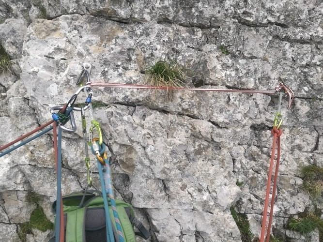

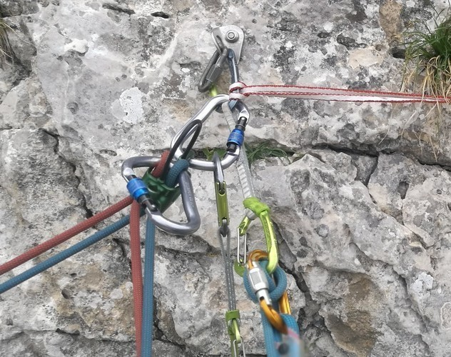

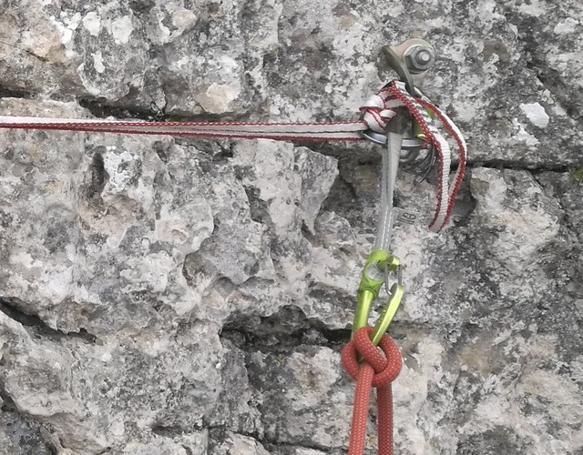

A voir: vachage du second et départ (pose d'une troisième dégaine pour pouvoir éviter chute sans protection)

#### Méthode corde à simple

* Se vacher (directement avec la corde):
* on mousquetonne de préférence directement les pitons plutôt que le tas de cordelettes (si c'est un relais utilisé pour la descente).
* On introduit un mousqueton à vis dans le piton du bas, on le retourne ouverture vers le bas, et on réalise un nœud de cabestan avec sa corde d'assurage, à la bonne longueur pour être confortable avec le relais à peu près à la hauteur du front, corde en tension.
* On règle une longueur suffisante pour ne pas être collé au relais.
* On pose un second mousqueton simple dans le piton du haut, on le retourne, et on fait un nœud de cabestan avec la corde qui vient du mousqueton du bas. En quelque sorte, le piton du haut contre-assure le piton du bas.
* Il n'y a pas répartition des forces sur les deux ancrages, mais chacun a été jugé suffisamment solide.
* On a ici recherché la simplicité du relais et sa rapidité de réalisation.
* Il reste à placer la plaquette d'assurage sur le mousqueton du bas. 

### Cas de points non béton => triangulation du relais

#### Triangulation unidirectionnelle avec sangle trop courte

Solution 1: Fixer la sangle avec des nœuds de cabestan sur chacun des mousquetons placés sur les ancrages. Un mou est laissé dans la portion reliant les deux ancrages, et le nœud du bas n'intéresse que deux épaisseurs de sangle. Ainsi, on consomme beaucoup moins de sangle (ou de cordelette pour un rappel). La sangle dyneema, au point de fusion bas, n'est pas recommandée pour cette utilisation. Les nœuds de cabestan empêchent la dangereuse traction horizontale sur les ancrages.

Solution 2: placer un nœud de huit ou un nœud simple en milieu de sangle, puis de mousquetonner chaque demianneau formé (voir image ci-après) 

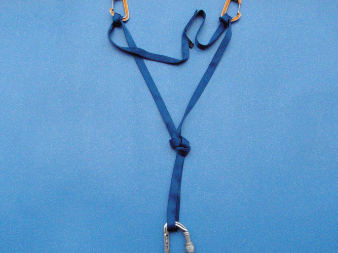

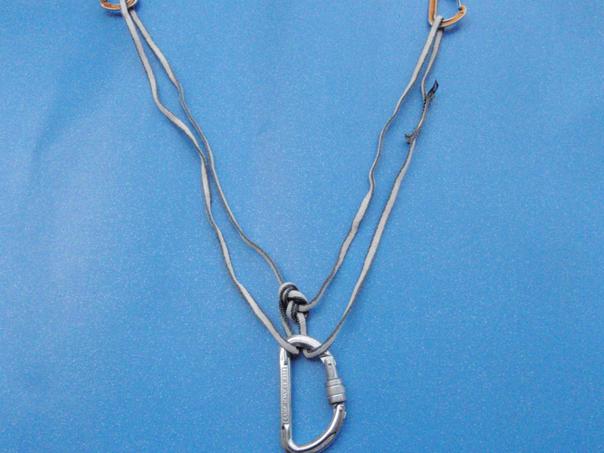

#### Triangulation multi-directionnelle ou uni-directionnelle pour un rappel

* Le nœud de huit placé sur la sangle peut être discutable pour un rappel inconnu. Ceci parce que le nœud fixe définitivement la direction de résistance qu'on a voulu donner au relais.
* Il s'agit d'une triangulation uni-directionnelle, car tirer dans une autre direction ferait supporter la charge sur un seul ancrage.
* Il s'agit donc de descendre le rappel dans la direction choisie, et non de changer en cours de route. Or, dans les rappels inconnus, il arrive fréquemment qu'on jette la corde d'un côté, puis qu'on se ravise en cours de descente car on a aperçu le relais inférieur décalé là où on ne l'attendait pas.
* On peut alors être tenté de ne pas réaliser de nœud sur la sangle, mais de seulement tourner une des deux boucles, comme on l'a longtemps préconisé, pour bénéficier d'un relais multidirectionnel se prêtant aux changements de direction. Malheureusement, une sangle ou une cordelette ne sont pas dynamiques et offrent peu de résistance à un choc. De plus, si la sangle résiste, le choc peut être fatal pour l'ancrage restant. C'est la raison pour laquelle cette option est actuellement abandonnée.
* Si on souhaite conserver une légère mobilité du relais, on lui préfère la solution du paragraphe suivant : le relais semi-directionnel.

Sur l'image suivante, uni-directionnel à gauche : un seul ancrage sollicité en tirant à gauche. Multi-directionnel à droite : solution abandonnée

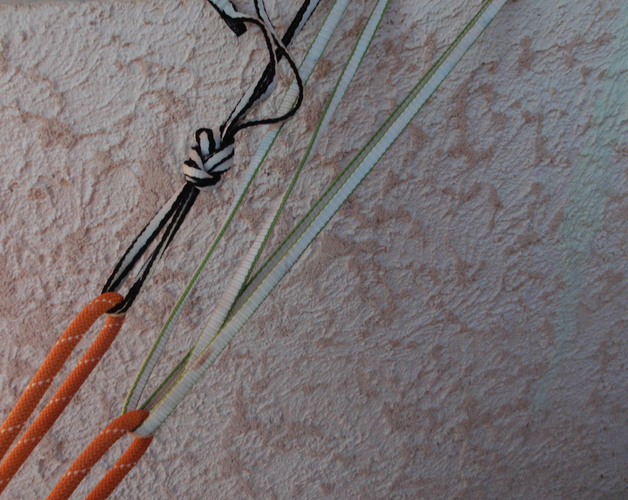

#### Triangulation semi-directionnelle : le bon compromis

Afin de limiter le choc potentiel, on peut placer un nœud sur chacune des branches du V. On obtient ainsi un compromis entre la liberté de mouvement de l'ancrage et le choc réduit. On nomme cette solution triangulation semidirectionnelle. C'est celle qui semble la plus recommandable pour concilier les avantages de chaque technique. On dose le compromis le plus judicieux en rapprochant plus ou moins les nœuds du bas du triangle.

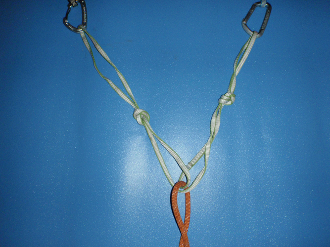

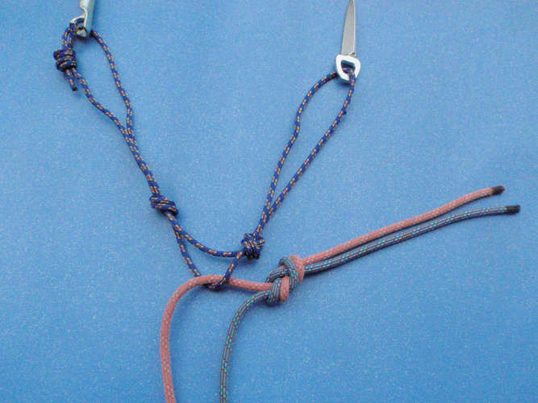

S'il s'agit d'un relais de progression et non de rappel, on peut mousquetonner les deux brins de la sangle à la condition bien sûr d'en tourner un des deux pour ne pas mettre le mousqueton à cheval sur l'ensemble. Les nœuds peuvent être indifféremment des nœuds simples ou des nœuds de huit. On recommande de ne pas laisser davantage que 20cm de débattement entre chaque nœud et le point inférieur du dispositif.

### Cas d'une traversée où l'usage du Reverso en mode relais est trop lent

* Cas d'une traversée où le second se déplace rapidement.
* On fait un relais triangulé ou non pour se vacher dessus en fonction de la qualité des points
* Au lieu de placer le Reverso sur le mousqueton central, on assure le second au baudrier en veillant à passer la corde dans une dégaine de renvoi (afin d'éviter de se faire tirer du relais et de ne pouvoir y revenir en cas de chute du second)

### Cas du Relais en neige.

* Le relais en neige est rarement prescrit en première intention. Si le rocher est proche, on privilégiera le relais en rocher.
* Si la glace est sous-jacente, on la dégagera pour visser deux broches. Si on ne dispose d'aucun ancrage possible en rocher ou en glace, on se résignera à poser un relais en neige, en seconde intention donc.
* Le principe du relais en neige consiste à confectionner un corps mort, un piolet le plus souvent, très en amont de l'assureur. Celui-ci assure le second à l'épaule ou à son pontet par une plaquette d'assurage ou un demi-cabestan, tout en étant vaché en tension sur le corps mort.
*  Dans les Alpes, la neige ne tient pas sur des pentes supérieures à 50 ou 55°, au-delà on a affaire à la glace.

* Le plus classique: piolet enfoui en corps mort.
  * On creuse avec la panne du piolet deux tranchées profondes : une horizontale qui va recevoir le piolet, une verticale partant du milieu de la première vers le bas, qui va accueillir une longue sangle allant au pontet du baudrier de l'assureur.
  * Le piolet est couché dans la tranchée horizontale, la sangle passée au milieu du manche en tête d'alouette ou mieux en nœud de cabestan.
  * L'assureur, vaché à la sangle tendue, se place en contrebas du piolet et assure à l'épaule (vêtements épais obligatoires) ou sur demi-cabestan pour doser un assurage dynamique.
  * Pour renforcer la tenue du corps mort, on doit le recouvrir de neige tassée.

* Relais de rappel
  * le plus simple est un corps-mort fait d'un objet abandonné : pierre trouvée sur place, gourde, sac plastique solide rempli de neige ...
  * En l'absence d'objet à abandonner, le modelage d'un champignon de neige de grand diamètre (2 mètres parfois) peut faire l'affaire en dépannage.
    * On y place directement la corde et on fait des essais de coulissement de la corde avant que le dernier de la cordée ne descende.
    * Sa confection est assez laborieuse : de diamètre trop petit, il est fragile ; de diamètre trop grand, la corde peut refuser de coulisser.
    * Sur une neige très dure de consistance proche de la glace, sa confection plus compacte est plus facile et on peut abandonner une sangle.

## Technique d'assurage au départ d'un relais

### Problème de la chute de facteur 2 - Mousquetonner premier point

* Solution 1 (mauvaise): Plaquette d'assurage au pontet du baudrier, chute du premier de cordée sans premiere degaine posée, chute facteur 2, ça fait mal.
* Solution 2 (mauvaise): Plaquette d'assurage au pontet du baudrier, premier mousquetonne le point le plus élevé du relais avant, pour éviter le facteur 2 et faciliter le blocage de la corde dans la plaquette. Chute de nouveau, le facteur de chute n'a presque pas changé mais deux fois plus d'effort sur le relais
* Solution 3 (déjà mieux) : mettre de la distance entre pontet et point mousquetonné => idem précédemment mais l'assureur descend de 3-4 mètres
* Solution 4 (mieux): si suffisamment de corde, l'assureur a veillé précédemment à mousquetonner le premier piton puis est redesendu au relais pour faire venir le second
* **Solution 5 (préconisée): Assurer avec un nœud de demi-cabestan directement sur le relais triangulé, au moins tant que le leader n'a pas mousquetonné un point dans la longueur. On évite l'effet poulie, la difficulté de freinage s'atténue car nœud de demi-cabestan possède une force de freinage supérieure aux plaquettes, l'assureur ne reçoit aucun choc.**
* Solution 6 (encore mieux): placer un ancrage en plus du relais

### Méthode britannique (Solution 7)

* PRINCIPE: Ancrages réliés individuellement au pontet de l'assureur et assurage du second en plaçant la plaquette d'assurage sur le pontet du baudrier et non sur le relais.
  
* AVANTAGES:
  * Les différents ancrages, coinceurs ou autres, sont reliées par la corde au pontet de l'assureur, chacun séparément. La mise en tension créée par le poids de l'assureur stabilise les coinceurs dans la bonne direction pour les maintenir à leurs places dans les fissures. Alors qu'un relais français reliera les coinceurs par une sangle en V dont la pointe sera tirée vers le dernier point mousquetonné de la longueur, donc dans une direction pas forcément favorable aux coinceurs.
  * On peut ajouter un nouveau coinceur après coup, si on le juge nécessaire : il suffit de refaire un renvoi du pontet au nouveau coinceur avec la suite de la corde.
  * L'assureur est tourné vers le bas, et peut donc suivre la progression du second, et au besoin lui donner des indications concernant les mouvement ou les prises cachées.
  * Le montage est déjà prêt pour que le second parte ensuite en tête dans la longueur suivante. On gagne du temps et le risque de perdre la plaquette dans la manipulation est éliminé.
  * Une chute du second est absorbée par le corps de l'assureur avant d'être transmis aux ancrages
  
* INCONVENIENTS:
  * Réservé aux cordées réversibles, car il est compliqué pour le second de se vacher à son tour à chaque coinceur séparément.
  * On ne peut pas installer un mouflage, car celui-ci devrait être installé sur le pontet de l'assureur.

## Choix d'un assurage du premier de cordée au pontet ou au relais

* Selon l'ENSA, il est préférable d'assurer sur le relais plutôt que sur le pontet lorsque
  * Différence de poids >=30 kg
  * risque de chute en facteur 2
  * risque de grande chute (points espacés) et pas de tirage dans la longueur

Voir [la vidéo](https://www.youtube.com/watch?v=bOsDiov_1NY)

## Relais en neige.

* Le relais en neige est rarement prescrit en première intention. Si le rocher est proche, on privilégiera le relais en rocher.
* Si la glace est sous-jacente, on la dégagera pour visser deux broches. Si on ne dispose d'aucun ancrage possible en rocher ou en glace, on se résignera à poser un relais en neige, en seconde intention donc.
* Le principe du relais en neige consiste à confectionner un corps mort, un piolet le plus souvent, très en amont de l'assureur. Celui-ci assure le second à l'épaule ou à son pontet par une plaquette d'assurage ou un demi-cabestan, tout en étant vaché en tension sur le corps mort.
*  Dans les Alpes, la neige ne tient pas sur des pentes supérieures à 50 ou 55°, au-delà on a affaire à la glace.

* Le plus classique: piolet enfoui en corps mort.
    * On creuse avec la panne du piolet deux tranchées profondes : une horizontale qui va recevoir le piolet, une verticale partant du milieu de la première vers le bas, qui va accueillir une longue sangle allant au pontet du baudrier de l'assureur.
    * Le piolet est couché dans la tranchée horizontale, la sangle passée au milieu du manche en tête d'alouette ou mieux en nœud de cabestan.
    * L'assureur, vaché à la sangle tendue, se place en contrebas du piolet et assure à l'épaule (vêtements épais obligatoires) ou sur demi-cabestan pour doser un assurage dynamique.
    * Pour renforcer la tenue du corps mort, on doit le recouvrir de neige tassée.

* Relais de rappel
    * le plus simple est un corps-mort fait d'un objet abandonné : pierre trouvée sur place, gourde, sac plastique solide rempli de neige ...
    * En l'absence d'objet à abandonner, le modelage d'un champignon de neige de grand diamètre (2 mètres parfois) peut faire l'affaire en dépannage.
        * On y place directement la corde et on fait des essais de coulissement de la corde avant que le dernier de la cordée ne descende.
        * Sa confection est assez laborieuse : de diamètre trop petit, il est fragile ; de diamètre trop grand, la corde peut refuser de coulisser.
        * Sur une neige très dure de consistance proche de la glace, sa confection plus compacte est plus facile et on peut abandonner une sangle.

## Relais sur un arbre

Les arbres peuvent être utilisés comme relais. Pour cela, on fixe une boucle autour de l’arbre avec un nœud de tête d’alouette afin qu'elle ne puisse pas remonter. Un arbre utilisable en relais doit toujours être vert, c'est-à-dire qu'il ne doit pas être mort ou pourri. Le diamètre de l'arbre doit être au moins l'épaisseur d'une jambe.

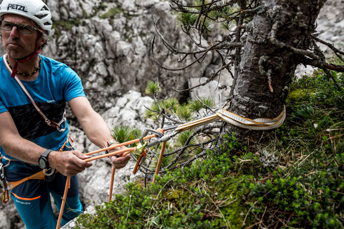

## Relais sur une lunule

Pour être en mesure de faire un relais sur une lunule, celle-ci doit être au moins de l’épaisseur d’un bras au point le plus fin et ne pas avoir de fissures. Pour cela, le grimpeur passe une sangle autour de la lunule. On n’utilise pas de nœud de tête d’alouette car il se déplacerait automatiquement vers le point le plus fin de la lunule, où la résistance est la plus faible. Au lieu de cela, le grimpeur passe une boucle de sangle dans la lunule, de sorte que sous l’effet de la charge elle repose sur sa base - le point le plus solide de la lunule. 

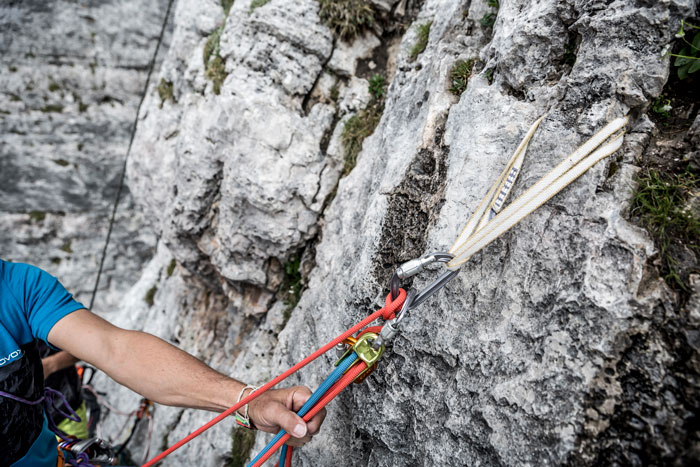

## Relais sur tête de rocher

En terrain alpin, il est fréquent de faire un relais et d’assurer sur une tête de rocher. Attention: Si la sangle peut être soulevée ou déplacée lors de la chute de celui qui grimpe en tête, le point central doit être mis sous tension. Si cela n'est pas possible, il faut le mettre sous tension avec le poids du corps et utiliser un point de rappel.

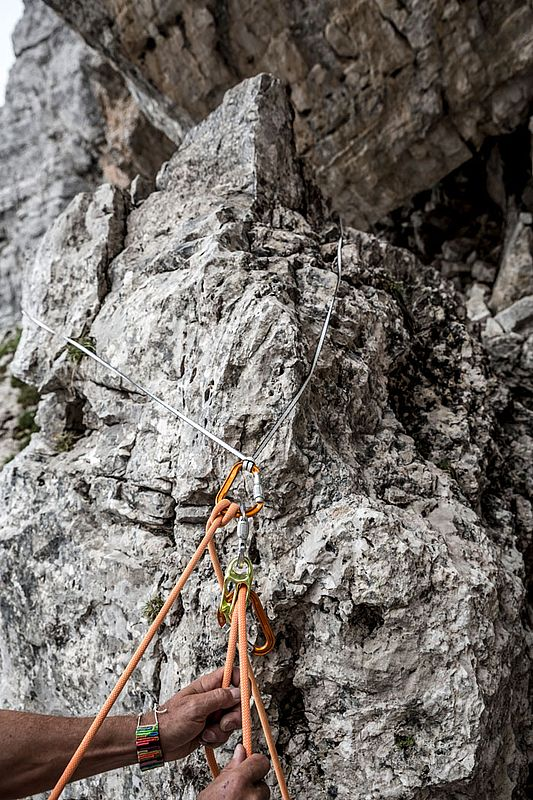