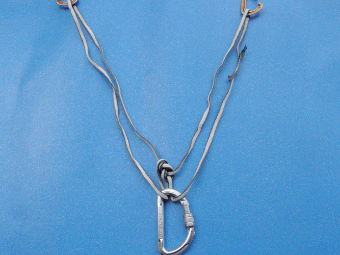
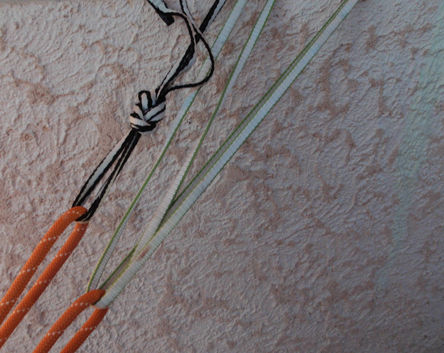
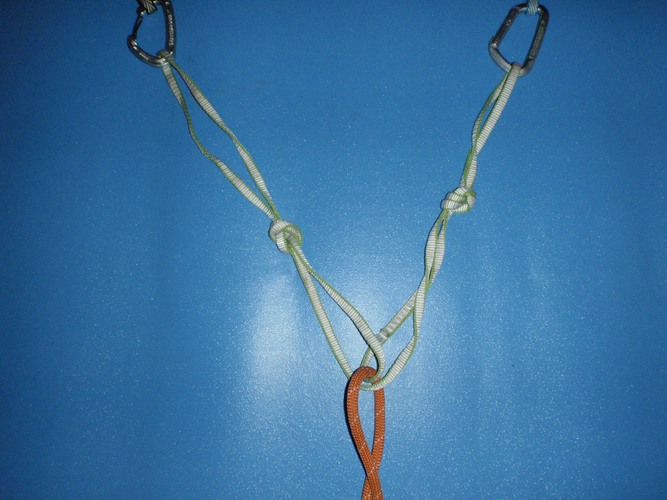

# NOTES ALPINISME

Table des matières

- [NOTES ALPINISME](#notes-alpinisme)
  - [Techniques d'assurage](#techniques-dassurage)
    - [Encordement montagne classique](#encordement-montagne-classique)
    - [Considérations générale sur l'assurage](#consid%C3%A9rations-g%C3%A9n%C3%A9rale-sur-lassurage)
    - [Assurage en mouvement - technique la plus simple](#assurage-en-mouvement---technique-la-plus-simple)
      - [Encordement COURT SANS ANNEAUX A LA MAIN](#encordement-court-sans-anneaux-a-la-main)
      - [Encordement COURT AVEC ANNEAUX A LA MAIN](#encordement-court-avec-anneaux-a-la-main)
      - [Encordement LONG dit souvent « progression à corde tendue »](#encordement-long-dit-souvent-%C2%AB-progression-%C3%A0-corde-tendue-%C2%BB)
      - [ENCORDEMENT EN N](#encordement-en-n)
      - [CAS PARTICULIERS](#cas-particuliers)
    - [Assurage à l'épaule](#assurage-%C3%A0-l%C3%A9paule)
    - [Mini-relais](#mini-relais)
    - [Assurage par longueurs](#assurage-par-longueurs)
    - [L'assurage dynamique - à relativiser](#lassurage-dynamique---%C3%A0-relativiser)
  - [Les relais](#les-relais)
    - [Cas où relais béton non nécessaire](#cas-o%C3%B9-relais-b%C3%A9ton-non-n%C3%A9cessaire)
    - [Relais en neige.](#relais-en-neige)
    - [Triangulation du relais](#triangulation-du-relais)
      - [Triangulation unidirectionnelle avec sangle trop courte](#triangulation-unidirectionnelle-avec-sangle-trop-courte)
    - [Triangulation multi-directionnelle ou uni-directionnelle pour un rappel](#triangulation-multi-directionnelle-ou-uni-directionnelle-pour-un-rappel)
    - [Triangulation semi-directionnelle : le bon compromis](#triangulation-semi-directionnelle--le-bon-compromis)
    - [Technique d'assurage au départ d'un relais](#technique-dassurage-au-d%C3%A9part-dun-relais)
      - [Problème de la chute de facteur 2 - Mousquetonner premier point](#probl%C3%A8me-de-la-chute-de-facteur-2---mousquetonner-premier-point)
      - [Méthode britannique (Solution 7)](#m%C3%A9thode-britannique-solution-7)
  - [Autres techniques générales](#autres-techniques-g%C3%A9n%C3%A9rales)
    - [Le rappel](#le-rappel)
    - [La réchappe](#la-r%C3%A9chappe)
    - [Pliage de corde](#pliage-de-corde)
    - [Remontée sur corde fixe](#remont%C3%A9e-sur-corde-fixe)
    - [Pas d'artif](#pas-dartif)
    - [Hissage de sac](#hissage-de-sac)
  - [Autres techniques en glace ou neige](#autres-techniques-en-glace-ou-neige)
    - [Stopper glissade en pente raide - Position de réchappe](#stopper-glissade-en-pente-raide---position-de-r%C3%A9chappe)
    - [Franchir la rimaye](#franchir-la-rimaye)
    - [Sortie de goulotte en neige : danger.](#sortie-de-goulotte-en-neige--danger)
  - [Encordement & Progression en fonction des cas de figure](#encordement--progression-en-fonction-des-cas-de-figure)
    - [GLACIER ENNEIGE](#glacier-enneige)
    - [PENTE RAIDE NEIGE](#pente-raide-neige)
    - [ARETE DE NEIGE](#arete-de-neige)
    - [ROCHER](#rocher)
    - [GLACE](#glace)
    - [CASCADE DE GLACE](#cascade-de-glace)

## Techniques d'assurage

### Encordement montagne classique

* Chaque membre de la cordée est encordé à une extrémité de la corde par un nœud en huit ou un nœud de chaise assorti de son double nœud d'arrêt, selon sa préférence.
* La corde est en tas, posée au sol. Chacun va raccourcir la corde en prenant des anneaux de buste.
* On place sa main droite, paume ouverte vers bas, devant et légèrement au-dessus du pontet de son baudrier. La main gauche, en glissant le long de la corde depuis le nœud d'encordement, va amener la corde derrière la nuque, de gauche à droite. On fait plusieurs tours, jusqu'à obtenir la bonne longueur entre les grimpeurs, en tenant compte de la longueur nécessaire pour les nœuds d'arrêt.
* Une fois le dernier anneau formé, on enfile le bras droit puis l'épaule droite dans la totalité des anneaux. On a donc ces anneaux en bandoulière sous l'aisselle droite, et derrière l'épaule droite.
* Le dernier anneau passe sous tous les anneaux puis dans la boucle d'encordement que forme le premier nœud d'encordement.

* Il reste à nouer le tout. On fait une boucle avec le dernier anneau qu'on enfile sous tous les anneaux (c'est à dire entre le paquet d'anneaux et la poitrine) de haut en bas. Cette boucle est ensuite repassée dans la boucle du nœud d'encordement initial (ou dans le pontet), puis est nouée sur elle-même par un nœud simple qui emprisonne la corde allant à l'autre grimpeur. En tendant alors cette corde, la tension est transmise à la boucle d'encordement.

* On place enfin un mousqueton entre la boucle et le pontet pour prévenir le lâchage progressif du nœud simple.
* On sécurise généralement la boucle en la mousquetonnant au pontet.

### Considérations générale sur l'assurage

* L'assurage en mouvement est assez long à acquérir. Il faut engranger beaucoup de courses de rocher PD et AD pour devenir vraiment efficace.
* En pratique, il ne faut pas hésiter à changer de méthode en fonction des circonstances et utiliser des [mini-relais](#mini-relais)
* Vous placez un friend ou deux dans le passage que vous surmontez en un éclair puis vous faites relais juste au-dessus. Ça ne prend pas des heures : une sangle sur un becquet, un demi-cabestan : C'est bon, tu peux venir.
* En pratique, on passe d'un mode d'assurage à un autre sans interruption. On cherche à être débrouillard, non académique.
* Connaître parfaitement le niveau d'escalade de son compagnon, ses points forts et ses points faibles (fissures en verrous, dalles friction, ou surplombs...) permet d'aller aux limites de l'assurage en mouvement sans se mettre en danger outre mesure. 
* Ce qui compte n'est pas la rapidité réelle des mouvements mais la fluidité de la progression. Passer sans temps mort d'un encordement court à un encordement long, à une mini-longueur, à une parade ou une petite courte-échelle, est la clef.

### Assurage en mouvement - technique la plus simple

* PRINCIPE:
  * Les membres de la cordée progressent ensemble en cherchant à maintenir la corde à peu près tendue. Si l'un glisse, il est retenu par l'autre.
  * Pas de pose de protections
  * En cas d'obstacle court, le premier de cordée le franchit, paré voire poussé par le second, se cale derrière un recoin du rocher, et assure son compagnon [à l'épaule](#assurage-%C3%A0-l%C3%A9paule) ou directement sur un becquet rocheux avec un [mini-relais](#mini-relais). Le second le rejoint, puis les deux repartent corde tendue.
* AVANTAGES:
  * Rapide et simple
* INCONVENIENTS:
  * L'assurage en mouvement est rudimentaire et apporte nettement moins de sécurité aux grimpeurs que l'assurage par longueurs. Mais la sécurité en montagne ne se réduit pas à la sécurité d'une longueur. Il s'agit aussi de descendre au plus tôt la pente de neige raide avant que le soleil ne la rende dangereuse, de quitter le sommet avant l'orage, de rentrer avant la nuit, et tout simplement de réduire la durée totale de la course afin d'épargner la fatigue de la cordée

#### Encordement COURT SANS ANNEAUX A LA MAIN

* PRINCIPE
  * La distance entre grimpeurs est de 3 à 4 mètres.
  * Le premier de cordée, devant à la montée, derrière à la descente, est toujours plus haut que le second.
  * Personne ne tient d'anneaux à la main.
  
* AVANTAGES:
  * Technique d'assurage qui permet la progression la plus rapide sur un terrain uniforme. 
  * Le second de cordée est bien assuré, sauf dans les traversées. Le leader peut avoir intérêt pour gérer celles-ci à traverser en amont de son second pour éviter un pendule.
  * Le premier de cordée a les deux mains libres. En neige, il peut donc manier deux piolets et être capable en permanence de retenir une glissade du second. En rocher, les deux mains libres lui donnent une grande sûreté.
  * Le risque de faire tomber des pierres est minimum. Les pierres qu'enverrait le leader n'auraient pas le temps de prendre de la vitesse avant d'atteindre le second.

* INCONVENIENTS:
  * Le premier de cordée n'est assuré que par la proximité du second qui peut le parer ou caler ses pieds sur des adhérences précaires. Le leader doit donc être très sûr.

* A UTILISER SI:
    * Terrains faciles pour la cordée - neige, glace, mixte ou rocher - à l'exception des glaciers enneigés en raison du risque de chute en crevasse
    * Pentes de neige raides, en montée et en descente
    * Gradins rocheux sans possibilité d'assurage, en montée et en descente
    * Arêtes de neige délicates non cornichées, en progressant de part et d'autre du fil, ce qui assez pénible mais sûr

* A NE PAS/PLUS UTILISER SI:
  * Nécessité fréquente de franchir des obstacles, si ceux-ci excèdent en hauteur la longueur d'encordement. Pour de tels obstacles, la marche aux anneaux est plus indiquée.
  * Le leader n'a plus la capacité de retenir une glissade du second.

#### Encordement COURT AVEC ANNEAUX A LA MAIN

* PRINCIPE:
  * La distance entre les grimpeurs est de 2 à 3 mètres.
  * Le premier de cordée, devant à la montée, derrière à la descente, est toujours plus haut que le second.
  * Le premier de cordée tient dans sa paume aval trois ou quatre mètres de corde, lovés en anneaux dont le dernier est serré en tour mort autour de la main. Ce dernier anneau doit toujours être le premier qu'on peut lâcher. Ceci implique de devoir retourner le paquet quand on change de main. Les anneaux sont assez courts
  * La corde est tendue comme une laisse entre la main aval et le pontet du second. Ceci permet au leader de sentir un début de glissade du second, et de le remettre en selle d'un coup de poignet énergique.
  * Si le leader monte plus vite que le second, il lâche des anneaux progressivement. S'il est rattrapé, il reprend des anneaux.
  * A la descente, s'il rattrape son second, il reprend des anneaux. S'il se fait distancer, il lâche des anneaux.
  * Il pense à bien refaire le dernier tour serré à chaque fois.

* AVANTAGES:
  * ???
  
* INCONVENIENTS
  * Le leader est non seulement mal assuré, mais doit maintenir en permanence la tension de la corde. Sa main occupée est un handicap non seulement pour grimper mais aussi pour rattraper une glissade du second. 
  
* A UTILISER SI
  * Terrains faciles pour la cordée, à la condition que le leader se sente capable de gérer les anneaux. à l'exception des glaciers enneigés
  * Terrain facile semé de courts passages plus difficiles

* A NE PAS/PLUS UTILISER SI:
  * Idem méthode d'encordement court sans anneaux
  * Premier de cordée n'est pas à l'aise avec la technique.
  * Pente de neige raide uniforme, sans franchissement d'obstacle, rien ne justifie de s'encombrer avec des anneaux, d'autant plus si on possède deux piolets. La méthode d'encordement court sans anneaux est alors préférable.
  * Sur des gradins rocheux uniformes sans possibilités d'assurage, le leader préférera sans doute aussi avoir ses deux mains libres.

#### Encordement LONG dit souvent « progression à corde tendue »

* PRINCIPE:
  * La distance entre les deux grimpeurs est de 12 à 15 mètres environ.
  * Le premier de cordée est devant à la montée.
  * A la descente, celui qui va devant est celui qui place le plus efficacement les protections. Celui qui va derrière est celui qui désescalade le mieux.
  * Personne ne tient d'anneaux à la main.
  * La tension de la corde est toute relative. Elle chemine à droite et à gauche des différents reliefs que présente le parcours. On en joue, afin que le passage de la corde suffise parfois à protéger la cordée
  * Celui qui va devant place des protections régulièrement avec trois objectifs :
    * Conserver au moins deux bonnes protections entre les deux grimpeurs. Si le terrain est un tantinet avare en possibilités, quand le compagnon de cordée arrive à une protection, il le signale avant de la démonter. Ceci permet au premier de cordée de vérifier si la cordée sera toujours protégée où s'il doit poser sans tarder une nouvelle protection.
    * A la montée, placer la protection juste avant le pas difficile, pour se protéger soi, comme on le fait classiquement quand on grimpe en tête.
    * A la descente, placer la protection juste après le pas difficile, pour protéger son compagnon de cordée qui va descendre ensuite. 
  * Quand le premier de cordée a épuisé son matériel, le second le rejoint pour soit lui rendre le matériel soit passer en premier de cordée.

* AVANTAGES:
  * La méthode est rapide, mais moins que les deux méthodes précédentes.
  * Les deux grimpeurs sont efficacement protégés à la condition que le second soit suffisamment discipliné pour ne pas laisser un mou se créer entre les deux grimpeurs. Il ne doit pas non plus bloquer dans un pas d'escalade sans prévenir le premier de cordée qui pourrait se trouver stoppé au plus mauvais moment.
  
* A UTILISER SI:
  * Voie rocheuse assez difficile mais facilement protégeable
  * Arête rocheuse (encordement à douze mètres maximum pour s'entendre, éviter un tirage excessif et réduire le risque de chute de pierres).
  * Pente de glace (encordement à vingt mètres minimum pour éviter de brocher et débrocher sans arrêt).
  * Terrain mixte assez difficile ;
  * Arêtes de neige faciles.

* A NE PAS/PLUS UTILISER SI:
  * Risque grandissant de chute du second. S'il chute, il risque d'entraîner le leader dans un vol en premier de cordée.
  * Quand le second se trouve trop limite dans la plupart des passages : relais.

#### ENCORDEMENT EN N

* PRINCIPE: L'encordement pour marche sur glacier en N est une variante de l'encordement long, mais sans pose de points intermédiaires.
* La réserve en vrac dans le sac
  * L'encordement en N préconisé pour un glacier enneigé (crevasses masquées) prévoit originellement de placer un tiers de la corde plié en écheveau sous le rabat de son sac à dos.
  * Récemment, on préconise plutôt de placer cet excédent de corde en vrac à l'intérieur du sac. Ceci permet de tirer la longueur de corde utile à une remontée sur corde ou à un mouflage sans devoir nécessairement ôter son sac à dos, et ce de façon plus rapide.
  * La corde doit être soigneusement introduite dans le sac en commençant par son extrémité, pour qu'elle puisse sortir sans nœud. Certains appellent cela enkiter la corde.

#### CAS PARTICULIERS

* Progression sur une arête de neige effilée horizontale: La distance entre les deux grimpeurs est de 5 à 6 mètres, le leader tenant deux ou trois mètres d'anneaux à la main. Il se place derrière son second pour le garder à vue si la trace est faite. En cas de chute sur un versant, le leader doit lâcher les anneaux et sauter de l'autre côté en tâchant de ne pas se blesser. Les anneaux lâchés donnent le temps nécessaire pour réagir.

### Assurage à l'épaule

* L'assurage à l'épaule consiste à se caler solidement derrière une saillie, la jambe avant devant être capable de supporter le poids du second sans déraper.
* La corde partant de l'assuré passe par la main avant en supination, passe sous l'aisselle du même côté, derrière le dos, puis sur l'épaule opposée, pour finir devant la poitrine dans l'autre main en pronation.
* On ne peut avec cette méthode qu'enrayer une glissade que l'assuré va devoir finir de stopper lui-même. 
* Vêtements épais pour l'assureur, des manches longues, le port de gants en cuir brut.
* L'assureur peut aussi s'auto-assurer à un becquet pour consolider sa position, mais dans ce cas, pourquoi ne pas assurer directement sur ce becquet avec un demi-cabestan ? Dans ce cas, la vache passe du même côté du corps que la corde qui va à l'assuré.

### Mini-relais

Les mini-relais (pour mini-longueurs) consistent à interrompre la progression simultanée le temps de franchir un passage plus difficile. Chacun son tour, mais on conserve l'encordement réduit. On place une sangle sur un becquet, le second se vache assez long pour pouvoir parer et passe la corde dans un demi-cabestan à son pontet.

### Assurage par longueurs

* Avec une corde à double, on ne mousquetonne qu'un brin à la fois pour diminuer la force de choc exercée sur les ancrages et réduire le tirage. On peut très bien mousquetonner plusieurs fois de suite le même brin, sans obligation d'alterner scrupuleusement, l'essentiel étant que les brins ne se croisent pas. En gros, un brin à gauche et un à droite. Aux changements de direction, on passe systématiquement le brin qu'on mousquetonne sous l'autre brin pour ne pas croiser.
* Des longueurs courtes
* Retaper les pitons: A chaque piton rencontré dans la voie : le marteau, deux coups sur le piton pour le tester, davantage s'il faut le renfoncer. 

### L'assurage dynamique - à relativiser

* Assurage dynamique: sauter vers le haut, avancer d'un pas ou lâcher un grand mou lorsque le copain s'envole.
* L'argument est la diminution de la force de choc afin que la réception du vol se fasse dans la douceur... à la condition que cela ne finisse pas par terre ou par un télescopage du grimpeur avec son assureur comme on le voit plus souvent qu'on ne voudrait.
* Il est vrai qu'un coulissement, même faible, de la corde dans le système d'assurage amortit le choc et permet une grande dissipation d'énergie. Mais est-il indispensable de sauter jusqu'à la première dégaine et pour éviter quoi au juste ? Les cordes dynamiques sont conçues et normées pour ne pas pouvoir transmettre une force de choc supérieure à 1200 daN (800 daN pour un brin d'une corde à double) lors d'une chute de facteur 1,77 d'un poids rigide guidé.
* Or, cette situation défavorable n'existe pas en salle d'escalade. Une fois le premier point clippé, la chute au niveau de la seconde dégaine va soit provoquer un facteur de chute proche de 1 si le mou strictement nécessaire a été donné, soit une chute au sol si le mou est excessif.
* La force de choc est donc d'emblée très inférieure aux 1200 daN qui sont pourtant déjà sans dommage pour le corps humain. Une fois les dégaines suivantes clippées, elle diminuera encore.
* En montagne, prendre d'emblée l'habitude d'assurer de manière dynamique, soit en sautant vers le haut quand on le peut, soit en donnant un bon mètre de mou pendant le vol, risque de conditionner un réflexe préjudiciable dans beaucoup de circonstances quand une chute trop longue ferait rencontrer directement une proéminence du terrain : terrasse, vire, écaille saillante, becquet, pieux métallique,
* S'il est bon de savoir comment assurer de manière dynamique, ce qui peut être utile parfois sur un relais en neige, en glace avec des broches douteuses, en rocher au-dessus d'un mauvais piton, on se gardera d'en faire une habitude. L'élasticité du système d'assurage peut se parfaire en montagne moins dangereusement avec l'emploi du nœud de demi-cabestan, l'utilisation pour les points douteux de dégaines-explose (dégaines à absorption d'énergie), la bonne gestion du tirage (un tirage important augmente la force de choc transmise au dernier ancrage) ou le mousquetonnage d'un seul brin de la corde à double.

## Les relais

Escalade sportive vs alpinisme :
* Le relais comporte un maillon primaire. Commencez par retaper les pitons puis par vous vacher n'importe où, plutôt que de vous lancer dans une longue recherche d'un éventuel maillon primaire. Il ne s'agit pas d'être scolaire mais efficace.
* Le relais doit être inarrachable. On croirait une publicité pour la colle du dentier de votre grand-père... Imaginez qu'un auteur vous dise que le relais doit être fragile.
* Le relais doit comporter deux points. Le relais sur piton unique était dans le passé de pratique courante., c'st à la fin des années 80 que le doublement se généralise. Bref, le chiffre deux ne possède aucun pouvoir magique : un piton solide vaut mieux que deux foireux, lesquels méritent d'en planter un troisième, et ainsi de suite jusqu'à obtenir une solidité suffisante pour le service que vous allez demander à votre relais. Car vous ne demanderez pas la même chose à tous vos relais.

### Cas où relais béton non nécessaire

* VIRE LARGE, HORIZONTALE, NON GLISSANTE faisant suite une longueur facile: On se cale pour assurer le second à l'épaule dans le but d'enrayer une petite glissade éventuelle. Pour la longueur suivante, l'assureur n'aura pas plus besoin de relais qu'à la salle d'escalade avec les deux pieds par terre. Il vaut mieux le parer que fabriquer un relais parfaitement inutile.
  
* RELAIS DE LA FIN DES DIFFICULTES: A partir d'ici, vous allez raccourcir l'encordement et partir corde tendue. Le relais doit uniquement
résister à la mise en tension de la corde en cas de chute du second : un choc faible. Si vous devez hisser un sac, l'affaire est différente : relais plus solide.

### Relais en neige.

* Le relais en neige est rarement prescrit en première intention. Si le rocher est proche, on privilégiera le relais en rocher.
* Si la glace est sous-jacente, on la dégagera pour visser deux broches. Si on ne dispose d'aucun ancrage possible en rocher ou en glace, on se résignera à poser un relais en neige, en seconde intention donc.
* Le principe du relais en neige consiste à confectionner un corps mort, un piolet le plus souvent, très en amont de l'assureur. Celui-ci assure le second à l'épaule ou à son pontet par une plaquette d'assurage ou un demi-cabestan, tout en étant vaché en tension sur le corps mort.
*  Dans les Alpes, la neige ne tient pas sur des pentes supérieures à 50 ou 55°, au-delà on a affaire à la glace.

* Le plus classique: piolet enfoui en corps mort.
    * On creuse avec la panne du piolet deux tranchées profondes : une horizontale qui va recevoir le piolet, une verticale partant du milieu de la première vers le bas, qui va accueillir une longue sangle allant au pontet du baudrier de l'assureur.
    * Le piolet est couché dans la tranchée horizontale, la sangle passée au milieu du manche en tête d'alouette ou mieux en nœud de cabestan.
    * L'assureur, vaché à la sangle tendue, se place en contrebas du piolet et assure à l'épaule (vêtements épais obligatoires) ou sur demi-cabestan pour doser un assurage dynamique.
    * Pour renforcer la tenue du corps mort, on doit le recouvrir de neige tassée.

* Relais de rappel
    * le plus simple est un corps-mort fait d'un objet abandonné : pierre trouvée sur place, gourde, sac plastique solide rempli de neige ...
    * En l'absence d'objet à abandonner, le modelage d'un champignon de neige de grand diamètre (2 mètres parfois) peut faire l'affaire en dépannage.
        * On y place directement la corde et on fait des essais de coulissement de la corde avant que le dernier de la cordée ne descende.
        * Sa confection est assez laborieuse : de diamètre trop petit, il est fragile ; de diamètre trop grand, la corde peut refuser de coulisser.
        * Sur une neige très dure de consistance proche de la glace, sa confection plus compacte est plus facile et on peut abandonner une sangle.

### Triangulation du relais

#### Triangulation unidirectionnelle avec sangle trop courte

Solution 1: Fixer la sangle avec des nœuds de cabestan sur chacun des mousquetons placés sur les ancrages. Un mou est laissé dans la portion reliant les deux ancrages, et le nœud du bas n'intéresse que deux épaisseurs de sangle. Ainsi, on consomme beaucoup moins de sangle (ou de cordelette pour un rappel). La sangle dyneema, au point de fusion bas, n'est pas recommandée pour cette utilisation. Les nœuds de cabestan empêchent la dangereuse traction horizontale sur les ancrages.

Une autre façon de procéder, rapide et astucieuse, consiste à placer un nœud de huit ou un nœud simple en milieu de sangle, puis de mousquetonner chaque demianneau formé: 

Montage dit parfois répartiteur Vertaco:

### Triangulation multi-directionnelle ou uni-directionnelle pour un rappel

Le nœud de huit placé sur la sangle peut être discutable pour un rappel inconnu. Ceci parce que le nœud fixe définitivement la direction de résistance qu'on a voulu donner au relais. Il s'agit d'une triangulation uni-directionnelle, car tirer dans une autre direction ferait supporter la charge sur un seul ancrage. Il s'agit donc de descendre le rappel dans la direction choisie, et non de changer en cours de route. Or, dans les rappels inconnus, il arrive fréquemment qu'on jette la corde d'un côté, puis qu'on se ravise en cours de descente car on a aperçu le relais inférieur décalé là où on ne l'attendait pas. On peut alors être tenté de ne pas réaliser de nœud sur la sangle, mais de seulement tourner une des deux boucles, comme on l'a longtemps préconisé, pour bénéficier d'un relais multidirectionnel se prêtant aux changements de direction. Malheureusement, une sangle ou une cordelette ne sont pas dynamiques et offrent peu de résistance à un choc. De plus, si la sangle résiste, le choc peut être fatal pour l'ancrage restant. C'est la raison pour laquelle cette option est actuellement abandonnée. Si on souhaite conserver une légère mobilité du relais, on lui préfère la solution du paragraphe suivant : le relais semi-directionnel.

Uni-directionnel à gauche : un seul ancrage sollicité en tirant à gauche.
Multi-directionnel à droite : solution abandonnée

### Triangulation semi-directionnelle : le bon compromis

Afin de limiter le choc potentiel, on peut placer un nœud sur chacune des branches du V. On obtient ainsi un compromis entre la liberté de mouvement de l'ancrage et le choc réduit. On nomme cette solution triangulation semidirectionnelle. C'est celle qui semble la plus recommandable pour concilier les avantages de chaque technique. On dose le compromis le plus judicieux en rapprochant plus ou moins les nœuds du bas du triangle.

Semi-directionnel, dit parfois répartiteur d'alpiniste:

Semi-directionnel pour un rappel:

S'il s'agit d'un relais de progression et non de rappel, on peut mousquetonner les deux brins de la sangle à la condition bien sûr d'en tourner un des deux pour ne pas mettre le mousqueton à cheval sur l'ensemble. Les nœuds peuvent être indifféremment des nœuds simples ou des nœuds de huit. On recommande de ne pas laisser davantage que 20cm de débattement entre chaque nœud et le point inférieur du dispositif.

### Technique d'assurage au départ d'un relais

#### Problème de la chute de facteur 2 - Mousquetonner premier point

* Solution 1 (mauvaise): Plaquette d'assurage au pontet du baudrier, chute du premier de cordée sans premiere degaine posée, chute facteur 2, ça fait mal.
* Solution 2 (mauvaise): Plaquette d'assurage au pontet du baudrier, premier mousquetonne le point le plus élevé du relais avant, pour éviter le facteur 2 et faciliter le blocage de la corde dans la plaquette. Chute de nouveau, le facteur de chute n'a presque pas changé mais deux fois plus d'effort sur le relais
* Solution 3 (déjà mieux) : mettre de la distance entre pontet et point mousquetonné => idem précédemment mais l'assureur descend de 3-4 mètres
* Solution 4 (mieux): si suffisamment de corde, l'assureur a veillé précédemment à mousquetonner le premier piton puis est redesendu au relais pour faire venir le second
* Solution 5 (préconisée): Assurer avec un nœud de demi-cabestan directement sur le relais triangulé, au moins tant que le leader n'a pas mousquetonné un point dans la longueur. On évite l'effet poulie, la difficulté de freinage s'atténue car nœud de demi-cabestan possède une force de freinage supérieure aux plaquettes, l'assureur ne reçoit aucun choc.
* Solution 6 (encore mieux): placer un ancrage en plus du relais

#### Méthode britannique (Solution 7)

* PRINCIPE: Ancrages réliés individuellement au pontet de l'assureur et assurage du second en plaçant la plaquette d'assurage sur le pontet du baudrier et non sur le relais.
  
* AVANTAGES:
  * Les différents ancrages, coinceurs ou autres, sont reliées par la corde au pontet de l'assureur, chacun séparément. La mise en tension créée par le poids de l'assureur stabilise les coinceurs dans la bonne direction pour les maintenir à leurs places dans les fissures. Alors qu'un relais français reliera les coinceurs par une sangle en V dont la pointe sera tirée vers le dernier point mousquetonné de la longueur, donc dans une direction pas forcément favorable aux coinceurs.
  * On peut ajouter un nouveau coinceur après coup, si on le juge nécessaire : il suffit de refaire un renvoi du pontet au nouveau coinceur avec la suite de la corde.
  * L'assureur est tourné vers le bas, et peut donc suivre la progression du second, et au besoin lui donner des indications concernant les mouvement ou les prises cachées.
  * Le montage est déjà prêt pour que le second parte ensuite en tête dans la longueur suivante. On gagne du temps et le risque de perdre la plaquette dans la manipulation est éliminé.
  * Une chute du second est absorbée par le corps de l'assureur avant d'être transmis aux ancrages
  
* INCONVENIENTS:
  * Réservé aux cordées réversibles, car il est compliqué pour le second de se vacher à son tour à chaque coinceur séparément.
  * On ne peut pas installer un mouflage, car celui-ci devrait être installé sur le pontet de l'assureur.

## Autres techniques générales

### Le rappel

* En cas de descente lourdement chargé ou corde très lisse, on peut avoir avantage à entourer plusieurs fois la jambe (pantalon de rigueur) avec la corde libre pour augmenter le freinage, ou bien utiliser un renvoi sur mousqueton
* A VERIFIER !!! Le nœud de jonction des deux brins est le nœud de huit. Le nœud de vache est maintenant abandonné.
    * Moins durable qu'un double nœud de pêcheur qui demeure le nœud d'aboutement de référence dans l'industrie, quand deux cordes reliées doivent servir toute une journée de travail. Ceci veut dire que l'utilisation du nœud de jonction en huit pour de nombreux rappels successifs suppose qu'on vérifie de nouveau le nœud à chaque rappel et qu'on le réajuste s'il a glissé.
* On recommande de laisser 30cm minimum de brins libres après le nœud. Les brins doivent rester parallèles dans le nœud pour pouvoir le serrer intimement jusqu'à former une boule et non un huit à plat.
* Les brins doivent être soigneusement pliés en écheveaux avant d'être lancés, le premier descendu installe le relais suivant en changeant la cordelette, se vache, crie « libre ».
* Pendant la descente du second, le premier installe déjà le brin à tirer dans l'anneau en pensant que le nœud d'aboutement doit se trouver contre le rocher, ceci pour éviter l'effet de la plaquette réverso: le brin du dessus plaqué contre le brin du dessous bloque celui-ci.
* Quand la longueur du rappel est inconnue et qu'on a aucune visibilité sur l'extrémité basse de la corde, on peut être tenté de réaliser d'emblée un nœud en bout de corde qui relie les deux brins mais problématique en cas de coincement.
* On recommande actuellement de lancer les deux brins dépourvus de nœud en bout de corde, de réaliser l'essentiel de la descente, puis, arrivé à une dizaine de mètres de  l'extrémité, de se laisser bloquer par son autobloquant, de ramener la corde restante à soi pour faire à ce moment seulement le nœud de sécurité rassemblant les deux brins en bout de corde.

### La réchappe

* Si vous êtes à un piton infaillible et que vous n'avez pas dépassé la moitié de la longueur, vous laissez un mousqueton et vous vous faites mouliner jusqu'au relais. 
* Si le piton est infaillible mais que vous êtes plus près de vos sous, vous vous vachez au piton, vous passez un anneau de cordelette dans son œil, et vous installez un rappel avec un autobloquant qui fonctionne dans les deux sens.
* Vous pouvez aussi être à un piton inspirant peu confiance sans possibilité de renforcer l'ancrage, et avoir dépassé le milieu de la corde. Le mieux est d'abandonner un mousqueton, de vous faire mouliner par le second très doucement sur un seul brin tandis qu'il ravale le deuxième brin au fur et à mesure de votre descente. Ainsi, vous ne risquez pas plus qu'un vol en premier de cordée.
* Si vous grimpez avec une corde à simple, il faudra placer un autobloquant costaud entre votre pontet et la corde qui monte, que vous ferez coulisser pendant votre descente. Dès que vous arrivez à un ancrage solide de la longueur, vous vous vachez, vous vous décordez du brin qui passe dans le mousqueton du haut, vous rappelez la corde et vous vous encordez de nouveau. Vous êtes revenu dans le premier cas de figure plus favorable.
* On peut objecter que se faire mouliner sur un point fragile n'est pas judicieux en raison de l'effet poulie qui double la charge sur l'ancrage par rapport à un rappel. Ceci est vrai. Mais installer un rappel est beaucoup plus long à réaliser, on sera donc plus longtemps sur le point douteux.
* Avec une corde double, on peut installer un rappel sur un seul brin, tandis que le second continue d'assurer sur le second brin pendant toute l'installation du rappel puis pendant toute la descente. Tout ceci va être bien chronophage et disproportionné si le piton n'est pas franchement minable et qu'il suffit de quelques mètres de moulinette pour atteindre un ancrage sûr.

### Pliage de corde

* En montagne, vous allez plier et déplier la corde de nombreuses fois, pour changer l'encordement, sortir un brin pour grimper une longueur avec la corde à double, en ranger un quand vous continuez à corde tendue, préparer un rappel, etc.
* Il n'est pas besoin d'envoyer les ganses derrière la nuque. Les brassées se prennent dans la paume en écartant les deux bras pour augmenter l'amplitude. Puis on finit en formant une poupée, et non en saucissonnant le milieu de l'écheveau, afin d'avoir un objet compact facile à fourrer dans le sac à dos. 91
* Le pliage en écheveau toronne moins la corde que le pliage en couronne, il est donc préférable avant de lancer un rappel.
* Par contre le pliage en couronne est plus rapide et permet de porter le brin en bandoulière. Sa meilleure indication est au pied du dernier rappel qu'il faut fuir le plus vite possible sous peine de recevoir les pierres des cordées suivantes.
    * Tandis que l'un tire la corde puis préparera le brin qui permet de se ré-encorder avec les anneaux de buste, l'autre plie déjà, au fur et à mesure de sa récupération, le premier brin qui vient, puis le passe en écharpe sans besoin d'ouvrir le sac. 

### Remontée sur corde fixe

* Matériel sophistiqué pour confort dans les longueurs (spéléo, big wall) - poignéesbloqueurs, bloqueurs de poitrine, bloqueurs de pied
* Matériel dispo (sangle et cordelette) pour s'échapper de situation compliquée en haute montagne
    * 2 cordelettes de 6mm, fermées en anneaux par un double-nœud de pêcheur, l'un de 60cm pour le baudrier, l'autre de 120cm pour la pédale de pied.

* Technique de remontage
    * Des noeuds autobloquants (Prussik ou Machard) permettent de fixer ces anneaux à la corde fixe, et de les coulisser vers le haut l'un après l'autre pendant la progression.
    * Première technique
        * On place l'anneau de 120cm en dessous de l'anneau de 60cm.
        * En se levant sur la pédale, la corde se tend et facilite le déplacement de l'autobloquant du baudrier vers le haut. Une fois celui-ci glissé au maximum vers le haut, on s'assied dans le baudrier, puis on plie la jambe pour monter l'autobloquant du bas, et ainsi de suite.  
    * Deuxième technique
        * La seconde technique à connaître utilise l'anneau de 60cm pour le baudrier, et un nœud de cœur en remplacement de l'anneau de 120cm.
        
        
        
        La corde forme un nœud de cœur autour des deux mousquetons côte à côte. Une sangle est fixée dans le bas des deux mousquetons. Cette sangle forme une tête d'alouette autour du pied pour réaliser une pédale bien serrée.
        
        * L'avantage de cette technique est une grande rapidité pour une fatigue réduite, mais elle nécessite de ne pas démarrer pendu en bout de corde. Vous ne pourrez donc  utiliser cette technique qu'après avoir amorcé la remontée par la première technique pour avoir un peu de corde libre, ou bien sur glacier, en utilisant la réserve de corde d'un encordement en N.
        * C'est la technique qui nécessite le moins de matériel puisqu'il suffit d'un anneau de cordelette, de deux mousquetons pour le nœud de cœur (de préférence de même modèle pour un blocage plus sûr), et d'une petite sangle pour la pédale.
    * Alternatives
        * Le machard sur mousqueton est également très agréable à utiliser car il coulisse plus facilement qu'un nœud de Prusik.
        Le machard croisé sur sangle est à essayer, au cas où.

* Remontée sur rappel
    * Le rappel ne se remonte évidemment qu'à la condition qu'on ait encore à sa disposition les deux extrémités.
    * Si on ne les a pas, on grimpe en s'assurant en premier de cordée avec la portion de corde qu'on a pu rappeler, jusqu'à la seconde extrémité qui pend en l'air, puis on démarre la remontée sur corde à cet endroit.
    * On remonte en emprisonnant les deux brins à la fois dans les autobloquants.

* Remontée en crevasse
    * Sur un glacier, une fois dans la crevasse, retirer votre sac sera souvent la première chose à faire.
    * Accrochez votre piolet à un porte-matériel du baudrier
    * Mettez une sangle à votre pontet en tête d'alouette, accrochez-y votre sac à dos pour gagner un peu de liberté et avoir accès à votre matériel
    * retirez vos lunettes de glacier et mettez-les dans la poche du rabat, sortez une fourrure polaire et enfilez-la
    * Récupérer frontale
    * Installer votre matériel de remontée
    * Votre remontée doit être efficace et sans à coup,il ne s'agit pas d'arracher le méchant piolet qui fait office de relais de fortune et de l'entraîner avec vous. Répétez ces techniques et peaufinez-les. 

### Pas d'artif

Voici les étapes pour franchir un pas en artif :
* On pose le coinceur, on mousquetonne la dégaine On se pend dessus, d'abord doucement pour le tester, puis on y met franchement tout son poids.
* On mousquetonne alors seulement la corde.
* On mousquetonne l'étrier en sangle sur le mousqueton du haut de la dégaine.
* On se vache très court avec une dégaine entre le pontet et ce mousqueton du haut, du côté opposé au doigt.
* On passe un pied dans une marche de l'étrier et on se lève. La dégaine qui sert de vache aide à se redresser dans un mouvement d'opposition avec le pied et pivote vers le haut.
* Une fois debout sur l'étrier, on pose un autre coinceur plus haut et on recommence l'opération.
* On récupère l'étrier dès qu'on a mousquetonné la corde sur le nouveau point en se laissant descendre à la corde.
* On se rapproche de nouveau du coinceur du haut en se tirant à la corde, comme à la salle quand on remonte après un vol.

La dégaine sur laquelle on est vaché, très courte, est accrochée au mousqueton du haut de la dégaine d'assurage, côté opposé au doigt.

### Hissage de sac

* La poulie autobloquante micro-traction de Petzl (85g) est l'outil idéal pour le hissage du sac. Elle sera aussi d'un grand secours en cas de mouflage. La combinaison tibloc (39g) et poulie oscillante P02 de Petzl (42g), convient aussi.

Le brin du sac est sur la poulie autobloquante, le brin du second sur la plaquette:

Tête de mouflage faite de la poulie autobloquante, renvoi inférieur sur mousqueton et tibloc, renvoi supérieur sur mousqueton. On peut ainsi tirer vers soi en étant positionné sous le relais:

## Autres techniques en glace ou neige

### Stopper glissade en pente raide - Position de réchappe

* Il n'est pas possible de stopper la glissade du compagnon de cordée si celui-ci est passif.

Position de réchappe.

* Le plus tôt possible, il tente de se retourner sur le ventre en conservant la tête à l'amont.
* PIOLET:
    * Il pèse de sa poitrine sur la tête de piolet tenue d'une main tandis que la seconde main tient le bas du manche, c'est à dire avec la même saisie que la technique du piolet-ancre.
    * Ainsi, la lame raye la neige à la manière d'un soc de charrue et freine progressivement.
    * On s'arrange pour que la pique ne s'enfonce pas dans la neige en relevant soigneusement le bas du manche, sinon, le piolet pourrait se bloquer d'un coup.
* PIEDS
    * En neige dure, on relève les pieds pour éviter de rebondir sur les pointes avant des crampons.
    * En neige molle, on écarte les pieds et on s'en sert pour freiner davantage, mais avec d'infinies précautions si l'on a chaussé les crampons pour ne pas risquer un arrêt brutal des pieds et une bascule tête en bas, et seulement après avoir déjà ralenti franchement par l'action du piolet. 

### Franchir la rimaye

L'état de la rimaye fait partie des conditions à vérifier pour préparer une course. Certaines courses sont réputées ne pouvoir se faire que jusqu'en milieu de saison pour cette raison.
* En bonne condition, la rimaye est bouchée et forme simplement une fente ou une petite marche. Un grand pas et l'affaire est faite.
* Quand elle est plus ouverte, un pont de neige solide peut avoir été construit par la dernière coulée ayant purgé la pente. On passe rapidement, puis on dégage vite de la goulotte d'avalanche, car plus haut que le halo de la frontale, plusieurs centaines de mètres de dénivelée organisés en entonnoir ne demandent qu'à passer par là au moindre appel de la pesanteur.
* Quand le pont de neige est douteux, on en fait un examen approfondi, en allant voir du côté gauche puis du côté droit. La glace, la neige, sont solides à la compression, pas à la traction. Aussi, on cherche à savoir si les piliers sont compacts de chaque côté du pont. La neige du milieu doit reposer sur une sorte de voûte soumise à la compression.
* Si vous n'avez pas de chance, la rimaye se présente comme un mur, la lèvre supérieure étant très au-dessus de la lèvre inférieure.
* Franchir le mur peut ne pas être facile car il est généralement en neige plus ou moins molle, qui supporte mal le poids du grimpeur sur les seules pointes avant des crampons.
* Il faut d'abord choisir l'endroit le moins difficile, donc éliminer les endroits où la lèvre supérieure est surplombante ou trop à distance de la lèvre inférieure. Le second assure depuis la lèvre inférieure qui forme généralement une partie horizontale, sans trop s'approcher du trou. Il est simplement calé dans la neige si la pente est débonnaire, vaché à un corps-mort sinon. Il n'est pas dans l'axe de chute du premier de cordée car réceptionner son copain équipée de crampons est moins agréable que de l'accueillir avec ses chaussons d'escalade.
* Ensuite on cherche à progresser en piolet traction et cramponnage frontal. Si la lèvre est trop molle et à tendance à s'effondrer, il va falloir l'aménager. Trois solutions :
  * On creuse des marches au piolet. C'est une des dernières circonstances où l'alpiniste contemporain s'emploie à ce genre d'exercice. Il faut souvent commencer par déblayer avec la panne du piolet la neige non adhérente et en cours de fonte qui pend de la lèvre supérieure. On tâche de se mouiller le moins possible. Une fois le déblayage accompli, on taille des marches profondes en tachant de trouver une ligne de faiblesse, pas forcément en ligne directe.
  * On prend les gros bâtons en bois qui ont servi pour l'approche et qu'on a prévu d'abandonner, et on les enfonce horizontalement dans le mur vertical pour en faire des échelons. On monte le pied sur le premier bâton, on ancre le piolet plus haut en enfonçant le manche obliquement jusqu'à la tête, et on enfonce le deuxième bâton pour avoir un second échelon. De là, on part en libre avec les deux piolets et en se ménageant de profondes marches pour les pieds si la neige est toujours inconsistante. Si on n'a pas de bâton, le premier de cordée emprunte les piolets du second pour les planter à l'horizontale comme les bâtons.
  * On creuse jusqu'à atteindre la glace pour placer une bonne broche, puis on mousquetonne un étrier en sangle sur la broche en tâchant de ne pas coincer une pointe de crampons dans le tissu de la sangle. On se vache très court sur la broche avec une dégaine.

* Après avoir franchi la rimaye, le premier de cordée se met un peu à distance pour ne pas tomber bêtement dedans, et fait relais sans attendre. Une longueur courte permet de mieux assurer le second car la corde n'est pas encore élastique. Le relais est fait d'un corps-mort ; classiquement, le deuxième piolet dans une tranchée horizontale, très haut par rapport à l'assureur qui se vache en tension dessus. Si vous trouvez de la glace, vous êtes le roi du pétrole : deux broches reliées par une grande sangle nouée. Si vous trouvez le rocher du bord du couloir avec fissure ou becquet : trop facile. Attention toutefois à ces immenses becquets inspirant confiance mais dont la base disparaît dans la neige. Testez-le en le bousculant un peu avant de lui confier la cordée.
  
### Sortie de goulotte en neige : danger.

* Les sorties de longueur en neige, on ne sait jamais à l'avance si on va avoir affaire à une neige compacte qui rend la sortie plus facile ou à une poudreuse inconsistante. Dans le raide, avec la corde qui tire en arrière en fin de longueur, on se fait vite peur.
* La glace bien sûr, c'est technique, mais c'est la sécurité.
* L'idéal est de progresser sur la neige compacte parce que ça va vite, et de s'assurer sur la glace parce que c'est solide.
* A la fin de la goulotte de glace, avant de prendre pied sur la neige, on commence par visser une broche au dernier emplacement solide possible. Puis on regarde attentivement la suite. Y-a-t-il un becquet ou une fissure de rocher dans la pente de neige pour faire relais ? A quelle distance ? Ai-je assez de corde pour y aller ? On demande au second. Il sait répondre car il vient de voir passer le milieu qu'on a marqué au feutre. Il crie : « Il reste vingt mètres. » C'est largement, vous y allez. Si en vous rapprochant de ce que vous avez pris de loin pour un becquet, mais qui n'en est pas un, vous regrettez de vous être aventuré dans la neige raide, vous redescendrez plus sereinement en sachant qu'une broche vous protège en sortie de glace. Maintenant, si le copain vous crie « il reste cinq mètres », ne tentez pas le diable : une deuxième broche superposée à l'autre, une sangle qui les relie ; relais !

## Encordement & Progression en fonction des cas de figure

### GLACIER ENNEIGE

Matériel minimum glacier (pour pouvoir se sortir d'une crevasse ou réaliser un relais + mouflage), voir [fichier "Materiel"](Materiel.md#course-sur-glacier)]

* ENCORDEMENT - Encordement dit en N (long), c'est à dire en divisant la corde en trois parties.
    * Chaque alpiniste réalise son nœud d'encordement au tiers de la corde.
    * Pour trouver le bon endroit sur la corde, soit on a marqué les tiers au feutre, soit chaque grimpeur place provisoirement un mousqueton à son pontet, dans lequel il place une boucle de la corde. Tout en tenant chacun une extrémité de la corde, les deux grimpeurs s'éloignent l'un de l'autre, la corde coulissant dans les deux mousquetons, jusqu'à tendre la corde. On obtient ainsi les tiers.
    * Le nœud d'encordement:
        * nœud de chaise avec double nœud d'arrêt.
        * Nœud en huit au lieu du nœud de chaise, mais il présente l'inconvénient d'être très volumineux quand, comme ici, on le réalise avec deux épaisseurs de corde, puisqu'on s'encorde dans le cours de la corde et non à son extrémité.
    * On love le tiers libre en un petit écheveau qu'on place sous le rabat de son sac à dos. C'est la réserve de corde. Elle va servir à faciliter les manœuvres de sauvetage en crevasse le cas échéant.

* PROGRESSION - Corde tendue.
    * L'idéal est que la corde ne touche pas le sol.
    * La tension est cependant fatigante pour le grimpeur de tête car elle le freine. On peut donc détendre légèrement dans les zones peu suspectes de crevasses et tendre à la perfection dès qu'un doute se présente.
    * Si un grimpeur perce un pont de neige fragile recouvrant une crevasse, la corde déjà tendue empêche la chute.
    * Chacun doit donc progresser en gardant à l'esprit qu'il peut être tiré brusquement vers l'autre à tout instant, et qu'il lui appartiendra de ne pas se laisser entraîner.

* CRAMPONNAGE OU MARCHES - dépend de la dureté de la glace/neige
  
    * GLACIER OU GLACE DURE: cramponnage dix pointes (technique française).
        * Il s'agit de faire mordre les dix pointes inférieures de chaque crampon dans la neige, un crampon classique en comptant deux de plus dirigées vers l'avant qui ne sont d'aucune utilité sur pente faible. En conséquence, on tord la cheville au gré de l'inclinaison de la pente. Contrairement au ski, on ne prend pas de « carre ».
        * A la montée, pour éviter d'allonger dangereusement le tendon d'Achille, on progresse de côté, voire presque à reculons, dans une sorte de traversée ascendante. C'est à dire qu'on présente une hanche vers l'amont, une autre vers l'aval.
            * Le pied amont se positionne de travers à la pente, voire pointe légèrement dirigée vers l'aval sur une pente plus importante.
            * Le pied aval, lors du pas, va passer devant le tibia amont, se placer en avant et en amont du pied amont, pointe nettement dirigée vers l'aval d'autant plus que la pente est grande.
            * On a donc à cet instant les jambes croisées, l'équilibre étant maintenu grâce au piolet tenu comme une canne par la main amont posée sur la panne, lame orientée vers l'avant : c'est la technique du piolet-canne.
            * On reporte le poids du corps sur le nouveau pied amont, puis l'ancien pied amont, devenu aval, passe derrière le mollet du nouveau pied amont (c'est à dire entre la pente de neige et la jambe, espace de plus en plus réduit à mesure que la pente s'accentue), et se pose de nouveau de travers à la pente, mais plus haut sur la pente.
            * Plus la pente est forte, plus l'ensemble du corps se tourne vers l'aval, donnant alors l'impression de progresser à reculons.
            * La progression forme donc des lacets. En bout de lacet, le changement de direction se fait pour le premier de cordée en se tournant vers l'aval, ce qui lui évite de devoir enjamber la corde qui relie les deux membres de la cordée, car la corde doit rester du côté de la hanche aval du leader pour l'empêcher d'être soumis à une rotation qui le déséquilibrerait lors d'une glissade du second.

            
            Technique dix pointes, au moment du croisement de jambes.

        * A la descente, les deux pieds sont en canard. Pour éviter la prise de carres, on porte le poids sur l'avant du pied. On peut s'aider à conserver la bonne position du corps vers l'avant en pente soutenue en plaçant la main libre, celle qui ne tient pas le piolet, sur le genou.

    * NEIGE MOLLE ET EPAISSE - imprimer des marches
        * A la montée, on marche alors normalement, comme on monte un escalier.
        * A la descente, on attaque franchement du talon. Mais dès que la couche de neige devient insuffisamment malléable, on revient au poids du corps porté sur l'avant du pied car une glissade sur le talon est une glissade sans filet.
            * Derrière le talon, il n'y a en effet plus rien pour retenir la chute, tandis que derrière l'avant-pied qui glisse, il y a encore toute la longueur du crampon pour se rattraper.

### PENTE RAIDE NEIGE

* ENCORDEMENT - Court
    * Le risque de glissade remplace le risque de chute en crevasse.
    * L'encordement en N devient trop long car très trompeur en neige du fait de l'élasticité de la corde. C'est quand l'assureur croit avoir enrayé la glissade de son compagnon que la corde transmet avec une relative douceur sa force de choc maximale et le décroche de la pente à la façon d'une catapulte.
    * Il faut donc s'encorder très court, environ trois mètres, afin d'enrayer la glissade dès son début, avant toute prise de vitesse dans la pente.
    * Le leader peut conserver quelques anneaux de corde à la main, le dernier serré en tour mort autour de la paume.
    * La corde est bien tendue de façon à sentir le second par la corde, un coup de poignet énergique le remettant en selle en cas de déséquilibre.
    * Si le leader a besoin de ses deux mains, on progresse sans anneaux à la main, à corde tendue, en conservant cette même distance très courte.
    * Dans les deux cas, la corde ne touche pas le sol.
    * On réduit la longueur de l'encordement en prenant des anneaux de buste. Il s'agit de l'encordement montagne classique. Si on vient du glacier crevassé avec un encordement en N, que la portion raide et non crevassée sera suivie d'une nouvelle portion de glacier crevassée, on peut prendre ces anneaux de buste à partir de l'encordement en N pour ne pas tout défaire. Puis on relâchera ces anneaux de buste quand le risque de crevasse reprendra.
    * Mais si le risque de chute en crevasse a définitivement disparu et qu'on aborde un terrain plus complexe, neigeux puis rocheux, où on devra peut-être changer encore la distance d'encordement, on peut préférer, pour plus de simplicité, défaire l'encordement en N puis réaliser l'encordement montagne classique à partir des extrémités de la corde.

* PROGRESSION
Note: Important de débotter en neige collante: on tape régulièrement un ou deux coups de piolet sur l'extérieur du crampon au moment où le pied est levé pour faire tomber le sabot de neige éventuel qui s'est formé dessous. 
  * EN MONTEE - dépend de la qualité de la neige
    * Neige idéale (à la fois solide et malléable) - piolet-appui ou piolet panne:
        * PIOLET: Piolet appui ou panne:
            * La main tient le piolet en haut du manche très près de la tête, ou bien par la panne, mais c'est cette fois la lame du piolet qui est plantée en la poussant simplement devant soi dans la pente raide, tandis que la main libre est posée sur la neige pour parfaire l'équilibre.

            

        * PIED:
            * On progresse face à la pente avec la moitié du pied qui pénètre à chaque pas dans la neige.
            * Cramponnage mixte (moins éprouvant) : un pied en cramponnage frontal, en faisant mordre face à la pente les quatre pointes avant du crampon, l'autre pied à plat pour soulager le mollet.
        * Rapidité et économie de mouvement, mais on ne peut ancrer profondément que si la neige est relativement molle. Sur neige plus dure, l'ancrage est superficiel et risque de ne pas pouvoir enrayer une glissade.
    * Pentes plus raides ou  neiges plus dures:
        * PIOLET: piolet-ancre
            * une main sur la tête, l'autre main en bas de manche.
            * On ancre la lame en tenant le piolet d'une seule main comme on le pratique en cascade de glace tel un smash de tennis, puis on s'y tient à deux mains.

            

        * PIED
            * Cramponnage frontal.
            * Cramponnage mixte
            * Pied assis (anciennement utilisé):
                * Pieds à plat, avec le corps vrillé, le bas tourné vers l'aval, le haut vers l'amont ou de travers.
                * Au moment critique du désancrage, l'équilibre était résolu par un pas intermédiaire dit du pied-assis: avant que le pied devenu aval ne passe de nouveau devant le tibia du pied amont, on le posait à plat contre la pente, orteils dirigés vers le bas, assez haut sous la fesse arrière, genou plié bien sûr, comme si on allait s'asseoir dans un étrier.
                * Ceci donne la stabilité nécessaire pour désancrer puis ancrer de nouveau plus haut.
                
        * Plus lent et fatiguant

    * Pentes très raides:
        * PIOLET: piolet traction comme en glace, avec souvent second piolet
        * PIED: cramponnage frontal

    * Neige molle:
        * PIOLET: piolet-manche:
            * planter le manche verticalement et entièrement dans la neige.
            * On se tient au piolet dont seule la tête dépasse comme en piolet-canne.
            * Si la neige est encore plus molle, on peut poser son piolet à plat horizontalement, tenu à deux mains devant soi en l'enfouissant comme un corps mort à chaque pas, mais ce cas de figure se rencontre plutôt en poudreuse 
            * On peut aussi utiliser les bâtons télescopiques réunis ensemble avec la même technique. 

  * EN DESCENTE OU TRAVERSEE - dépend de la pente
    * Traversée et descentes raides: piolet-ramasse.
        * Piolet est tenu sensiblement horizontalement au niveau de la hanche amont, pique posée ou plantée dans la neige, une main en pronation en bas du manche (très proche de la pique) appuyant vers la pente, l'autre main en supination sur la tête du piolet tirant vers le haut. 

        
    
    * Pentes très raides:
        * PIOLET: piolet traction comme en glace, avec souvent second piolet
        * PIED: cramponnage frontal et descente à reculon 

### ARETE DE NEIGE

* Arête sans corniche importante qui empêcherait de parcourir le fil:
    * on marche sur celui-ci en prenant garde à l'effondrement des marches formant la trace.
    * L'encordement est réduit par des anneaux de buste à sept mètres.
    * Le membre de la cordée le plus à l'aise sur ce genre de terrain est derrière et tient à la main deux mètres de corde formant des anneaux. Les alpinistes progressent donc à cinq mètres l'un de l'autre.
    * Si le grimpeur placé en arrière voit devant lui son compagnon chuter d'un côté, il doit lâcher ses anneaux et sauter de l'autre côté de l'arête. La réserve de corde permet de donner le temps d'agir.

* Arête fortement cornichée, la trace se trouve très en contrebas du fil ce qui interdit cette technique.
    * Encordement très court si l'inclinaison n'est pas trop forte et que la consistance de la neige rend la progression sûre.
    * Si vous êtes très sûr et que vous emmenez un débutant, vous préférerez dans ce cas de figure particulier progresser sur une trace amont de votre second, afin d'éviter tout pendule. Il sera ainsi mieux assuré, et ne vous déstabilisera pas par ses pertes d'équilibre.
    * Si la pente est délicate, on rallonge l'encordement de façon suffisante pour dépasser l'obstacle que constitue la portion cornichée en posant un relais avant et un après.
     
### ROCHER

* Grimper en grosses
    * En montagne, on grimpe généralement en chaussons à partir du 4e degré.
    * On pourra préférer grimper en grosses, si les fissures nécessite des coincements nombreux, si le rocher est partiellement enneigé, s'il y a alternance de roches et de mixte qui impose les crampons. Si les sections rocheuses sont courtes et peu difficiles, on conserve alors les crampons pour éviter de perdre du temps.

* Désescalade
    * Face au vide, les paumes prenant appui le plus bas possible, les bras un peu écartés, les jambes écartées. On plie une jambe tandis que l'autre jambe tendue va chercher une prise très en aval.
    * Quand la pente est trop raide ou que la difficulté est trop grande, on se retourne face au rocher.

* Assurage en mouvements
    * Encordement montagne classique pour encordement long ou court comme en neige
    * Encordement long
        * les deux grimpeurs sont éloignés de quinze à vingt mètres.
        * Le premier de cordée place des protections que le second récupère en passant.
        * En présence d'obstacles rocheux sur une arête par exemple, le simple passage de la corde à droite puis à gauche de deux obstacles successifs peut suffire à créer l'assurage.
        * De la même façon, en traversée, on passe simplement la corde derrière une écaille saillante sans déposer de matériel.
        * Quand le premier de cordée ne dispose plus assez de matériel pour assurer convenablement la cordée, il fait venir le second à lui sur une protection sûre, et soit le second part en premier de cordée, soit le premier récupère son matériel.
        * On essaie de conserver au moins deux protections en permanence entre les deux grimpeurs pour plus de sécurité
    * Encordement court, réservé aux sections faciles
        * on progresse à trois mètres l'un de l'autre, sans pose de protection entre les deux grimpeurs.
        * Il s'agit du mode d'assurage le plus rapide.
        
* Assurage par longueurs
    * La seule différence avec les voies équipées tiendra à la pose des coinceurs, des pitons, des sangles sur les becquets rocheux, dans les lunules de rocher ou autour de pierres coincées dans des fissures.
    * Relais en place:
        * Si relais en piton, il faut retaper les pitons
        * Se vacher (directement avec la corde):
            * on mousquetonne de préférence directement les pitons plutôt que le tas de cordelettes (si c'est un relais utilisé pour la descente).
            * On introduit un mousqueton à vis dans le piton du bas, on le retourne ouverture vers le bas, et on réalise un nœud de cabestan avec sa corde d'assurage, à la bonne longueur pour être confortable avec le relais à peu près à la hauteur du front, corde en tension.
            * On règle une longueur suffisante pour ne pas être collé au relais.
            * On pose un second mousqueton simple dans le piton du haut, on le retourne, et on fait un nœud de cabestan avec la corde qui vient du mousqueton du bas. En quelque sorte, le piton du haut contre-assure le piton du bas.
            * Il n'y a pas répartition des forces sur les deux ancrages, mais chacun a été jugé suffisamment solide.
            * On a ici recherché la simplicité du relais et sa rapidité de réalisation.
            * Il reste à placer la plaquette d'assurage sur le mousqueton du bas. 
            * Si les pitons sont douteux, parce que très rouillés, cherchez à ajouter une protection quelconque : coinceur, sangle ou piton. Puis répartissez les forces exercées sur les différents ancrages avec une longue sangle (relais triangulé)
    * Relais n'est pas en place
        * En présence d'une terrasse confortable dépourvue de matériel mais flanquée d'un solide becquet, on admettra qu'il s'agit du relais habituel de la longueur
            * On tente d'ébranler le becquet pour éprouver sa solidité. 
            * On coiffe la protubérance avec une longue sangle qui descend bien bas sur le becquet
            * on place un mousqueton à vis et on se vache avec la corde avec un nœud de cabestan, en tension, en se tenant en contrebas du becquet.
            * La règle du V le plus fermé possible s'applique aussi ici : on évite d'utiliser une sangle trop courte.
            * D'une façon générale, on choisit un mousqueton à vis quand l'ancrage est unique donc le mousqueton unique également ; et on choisit des mousquetons simples quand les ancrages sont multiples donc les mousquetons également. 
        * Les autres relais seront des compromis tentant de concilier la longueur de corde optimale, la sécurité des ancrages composant ce relais (doublage d'un bon piton préexistant par exemple) et la commodité (éviter le plus possible les relais suspendus qui sont très éprouvants).
        
* Pose des sangles d'assurage
    * Les sangles sont un moyen d'assurage très fréquent dans les courses classiques.
    * En falaise:
        * on les utilise autour des buis et des pins poussant en paroi. Si on veut assujettir la sangle à un endroit précis de la racine ou du tronc, on en fait une tête d'alouette avant de placer un mousqueton et de mousquetonner la corde, mais on sait que ce nœud fragilise la sangle.
        * Aussi, quand il est inutile de serrer la sangle autour du bois, on se contente de mousquetonner les deux boucles de la sangle, pour obtenir une meilleure résistance.
    * En haute-montagne, point de végétation.
        * On utilisera les sangles pour coiffer les becquets et les écailles en tous genres qu'on rencontre quasiment partout sauf dans les parois vraiment dures.
        * On passe tout simplement l'anneau de sangle cousue en collier autour du bollard de rocher et on mousquetonne la corde avec un mousqueton. 
        * Par grand vent, pour éviter qu'elle ne quitte le becquet en s'envolant, on peut la forcer à frotter contre le rocher en faisant un nœud qui l'étrangle
        * Parfois on peut bloquer la sangle avec une pierre coincée en amont du becquet ou de l'écaille.
        * De même en bas d'une brèche qu'on vient de franchir, la tension de la corde entraîne les sangles vers le haut. Il faut donc trouver une astuce pour empêcher ce phénomène, un friend posé plus bas et retenant la sangle vers le bas par exemple, ou soit faire relais à la brèche, soit se passer de cette protection.
        * On utilise aussi fréquemment les sangles pour entourer une pierre coincée au fond d'une grosse fissure.
            * On mousquetonne les deux boucles.
            * On est souvent obligé de rallonger par une dégaine pour éviter le tirage car ces sangles, qui sont posées assez profondément dans les cheminées ou les dièdres, sont généralement surmontées par un surplomb.
            * Forcer la corde à suivre un angle à cet endroit tout en frottant contre le surplomb a de bonnes chances de provoquer un important tirage en fin de longueur.
        * Plus rarement, on trouve des lunules naturelles de rocher et on est alors heureux de posséder au moins une sangle très fine en dyneema car les trous peuvent être très étroits. Attention au coincement intempestif de la couture en double épaisseur au moment de la dépose. On tâche de tirer la sangle dans le sens qui ne va pas entraîner la couture dans un endroit inaccessible. 

        
        
        
        La sangle est ici trop courte et forme un v beaucoup trop ouvert. De plus, la boucle située à gauche est trop proche de l'ouverture du mousqueton.

        
        On a allongé la première sangle par une seconde pour refermer l'angle et on a retourné le mousqueton pour éviter la proximité de la boucle de gauche avec le doigt.

        
        Même endroit, mais on a ici noué un morceau d'une corde mise au rebut par un double nœud de pêcheur, dans le but de poser un rappel, et non plus un point d'assurage.

* La pose des pitons
    * Il existe grosso deux types de pitons: 
        * acier doux écroui pour roches tendres comme le calcaire
        * acier au chrome et au molybdène traité à chaud, acier allié moins déformable, pour des roches dures comme le granit.  

    * cinq formes principales :
        * Vertical: œil de mousquetonnage est dans le même plan que la lame (plus trop fabriqué), contre indiqué pour les fissures verticales
        * Horizontal : œil est dans un plan perpendiculaire à la lame, soit centré, soit plus souvent décentré. Contre indiqué pour les fissures horizontales sauf si oeil décentré et dans le cas, véritable piton universel.
        * Universel (qui ne l'est pas) : œil est dans un plan à 45° de la lame, tourné à droite ou à gauche
        * A anneau: anneau métallique passé dans l’œil qui permettait de faire passer directement la corde pour un rappel. Pas top car pas de couple de verrouillage.
        * Cornières: lame est repliée sur toute la longueur sur elle-même pour former un U épais, pour les larges fissures.
    
    
    Petit assortiment de pitons. En noir, les pitons en acier dur ; en blanc, les pitons en acier mou ; au milieu en bas, le piton Grivel en acier mi-dur. En haut à gauche, les pitons dits horizontaux les plus courants. Les cornières en bas à gauche. Les universels vers la droite. Deux pitons horizontaux mais à œil centré à l'extrême droite.
    
    * Le principe du pitonnage est d'enfoncer, jusqu'à l’œil, le piton avec force, c'est à dire contre une résistance réelle du rocher, de telle façon que la traction vers le bas au niveau de l’œil engendre un effet de couple cherchant à tordre le piton dans la fissure, ce qui crée le verrouillage.
    * Pour planter un piton:
        * on libère une main
        * on saisit un piton à son portematériel, on l'introduit à la main dans la fissure jusqu'à la moitié de la longueur environ,
        * on le coince par un coup sec de la paume. Là, il doit tenir tout seul son propre poids.
        * On sort son marteau d'une main, on tape très légèrement le premier coup surtout si c'est un piton dur qui a tendance à rebondir en début de frappe. S'il a du mal à tenir en place, on sort la petite ficelle qu'on a prévue pour assurer le piton dans ces cas de figure.
        * Puis on frappe de plus en plus fort au fur et à mesure que le piton rentre. Il faut vraiment taper très fort, surtout si on a choisi un marteau léger.
        * Si le piton rentre avec des coups de marteau dépourvus de force, c'est qu'il est trop fin pour la fissure.
        * Les coups de marteau produisent un son de plus en plus aigu : on dit que le piton chante, gage d'une bonne tenue.
        * Si le marteau rebondit violemment, c'est que la lame a rencontré un obstacle insurmontable. Soit on s'en contente (presque planté à fond, rien de mieux autour de cette fissure et pas d'autre piton), soit on recommence avec un piton de dimensions différentes ou le même piton dans une autre fissure.
    * S'il est impossible de planter le piton à fond, on cherche à annuler le bras de levier défavorable, soit en cravatant la lame du piton avec une cordelette qu'on mousquetonne à la place de l’œil (nœud en tête d'alouette ou nœud coulant), soit s'il s'agit d'un piton mou en rabattant la partie du piton hors du rocher contre celui-ci  la force de la paume ou avec le poids du corps plutôt qu'au marteau.

    
    Placement d'un piton dit horizontal en acier mou. La position du mousqueton participe à la création du couple. Éviter de le mettre à cheval sur la totalité du corps du piton.
   
    
    Universel insuffisamment planté et cravaté par une sangle. Pas d'effet de verrouillage dans ce cas !

    
    Piton insuffisamment planté et rabattu à la main pour réduire le porte-à-faux.

    * Dans tous les cas, piton trouvé en place ou piton qu'on a planté soi-même, on reste critique vis à vis de sa tenue, ce qui ne signifie pas qu'on ne puisse pas utiliser un piton très moyen, comme point de progression par exemple. 
    * Pour ôter un piton, on se sert du crochet à dépitonner du marteau. On tape d'abord latéralement sur la tête du piton pour l'incliner, puis on fait levier avec le crochet à dépitonner passé dans l’œil du piton jusqu'à l'incliner dans l'autre sens, et on recommence l'opération jusqu'à l'extraction totale. On peut aussi utiliser une chaîne ou un câble à dépitonner. On fixe une extrémité au piton par un maillon rapide et l'autre extrémité à l’œil du marteau, puis on donne des coups de marteau vers le vide. On maintient son visage hors de l'axe d'éjection car on a payé la porcelaine de son incisive centrale suffisamment cher. Parfois, on peut utiliser son poids pour achever un piton affaibli.

    
    Utilisation du crochet à dépitonner.
    
    
    Utilisation du câble à dépitonner

* Pose des coinceurs
    * Matériel habituel
        * jeu de coinceurs câblés du n°1 au n°8 pour les fissures étroites qui présentent des étranglements (très utilisé outre manche sur granit très fracturé avec numéros courants au moins triplés)
        * jeu de friends du n°1 au n°3 voire 3,5 pour les fissures larges. Les bons topos précisent s'il faut prévoir aussi le volumineux friend n°4.

    
    De gauche à droite, décoinceur, jeu de coinceurs câblés, friend à tige rigide (cordelette en dyneema nouée avec un nœud de pêcheur triple), deux friends flexibles, un Alien, et un C3 de Black Diamond. Dessous, trois copper-heads à mater.

    * Pour placer un coinceur câblé
        * on sort le jeu entier monté sur un mousqueton.
        * On présente le numéro correspondant à la largeur de la fissure juste au-dessus d'un resserrement.
        * Si la taille ne convient pas, on en sélectionne un autre.
        * On l'introduit dans la fissure, et en tenant la grappe des autres coinceurs, on tire un ou deux coups secs vers le bas pour le coincer.
        * On détache ensuite le coinceur du mousqueton portant les autres qu'on range à son porte-matériel et on mousquetonne la dégaine.
        * Dans les cas difficiles, on peut coupler plusieurs coinceurs, l'un coincé vers le bas, l'autre coincé vers le haut et dont le câble passe dans la boucle du précédent afin que les deux se contrarient. On obtient ainsi un ancrage qui peut être multi-directionnel.
    * Pour placer un friend,
        * on sélectionne le numéro correspondant à la taille de la fissure en sachant que le friend doit tenir avec les cames presque entièrement refermées. Cames trop ouvertes, le friend ne résistera pas à un choc. Cames totalement fermées, on ne pourra peut-être pas le récupérer.
        * On tache de ne pas l'installer à proximité d'un élargissement de la fissure car le friend se déplace comme un crabe quand il est sollicité par les mouvements de la corde. Il faut alors choisir un numéro de plus grosse taille qui convient à cet élargissement et le mettre à cet endroit. Ainsi, s'il se déplace, il va vers le rétrécissement et reste coincé.
        * On place la queue du friend dans la direction de la chute (même si cette recommandation est moins cruciale que naguère pour les friends à tige rigide) car le choc risquerait de provoquer une rotation dont l'issue n'est pas forcément favorable. 
        * Il est préférable de porter les friends avec un mousqueton pour chacun, ce qui évite l'emploi systématique d'une dégaine et permet leur mise en place plus rapide. 
        
        
        Coinceur câblé en place. Si cette position rendait le coinceur instable, on le retournerait, avec la face convexe à gauche et la face concave à droite. On choisit le sens le plus stable.
        
        
        Friend en place. S'il est instable dans cette position, on le retourne avec les cames externes à gauche et les cames internes à droite. On choisit le sens le plus stable.
        
        
        On aurait préféré enfoncer davantage le friend afin que sa tige soit entièrement en appui sur la partie horizontale du rocher et éviter ainsi une flexion du câble, mais la fissure est insuffisamment profonde. C'est ce genre de situation qui a fait abandonner les premiers friends à tige rigide. 
        
        
        Cette façon de positionner un coinceur câblé est autorisée. On bénéficie ainsi d'une plus grande largeur, ce qui est intéressant si on ne dispose pas d'un coinceur suffisamment large dans la position classique. Mais on ne bénéficie pas dans cette position de l'effet de came provoqué par les faces concave et convexe du coinceur.

### GLACE

* Matériel:
    * 2 Broches à glace chacun (broche longue et courte, cette dernière pour la glace mince)
    * Dégaine explose
    * Crochet à Abalakov: on peut confectionner le crochet à abalakov soi-même à partir d'un rayon de bicyclette. 

    
    3 broches classiques (22, 19, 16 cm), un capuchon, une broche 360, 2 étuis à placer à la ceinture, une dégaine « explose ».
    
    
    De haut en bas, crochet à câble, multihook de CharletMoser pouvant aussi servir de décoinceur, et fabrication maison à partir d'un rayon de bicyclette.

* Progression
    * Cramponnage dix pointes est identique à celui décrit en neige.
    * La seule différence est que la surface n'est plus du tout malléable.
    * En pente plus raide, le piolet-appui ou le piolet-panne ne sont pas utilisables en glace car pousser simplement la lame en tenant le piolet par la panne ou en haut du manche ne suffit pas pour la faire mordre.
    * La technique du piolet-ancre est la technique royale quand on ne dispose que d'un piolet.
    * Le piolet-ramasse convient tout à fait pour de courtes traversées horizontales, ascendantes ou descendantes.
    * Dès que la pente se redresse, on utilise la technique du piolet-traction, avec un ou deux piolets (cf. p.102).
    * Sur cramponnage frontal, on garde les talons bas pour faire mordre les quatre pointes avant de chaque crampon, les deux pointes les plus basses servant à stabiliser la position. Si la section est longue, on peut préférer la technique mixte, un pied en technique frontale, un pied à plat, pour épargner les mollets.
    * En descente, le piolet-rampe est très efficace à condition de ne pas avoir choisi une lame banane qui ne tient pas à l'envers. On ancre très bas le piolet puis on se sert du manche comme d'une rampe en cherchant à l'exploiter le plus bas possible.

    
    Piolet-rampe, main en bout de manche.

    
    Piolet rampe : la main a glissé le long du manche pendant le pas de désescalade. L'autre main posée sur le genou aide à conserver la position vers l'avant pour
    que le poids du corps soit à l'aplomb des pieds.

* Points d'assurage
    * Broches tubulaires qu'on visse à la main perpendiculairement à la surface de la glace.
    * La qualité de celle-ci est évidemment primordiale. La consistance de la carotte sortant de la broche pendant le vissage nous renseigne :
        * des copeaux épars, trop d'air dans la glace
        * de l'eau, glace trop chaude.
    * Une dégaine « explose » dont les coutures se déchirent pour amortir le choc peut être utilisée dans le cas d'une glace douteuse.
    * On peut aussi nettoyer au piolet cette mauvaise glace pour accéder à un matériau solide.
    * Une vieille glace fossile mise à nue dans une pente de haute-montagne en fin d'été peut interdire le brochage par sa dureté extrême. On est alors heureux d'avoir entretenu avec soin les dents d'amorçage et l'état de surface du corps de ses broches, pour réussir à se protéger néanmoins un minimum.
    * Quelques broches courtes pour la glace mince plaquée sur du rocher afin d'éviter le porte-à-faux d'une broche incomplètement vissée. 

* Relais de progression
 * Simple et sûr si la glace est suffisamment épaisse et solide.
 * On visse deux broches tubulaires l'une au-dessus de l'autre, suffisamment éloignées pour qu'elles ne sollicitent pas le même cône de glace, et on les relie avec une grande sangle.
 * On fait un nœud (simple ou en huit selon la longueur disponible) en bas de la sangle pour éviter qu'un choc ne se produise sur une broche si l'autre venait à céder.
 
* Relais de rappel - Abalakov
    * Pour éviter d'abandonner une coûteuse broche à glace, on confectionne une lunule artificielle, dite abalakov, en vissant deux broches inclinées de façon qu'elles se rencontrent en profondeur. Il faut savoir viser juste. 
    * Après avoir retiré les broches, on enfile une cordelette dans un tunnel pour la ressortir du second tunnel en la piquant avec un crochet métallique pointu.
    * On conseille actuellement un diamètre de 7mm pour la cordelette, ce relativement gros diamètre sciant moins facilement une glace de consistance douteuse. En glace compacte, rien n'empêche de descendre à 6 ou 5mm.
    * La cordelette est fermée en anneau par un double nœud de pêcheur.
    * On recommande une angulation des broches avec la surface de 45°, de façon qu'elles se rencontrent à 90°.
    * On recommande que les deux broches se rencontrent le plus profondément possible. Il nous semble opportun de proposer un triangle équilatéral, afin d'obtenir autant d'épaisseur que de largeur à la lunule, donc des angles de 60°, les broches se rencontrant à... 60°.
    * En pratique, vous verrez que vous serez déjà bien content de voir vos deux tunnels se rejoindre, surtout en glace dure où on ne peut pas récupérer un mauvais angle de départ, et que vous n'ergoterez pas sur quelques degrés pourvu que l’œuvre semble solide.
    * Les fractures naturelles de la glace se produisant la plupart du temps horizontalement, on conseille aujourd'hui de réaliser une lunule verticale plutôt qu'horizontale.
    * Quand la glace est bien sèche, on peut même économiser la cordelette en passant la corde directement. Le nœud doit alors se situer en dessous, pour avoir à tirer sur le brin sortant du tunnel inférieur. On parle de lunule sèche.

    
    Lunule sèche.

    
    Deux abalakovs verticaux superposés et liés avec la même cordelette. Nœud de chaise avec nœud d'arrêt pour chaque lunule, nœud simple ou en huit en bas de la cordelette. 
    
    
    Abalakov en triangle. On réalise d'abord la lunule verticale, ici située à droite. Puis on crée le tunnel plus ou moins horizontal (situé ici à gauche) qui rejoint vers la droite le tunnel du bas. La cordelette est insérée comme pour une lunule verticale classique, puis est repêchée en double par le trou en bas à gauche.

    
    La solution de Mike Barter pour les étourdis ayant oublié leur crochet: la cordelette vient se pêcher elle-même.

* En l'absence de broche à glace , on peut confectionner comme en neige un corps-mort (un caillou trouvé sur le glacier par exemple), un champignon de glace, ou un coin de glace. Un gros nœud vient alors se coincer dans la fente en V creusée avec la lame du piolet.

Le coin de glace.

Plus classique,une pierre du glacier utilisée en corps mort.

### CASCADE DE GLACE

* Bonne position: le bassin qui va être décollé de la glace pendant la montée des pieds, et au contraire collé à la glace avec le dos cambré une fois les pieds montés, pour sortir le plus possible l'épaule qui va frapper.
* Réussir à décoller le bassin pendant la montée des pieds suppose de ne pas avoir ancré les piolets trop haut, en extension complète, car il faut pouvoir casser le corps vers l'arrière, fesses sorties, jambes tendues, bras tendus. (Ancrer trop haut rend également très difficile le désancrage, au cas où la première frappe n'aurait pas donné satisfaction.)
* Ainsi, on voit facilement entre ses jambes toutes les prises qui s'offrent aux pieds, et ceux-ci ont le recul nécessaire pour frapper la glace. Il n'y a plus besoin d'avoir une souplesse extraordinaire de la cheville pour ancrer les pointes frontales plutôt que la chaussure.
* Car on est loin de la glace. N'hésitez pas à être caricatural dans cette cassure du corps et cette projection du bassin vers l'arrière. Ceci va vous permettre de monter très haut les pieds.
* Dès que les pieds sont montés, de part et d'autre du piolet que vous allez conserver, plaquez le bassin contre la glace et cambrez le dos le plus possible en sortant les épaules. Souplesse bienvenue dans ce sens pour pouvoir mettre le plus de distance possible entre l'épaule qui va frapper et la glace. Vous obtenez ainsi un
dégagement immense pour une frappe puissante.
* Le second point important consiste à se diriger vers le piolet qu'on va garder.
    * Si vous conservez le piolet de la main droite, commencez par vous diriger à droite pour vous retrouver centré par rapport à ce piolet, sans nécessairement monter, mais par un petit pas chassé de côté.
    * Cela évite au moment du désancrage de l'autre piolet puis lors de la frappe, de tourner comme une porte sur ses gonds.
    * Pour grimper de façon la plus rectiligne possible, donc gagner en rapidité, la conséquence est de tenter d'ancrer le piolet le plus possible au-dessus de l'autre piolet, sur une même verticale, ce qui suppose de bien monter les pieds à chaque ancrage pour conserver un écart de sécurité suffisant entre les deux piolets, et de garder le coude tirant bien vers le bas pour éviter que le piolet ne sorte quand on l'exploite complètement.
* Pour les cascades encore plus raides, grimper de face ne suffit plus, sauf souplesse exceptionnelle.
    * La seule façon de plaquer le bassin et de sortir les épaules est d'utiliser les lolottes. On joue alors les essuies-glaces avec les talons.
    * On essaie les talons tournés à gauche, si on n'est pas à l'aise, on les tourne à droite. Il y a forcément un sens où ça va mieux.
* Pour brocher, on a les pieds écartés, le dos cambré, le bassin contre la glace. On se tient au piolet de sa main la moins adroite, et on broche au niveau de la hanche, c'est à dire là où on a le plus de force, avec sa main la moins gauche.
* Pour mousquetonner avec les gants, si ceux-ci sont un peu gros, on peut raidir la corde audessus de la broche en la tenant entre les dents, et saisir à pleine main la dégaine en appuyant le doigt du mousqueton contre la corde tendue.
* Si vous êtes à la rue, évitez la course en avant sans brochage sous prétexte que vous ne trouvez pas de position de repos. Tachez de replacer vos pieds de part et d'autre de votre piolet le moins mauvais, peu importe s'il y a des prises à cet endroit. C'est ici que vous devez être. Tapez alors avec les crampons plusieurs fois pour vous ménager des petites prises de pieds. Une fois à peu près équilibré, désancrez votre piolet minable et replantez-le pas trop loin mais à distance du premier piolet pour ne pas dépendre de la même zone de glace.
* Ancrez autant de fois que nécessaire au même endroit pour avoir un ancrage béton. Puis lâchez l'autre piolet, décrochez la dragonne et vachez-vous avec la vache courte que vous avez en permanence à votrepontet à votre piolet sûr. Mettez-vous en tension. Brochez tranquillement. Le style a été très laid, soit. Mais vos chevilles, qui ont évité laréception d'un vol crampons aux pieds, restent en bon état. Ceci compense cela...
* Pour des ancrages de piolet faciles et un brochage sûr, sachez enfin que la glacepossède la température idéale, proche de zéro degré, les jours de neige, quand ceux-ci
correspondent bien à un redoux modéré.