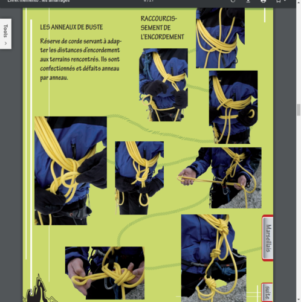
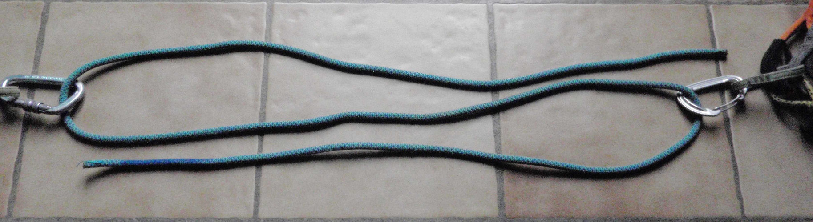
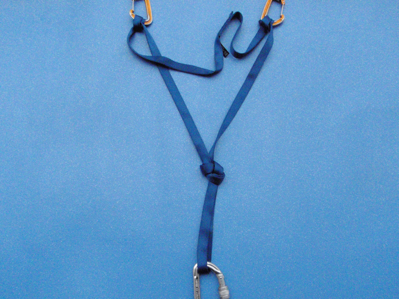
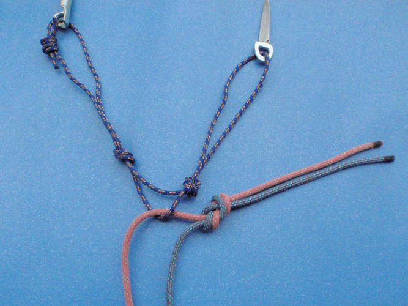

# Techniques

- [Techniques](#techniques)
  - [Techniques d'assurage et d'encordement selon type de progression](#techniques-dassurage-et-dencordement-selon-type-de-progression)
    - [Considérations générale sur l'assurage](#consid%C3%A9rations-g%C3%A9n%C3%A9rale-sur-lassurage)
    - [A retenir](#a-retenir)
    - [Anneaux de buste](#anneaux-de-buste)
      - [Technique classique](#technique-classique)
      - [Technique EMHM Chamonix](#technique-emhm-chamonix)
    - [Assurage en mouvement - technique la plus simple](#assurage-en-mouvement---technique-la-plus-simple)
      - [Encordement COURT SANS ANNEAUX A LA MAIN](#encordement-court-sans-anneaux-a-la-main)
      - [Encordement COURT AVEC ANNEAUX A LA MAIN](#encordement-court-avec-anneaux-a-la-main)
      - [Encordement LONG dit souvent « progression à corde tendue »](#encordement-long-dit-souvent-%C2%AB-progression-%C3%A0-corde-tendue-%C2%BB)
      - [ENCORDEMENT EN N](#encordement-en-n)
      - [CAS PARTICULIERS](#cas-particuliers)
      - [Encordement d'un troisième sur la corde](#encordement-dun-troisi%C3%A8me-sur-la-corde)
    - [Assurage à l'épaule](#assurage-%C3%A0-l%C3%A9paule)
    - [Assurage par longueurs](#assurage-par-longueurs)
    - [L'assurage dynamique - à relativiser](#lassurage-dynamique---%C3%A0-relativiser)
  - [Les relais](#les-relais)
    - [Cas où relais béton non nécessaire](#cas-o%C3%B9-relais-b%C3%A9ton-non-n%C3%A9cessaire)
    - [Mini-relais](#mini-relais)
    - [Triangulation du relais](#triangulation-du-relais)
      - [Triangulation unidirectionnelle avec sangle trop courte](#triangulation-unidirectionnelle-avec-sangle-trop-courte)
    - [Triangulation multi-directionnelle ou uni-directionnelle pour un rappel](#triangulation-multi-directionnelle-ou-uni-directionnelle-pour-un-rappel)
    - [Triangulation semi-directionnelle : le bon compromis](#triangulation-semi-directionnelle--le-bon-compromis)
    - [Technique d'assurage au départ d'un relais](#technique-dassurage-au-d%C3%A9part-dun-relais)
      - [Problème de la chute de facteur 2 - Mousquetonner premier point](#probl%C3%A8me-de-la-chute-de-facteur-2---mousquetonner-premier-point)
      - [Méthode britannique (Solution 7)](#m%C3%A9thode-britannique-solution-7)
    - [Relais en neige.](#relais-en-neige)
  - [Autres techniques générales](#autres-techniques-g%C3%A9n%C3%A9rales)
    - [Le rappel](#le-rappel)
    - [La réchappe](#la-r%C3%A9chappe)
    - [Pas d'artif](#pas-dartif)
    - [Pliage de corde](#pliage-de-corde)
    - [Hissage de sac](#hissage-de-sac)
    - [Poser une main courante](#poser-une-main-courante)
  - [Autres techniques en glace ou neige](#autres-techniques-en-glace-ou-neige)
    - [Stopper glissade en pente raide - Position de réchappe](#stopper-glissade-en-pente-raide---position-de-r%C3%A9chappe)
    - [Creuser un corps mort pour assurage en neige](#creuser-un-corps-mort-pour-assurage-en-neige)
    - [Remontée sur corde fixe - autosauvetage](#remont%C3%A9e-sur-corde-fixe---autosauvetage)
    - [Sauvetage en crevasse - cas où remontée](#sauvetage-en-crevasse---cas-o%C3%B9-remont%C3%A9e)
    - [Franchir la rimaye](#franchir-la-rimaye)
    - [Sortie de goulotte en neige : danger.](#sortie-de-goulotte-en-neige--danger)

## Techniques d'assurage et d'encordement selon type de progression

### Considérations générale sur l'assurage

* L'assurage en mouvement est assez long à acquérir. Il faut engranger beaucoup de courses de rocher PD et AD pour devenir vraiment efficace.
* En pratique, il ne faut pas hésiter à changer de méthode en fonction des circonstances et utiliser des [mini-relais](#mini-relais)
* Vous placez un friend ou deux dans le passage que vous surmontez en un éclair puis vous faites relais juste au-dessus. Ça ne prend pas des heures : une sangle sur un becquet, un demi-cabestan : C'est bon, tu peux venir.
3. * En pratique, on passe d'un mode d'assurage à un autre sans interruption. On cherche à être débrouillard, non académique.
* Connaître parfaitement le niveau d'escalade de son compagnon, ses points forts et ses points faibles (fissures en verrous, dalles friction, ou surplombs...) permet d'aller aux limites de l'assurage en mouvement sans se mettre en danger outre mesure. 
* Ce qui compte n'est pas la rapidité réelle des mouvements mais la fluidité de la progression. Passer sans temps mort d'un encordement court à un encordement long, à une mini-longueur, à une parade ou une petite courte-échelle, est la clef.

NOTE: pour s’encorder, la FFME préconise le nœud en 8 avec nœud d’arrêt.

### A retenir

**TO DO: Faire tableau récapitulatif type de terrain > encordement**

1. L'escalade est elle DIFFICILE ?
   
   Oui => Progression de relais en relais
   
   Non => progression simultanée (voir 2.)

2. Y a t'il présence de CREVASSE ?
   
   Oui => Progression simultanée "corde tendue" avec encordement en N (voire encordement anneaux de buste version EMHM), distance de 15 à 20 mètres
   
   Non => (voir 3.)

3. Le terrain est il ... ?

   Facile, régulier, ne demandant pas trop de variation de corde:

    * Progression avec ou sans "Anneaux à la main" ... 
    * ...anneaux de buste ouvert ou fermés
   
   Facilement protégeable, sans risque de glissade:

    * Progression "assurage en mouvement", encordement long, distance de 15-30 mètres

   Risque de glissade (pente de neige raide, arêtes de neige):

    * Progression avec anneaux de buste et distance de 2 à 3 mètres

### Anneaux de buste

#### Technique classique

* Chaque membre de la cordée est encordé à une extrémité de la corde par un nœud en huit ou un nœud de chaise assorti de son double nœud d'arrêt, selon sa préférence.
* La corde est en tas, posée au sol. Chacun va raccourcir la corde en prenant des anneaux de buste.
* On place sa main droite, paume ouverte vers bas, devant et légèrement au-dessus du pontet de son baudrier. La main gauche, en glissant le long de la corde depuis le nœud d'encordement, va amener la corde derrière la nuque, de gauche à droite. On fait plusieurs tours, jusqu'à obtenir la bonne longueur entre les grimpeurs, en tenant compte de la longueur nécessaire pour les nœuds d'arrêt.
* Une fois le dernier anneau formé, on enfile le bras droit puis l'épaule droite dans la totalité des anneaux. On a donc ces anneaux en bandoulière sous l'aisselle droite, et derrière l'épaule droite.
* Le dernier anneau passe sous tous les anneaux puis DANS LA BOUCLE d'encordement que forme le premier nœud d'encordement (et non pas le pontet du baudrier).

* Il reste à nouer le tout. On fait une boucle avec le dernier anneau qu'on enfile sous tous les anneaux (c'est à dire entre le paquet d'anneaux et la poitrine) de haut en bas. Cette boucle est ensuite repassée dans la boucle du nœud d'encordement initial (ou dans le pontet), puis est nouée sur elle-même par un nœud simple qui emprisonne la corde allant à l'autre grimpeur. En tendant alors cette corde, la tension est transmise à la boucle d'encordement.

* On place enfin un mousqueton entre la boucle et le pontet pour prévenir le lâchage progressif du nœud simple.
* On sécurise généralement la boucle en la mousquetonnant au pontet.

#### Technique EMHM Chamonix

Source: https://www.randonneepyrenees.com/Images/rando/escalade/docs/Encordement.pdf

### Assurage en mouvement - technique la plus simple

* PRINCIPE:
  * Les membres de la cordée progressent ensemble en cherchant à maintenir la corde à peu près tendue. Si l'un glisse, il est retenu par l'autre.
  * Pas de pose de protections
  * En cas d'obstacle court, le premier de cordée le franchit, paré voire poussé par le second, se cale derrière un recoin du rocher, et assure son compagnon [à l'épaule](#assurage-%C3%A0-l%C3%A9paule) ou directement sur un becquet rocheux avec un [mini-relais](#mini-relais). Le second le rejoint, puis les deux repartent corde tendue.
* AVANTAGES:
  * Rapide et simple
* INCONVENIENTS:
  * L'assurage en mouvement est rudimentaire et apporte nettement moins de sécurité aux grimpeurs que l'assurage par longueurs. Mais la sécurité en montagne ne se réduit pas à la sécurité d'une longueur. Il s'agit aussi de descendre au plus tôt la pente de neige raide avant que le soleil ne la rende dangereuse, de quitter le sommet avant l'orage, de rentrer avant la nuit, et tout simplement de réduire la durée totale de la course afin d'épargner la fatigue de la cordée

#### Encordement COURT SANS ANNEAUX A LA MAIN

* PRINCIPE
  * La distance entre grimpeurs est de 3 à 4 mètres.
  * Le premier de cordée est TOUJOURS PLUS HAUT que le second: devant à la montée, derrière à la descente.
  * Personne ne tient d'anneaux à la main.
  
* AVANTAGES:
  * Technique d'assurage qui permet la progression la plus rapide sur un terrain uniforme. 
  * Le second de cordée est bien assuré, sauf dans les traversées. Le leader peut avoir intérêt pour gérer celles-ci à traverser en amont de son second pour éviter un pendule.
  * Le premier de cordée a les deux mains libres. En neige, il peut donc manier deux piolets et être capable en permanence de retenir une glissade du second. En rocher, les deux mains libres lui donnent une grande sûreté.
  * Le risque de faire tomber des pierres est minimum. Les pierres qu'enverrait le leader n'auraient pas le temps de prendre de la vitesse avant d'atteindre le second.

* INCONVENIENTS:
  * Le premier de cordée n'est assuré que par la proximité du second qui peut le parer ou caler ses pieds sur des adhérences précaires. Le leader doit donc être très sûr.

* A UTILISER SI:
    * Terrains faciles pour la cordée - neige, glace, mixte ou rocher - à l'exception des glaciers enneigés en raison du risque de chute en crevasse
    * Pentes de neige raides, en montée et en descente
    * Gradins rocheux sans possibilité d'assurage, en montée et en descente
    * Arêtes de neige délicates non cornichées, en progressant de part et d'autre du fil, ce qui assez pénible mais sûr

* A NE PAS/PLUS UTILISER SI:
  * Nécessité fréquente de franchir des obstacles, si ceux-ci excèdent en hauteur la longueur d'encordement. Pour de tels obstacles, la marche aux anneaux est plus indiquée.
  * Le leader n'a plus la capacité de retenir une glissade du second.

#### Encordement COURT AVEC ANNEAUX A LA MAIN

* PRINCIPE:
  * La distance entre les grimpeurs est de 2 à 3 mètres.
  * Le premier de cordée est TOUJOURS PLUS HAUT que le second: devant à la montée, derrière à la descente.
  * Le premier de cordée tient dans sa paume aval trois ou quatre mètres de corde, lovés en anneaux dont le dernier est serré en tour mort autour de la main. Ce dernier anneau doit toujours être le premier qu'on peut lâcher. Ceci implique de devoir retourner le paquet quand on change de main. Les anneaux sont assez courts
  * La corde est tendue comme une laisse entre la main aval et le pontet du second. Ceci permet au leader de sentir un début de glissade du second, et de le remettre en selle d'un coup de poignet énergique.
  * Si le leader monte plus vite que le second, il lâche des anneaux progressivement. S'il est rattrapé, il reprend des anneaux.
  * A la descente, s'il rattrape son second, il reprend des anneaux. S'il se fait distancer, il lâche des anneaux.
  * Il pense à bien refaire le dernier tour serré à chaque fois.

* AVANTAGES:
  * ???
  
* INCONVENIENTS
  * Le leader est non seulement mal assuré, mais doit maintenir en permanence la tension de la corde. Sa main occupée est un handicap non seulement pour grimper mais aussi pour rattraper une glissade du second. 
  
* A UTILISER SI
  * Terrains faciles pour la cordée, à la condition que le leader se sente capable de gérer les anneaux. à l'exception des glaciers enneigés
  * Terrain facile semé de courts passages plus difficiles

* A NE PAS/PLUS UTILISER SI:
  * Idem méthode d'encordement court sans anneaux
  * Premier de cordée n'est pas à l'aise avec la technique.
  * Pente de neige raide uniforme, sans franchissement d'obstacle, rien ne justifie de s'encombrer avec des anneaux, d'autant plus si on possède deux piolets. La méthode d'encordement court sans anneaux est alors préférable.
  * Sur des gradins rocheux uniformes sans possibilités d'assurage, le leader préférera sans doute aussi avoir ses deux mains libres.

#### Encordement LONG dit souvent « progression à corde tendue »

Note: me semble très proche d'un assurage en mouvement avec pose de protections

* PRINCIPE:
  * La distance entre les deux grimpeurs est de 12 à 15 mètres environ.
  * Le premier de cordée est devant à la montée.
  * A la descente, celui qui va devant est celui qui place le plus efficacement les protections. Celui qui va derrière est celui qui désescalade le mieux.
  * Personne ne tient d'anneaux à la main.
  * La tension de la corde est toute relative. Elle chemine à droite et à gauche des différents reliefs que présente le parcours. On en joue, afin que le passage de la corde suffise parfois à protéger la cordée
  * Celui qui va devant place des protections régulièrement avec trois objectifs :
    * Conserver au moins deux bonnes protections entre les deux grimpeurs. Si le terrain est un tantinet avare en possibilités, quand le compagnon de cordée arrive à une protection, il le signale avant de la démonter. Ceci permet au premier de cordée de vérifier si la cordée sera toujours protégée où s'il doit poser sans tarder une nouvelle protection.
    * A la montée, placer la protection juste avant le pas difficile, pour se protéger soi, comme on le fait classiquement quand on grimpe en tête.
    * A la descente, placer la protection juste après le pas difficile, pour protéger son compagnon de cordée qui va descendre ensuite. 
  * Quand le premier de cordée a épuisé son matériel, le second le rejoint pour soit lui rendre le matériel soit passer en premier de cordée.

* AVANTAGES:
  * La méthode est rapide, mais moins que les deux méthodes précédentes.
  * Les deux grimpeurs sont efficacement protégés à la condition que le second soit suffisamment discipliné pour ne pas laisser un mou se créer entre les deux grimpeurs. Il ne doit pas non plus bloquer dans un pas d'escalade sans prévenir le premier de cordée qui pourrait se trouver stoppé au plus mauvais moment.
  
* A UTILISER SI:
  * Voie rocheuse assez difficile mais facilement protégeable
  * Arête rocheuse (encordement à douze mètres maximum pour s'entendre, éviter un tirage excessif et réduire le risque de chute de pierres).
  * Pente de glace (encordement à vingt mètres minimum pour éviter de brocher et débrocher sans arrêt).
  * Terrain mixte assez difficile ;
  * Arêtes de neige faciles.

* A NE PAS/PLUS UTILISER SI:
  * Risque grandissant de chute du second. S'il chute, il risque d'entraîner le leader dans un vol en premier de cordée.
  * Quand le second se trouve trop limite dans la plupart des passages : relais.

#### ENCORDEMENT EN N

NOTE: L'encordement en N avec réserve de corde dans le sac est une variante de l'encordement long avec anneaux de buste, mais sans pose de points intermédiaires:
  * encordement long avec anneaux de buste: utilisé plutôt l’été lors des raids glaciaires, mais principal inconvénient est qu'en cas de chute en crevasse, les anneaux de corde ne sont pas mobilisables rapidement, pour terrain régulier, demandant peu de variations de corde par Petzl
  * encordement en N avec réserve de corde: utilisé plutôt en ski de montagne, recommandé par la FFME pour les traversées glacières, pour marche longue (car configuration figée) par Petzl
  * Autre méthode pour progression facile sur glacier: anneaux de buste non bloqués https://forum.camptocamp.org/t/anneaux-de-buste-new-school/114158/9

* PRINCIPE:
  * L'encordement pour glacier enneigé est l'encordement dit en N, c'est à dire en divisant la corde en trois parties.
  * Chaque alpiniste réalise son nœud d'encordement au tiers de la corde.
  * Pour trouver le bon endroit sur la corde, soit on a marqué les tiers au feutre, soit chaque grimpeur place provisoirement un mousqueton à son pontet, dans lequel il place une boucle de la corde. Tout en tenant chacun une extrémité de la corde, les deux grimpeurs s'éloignent l'un de l'autre, la corde coulissant dans les deux mousquetons, jusqu'à tendre la corde. On obtient ainsi les tiers.

  

  Recherche des tiers (in vitro).

  * Le nœud d'encordement est le nœud de chaise avec double nœud d'arrêt. On peut également réaliser un nœud en huit au lieu du nœud de chaise, mais il présente l'inconvénient d'être très volumineux quand, comme ici, on le réalise avec deux épaisseurs de corde, puisqu'on s'encorde dans le cours de la corde et non à son extrémité.
  * Après la réalisation du nœud de chaise, on love le tiers libre en un petit écheveau qu'on place dans le sac (voir note ci-après). C'est la réserve de corde. Elle va servir à faciliter les manœuvres de sauvetage en crevasse le cas échéant : confection d'un mouflage ou jet de cette réserve au compagnon tombé dans le pot afin qu'il s'en serve pour remonter sur corde fixe, car la portion de corde reliant les deux grimpeurs peut avoir pénétré profondément dans la lèvre de la crevasse et être difficilement utilisable.
  * La progression se fait corde tendue. L'idéal est que la corde ne touche pas le sol. La tension est cependant fatigante pour le grimpeur de tête car elle le freine. On peut donc détendre légèrement dans les zones peu suspectes de crevasses et tendre à la perfection dès qu'un doute se présente.
  * Si un grimpeur perce un pont de neige fragile recouvrant une crevasse, la corde déjà tendue empêche la chute.
  * Chacun doit donc progresser en gardant à l'esprit qu'il peut être tiré brusquement vers l'autre à tout instant, et qu'il lui appartiendra de ne pas se laisser entraîner.
  * Pour cet encordement, on peut utiliser un seul brin d'une corde à double car il s'agit d'enrayer une glissade plus que de stopper une véritable chute. Mais on peut aussi bien entendu utiliser une corde à simple : qui peut le plus peut le moins. L'idéal est d'avoir un brin de 50 mètres de façon à disposer d'une quinzaine de mètres entre les grimpeurs.
  * Si la corde est plus courte, on privilégie la longueur de l'encordement par rapport à la réserve de corde, qui sera alors plus courte. L'encordement n'est donc plus rigoureusement au tiers
  * Quand le risque de chute dans d'immenses crevasses, bien larges et bien profondes, existe, on recommande de créer plusieurs [nœuds de freinage](Noeuds_%26_Mouglages.md#autres-noeuds-utiles-alouette-mule-tour-mort-et-deux-demi-clés-noeud-de-freinage) (au moins trois : à 4-5 mètres du nœud d'encordement puis à 2-3 mètres de distance) sur l'encordement afin qu'ils se bloquent dans la lèvre de la crevasse, ce qui facilite le travail de celui resté à l'air libre puisqu'il n'est plus tiré (ou moins) par le poids de son compagnon. Ces nœuds de freinage ne fonctionnent réellement qu'avec une lèvre decrevasse faite de neige épaisse et molle, ce qui est justement le genre de terrain où le risque de percer un large pont de neige est élevé.

Nœud de freinage : un nœud de huit pour commencer, puis piéger un brin avec la boucle qui repart dans le nœud.

* NOTE: La réserve en vrac dans le sac
  * L'encordement en N préconisé pour un glacier enneigé (crevasses masquées) prévoit originellement de placer un tiers de la corde plié en écheveau sous le rabat de son sac à dos.
  * Récemment, on préconise plutôt de placer cet excédent de corde en vrac à l'intérieur du sac. Ceci permet de tirer la longueur de corde utile à une remontée sur corde ou à un mouflage sans devoir nécessairement ôter son sac à dos, et ce de façon plus rapide.
  * La corde doit être soigneusement introduite dans le sac en commençant par son extrémité, pour qu'elle puisse sortir sans nœud. Certains appellent cela enkiter la corde.

#### CAS PARTICULIERS

* Progression sur une arête de neige effilée horizontale: La distance entre les deux grimpeurs est de 5 à 6 mètres, le leader tenant deux ou trois mètres d'anneaux à la main. Il se place derrière son second pour le garder à vue si la trace est faite. En cas de chute sur un versant, le leader doit lâcher les anneaux et sauter de l'autre côté en tâchant de ne pas se blesser. Les anneaux lâchés donnent le temps nécessaire pour réagir.

#### Encordement d'un troisième sur la corde

* La FFME recommande l'encordement à double noeud d'arrêt en randonnée et en randonnée glaciaire. Noeud de huit en bout.
https://www.ffme.fr/fiches-ffme-techniques/page/encordement-avec-le-double-noeud-d-arret.html

### Assurage à l'épaule

**TODO: Voir comment on fait dans la pratique (tirage de la corde)**

* L'assurage à l'épaule consiste à se caler solidement derrière une saillie, la jambe avant devant être capable de supporter le poids du second sans déraper.
* La corde partant de l'assuré passe par la main avant en supination, passe sous l'aisselle du même côté, derrière le dos, puis sur l'épaule opposée, pour finir devant la poitrine dans l'autre main en pronation.
* On ne peut avec cette méthode qu'enrayer une glissade que l'assuré va devoir finir de stopper lui-même. 
* Vêtements épais pour l'assureur, des manches longues, le port de gants en cuir brut.
* L'assureur peut aussi s'auto-assurer à un becquet pour consolider sa position, mais dans ce cas, pourquoi ne pas assurer directement sur ce becquet avec un demi-cabestan ? Dans ce cas, la vache passe du même côté du corps que la corde qui va à l'assuré.

### Assurage par longueurs

* Avec une corde à double, on ne mousquetonne qu'un brin à la fois pour diminuer la force de choc exercée sur les ancrages et réduire le tirage. On peut très bien mousquetonner plusieurs fois de suite le même brin, sans obligation d'alterner scrupuleusement, l'essentiel étant que les brins ne se croisent pas. En gros, un brin à gauche et un à droite. Aux changements de direction, on passe systématiquement le brin qu'on mousquetonne sous l'autre brin pour ne pas croiser.
* Des longueurs courtes
* Retaper les pitons: A chaque piton rencontré dans la voie : le marteau, deux coups sur le piton pour le tester, davantage s'il faut le renfoncer. 

### L'assurage dynamique - à relativiser

* Assurage dynamique: sauter vers le haut, avancer d'un pas ou lâcher un grand mou lorsque le copain s'envole.
* L'argument est la diminution de la force de choc afin que la réception du vol se fasse dans la douceur... à la condition que cela ne finisse pas par terre ou par un télescopage du grimpeur avec son assureur comme on le voit plus souvent qu'on ne voudrait.
* Il est vrai qu'un coulissement, même faible, de la corde dans le système d'assurage amortit le choc et permet une grande dissipation d'énergie. Mais est-il indispensable de sauter jusqu'à la première dégaine et pour éviter quoi au juste ? Les cordes dynamiques sont conçues et normées pour ne pas pouvoir transmettre une force de choc supérieure à 1200 daN (800 daN pour un brin d'une corde à double) lors d'une chute de facteur 1,77 d'un poids rigide guidé.
* Or, cette situation défavorable n'existe pas en salle d'escalade. Une fois le premier point clippé, la chute au niveau de la seconde dégaine va soit provoquer un facteur de chute proche de 1 si le mou strictement nécessaire a été donné, soit une chute au sol si le mou est excessif.
* La force de choc est donc d'emblée très inférieure aux 1200 daN qui sont pourtant déjà sans dommage pour le corps humain. Une fois les dégaines suivantes clippées, elle diminuera encore.
* En montagne, prendre d'emblée l'habitude d'assurer de manière dynamique, soit en sautant vers le haut quand on le peut, soit en donnant un bon mètre de mou pendant le vol, risque de conditionner un réflexe préjudiciable dans beaucoup de circonstances quand une chute trop longue ferait rencontrer directement une proéminence du terrain : terrasse, vire, écaille saillante, becquet, pieux métallique,
* S'il est bon de savoir comment assurer de manière dynamique, ce qui peut être utile parfois sur un relais en neige, en glace avec des broches douteuses, en rocher au-dessus d'un mauvais piton, on se gardera d'en faire une habitude. L'élasticité du système d'assurage peut se parfaire en montagne moins dangereusement avec l'emploi du nœud de demi-cabestan, l'utilisation pour les points douteux de dégaines-explose (dégaines à absorption d'énergie), la bonne gestion du tirage (un tirage important augmente la force de choc transmise au dernier ancrage) ou le mousquetonnage d'un seul brin de la corde à double.

## Les relais

Escalade sportive vs alpinisme :
* Le relais comporte un maillon primaire. Commencez par retaper les pitons puis par vous vacher n'importe où, plutôt que de vous lancer dans une longue recherche d'un éventuel maillon primaire. Il ne s'agit pas d'être scolaire mais efficace.
* Le relais doit être inarrachable. On croirait une publicité pour la colle du dentier de votre grand-père... Imaginez qu'un auteur vous dise que le relais doit être fragile.
* Le relais doit comporter deux points. Le relais sur piton unique était dans le passé de pratique courante., c'st à la fin des années 80 que le doublement se généralise. Bref, le chiffre deux ne possède aucun pouvoir magique : un piton solide vaut mieux que deux foireux, lesquels méritent d'en planter un troisième, et ainsi de suite jusqu'à obtenir une solidité suffisante pour le service que vous allez demander à votre relais. Car vous ne demanderez pas la même chose à tous vos relais.

### Cas où relais béton non nécessaire

* VIRE LARGE, HORIZONTALE, NON GLISSANTE faisant suite une longueur facile: On se cale pour assurer le second à l'épaule dans le but d'enrayer une petite glissade éventuelle. Pour la longueur suivante, l'assureur n'aura pas plus besoin de relais qu'à la salle d'escalade avec les deux pieds par terre. Il vaut mieux le parer que fabriquer un relais parfaitement inutile.
  
* RELAIS DE LA FIN DES DIFFICULTES: A partir d'ici, vous allez raccourcir l'encordement et partir corde tendue. Le relais doit uniquement
résister à la mise en tension de la corde en cas de chute du second : un choc faible. Si vous devez hisser un sac, l'affaire est différente : relais plus solide.

### Mini-relais

Les mini-relais (pour mini-longueurs) consistent à interrompre la progression simultanée le temps de franchir un passage plus difficile. Chacun son tour, mais on conserve l'encordement réduit. On place une sangle sur un becquet, le second se vache assez long pour pouvoir parer et passe la corde dans un demi-cabestan à son pontet.

### Triangulation du relais

#### Triangulation unidirectionnelle avec sangle trop courte

Solution 1: Fixer la sangle avec des nœuds de cabestan sur chacun des mousquetons placés sur les ancrages. Un mou est laissé dans la portion reliant les deux ancrages, et le nœud du bas n'intéresse que deux épaisseurs de sangle. Ainsi, on consomme beaucoup moins de sangle (ou de cordelette pour un rappel). La sangle dyneema, au point de fusion bas, n'est pas recommandée pour cette utilisation. Les nœuds de cabestan empêchent la dangereuse traction horizontale sur les ancrages.

Une autre façon de procéder, rapide et astucieuse, consiste à placer un nœud de huit ou un nœud simple en milieu de sangle, puis de mousquetonner chaque demianneau formé: 

Montage dit parfois répartiteur Vertaco:

### Triangulation multi-directionnelle ou uni-directionnelle pour un rappel

Le nœud de huit placé sur la sangle peut être discutable pour un rappel inconnu. Ceci parce que le nœud fixe définitivement la direction de résistance qu'on a voulu donner au relais. Il s'agit d'une triangulation uni-directionnelle, car tirer dans une autre direction ferait supporter la charge sur un seul ancrage. Il s'agit donc de descendre le rappel dans la direction choisie, et non de changer en cours de route. Or, dans les rappels inconnus, il arrive fréquemment qu'on jette la corde d'un côté, puis qu'on se ravise en cours de descente car on a aperçu le relais inférieur décalé là où on ne l'attendait pas. On peut alors être tenté de ne pas réaliser de nœud sur la sangle, mais de seulement tourner une des deux boucles, comme on l'a longtemps préconisé, pour bénéficier d'un relais multidirectionnel se prêtant aux changements de direction. Malheureusement, une sangle ou une cordelette ne sont pas dynamiques et offrent peu de résistance à un choc. De plus, si la sangle résiste, le choc peut être fatal pour l'ancrage restant. C'est la raison pour laquelle cette option est actuellement abandonnée. Si on souhaite conserver une légère mobilité du relais, on lui préfère la solution du paragraphe suivant : le relais semi-directionnel.

Uni-directionnel à gauche : un seul ancrage sollicité en tirant à gauche.
Multi-directionnel à droite : solution abandonnée

### Triangulation semi-directionnelle : le bon compromis

Afin de limiter le choc potentiel, on peut placer un nœud sur chacune des branches du V. On obtient ainsi un compromis entre la liberté de mouvement de l'ancrage et le choc réduit. On nomme cette solution triangulation semidirectionnelle. C'est celle qui semble la plus recommandable pour concilier les avantages de chaque technique. On dose le compromis le plus judicieux en rapprochant plus ou moins les nœuds du bas du triangle.

Semi-directionnel, dit parfois répartiteur d'alpiniste:

Semi-directionnel pour un rappel:

S'il s'agit d'un relais de progression et non de rappel, on peut mousquetonner les deux brins de la sangle à la condition bien sûr d'en tourner un des deux pour ne pas mettre le mousqueton à cheval sur l'ensemble. Les nœuds peuvent être indifféremment des nœuds simples ou des nœuds de huit. On recommande de ne pas laisser davantage que 20cm de débattement entre chaque nœud et le point inférieur du dispositif.

### Technique d'assurage au départ d'un relais

#### Problème de la chute de facteur 2 - Mousquetonner premier point

* Solution 1 (mauvaise): Plaquette d'assurage au pontet du baudrier, chute du premier de cordée sans premiere degaine posée, chute facteur 2, ça fait mal.
* Solution 2 (mauvaise): Plaquette d'assurage au pontet du baudrier, premier mousquetonne le point le plus élevé du relais avant, pour éviter le facteur 2 et faciliter le blocage de la corde dans la plaquette. Chute de nouveau, le facteur de chute n'a presque pas changé mais deux fois plus d'effort sur le relais
* Solution 3 (déjà mieux) : mettre de la distance entre pontet et point mousquetonné => idem précédemment mais l'assureur descend de 3-4 mètres
* Solution 4 (mieux): si suffisamment de corde, l'assureur a veillé précédemment à mousquetonner le premier piton puis est redesendu au relais pour faire venir le second
* Solution 5 (préconisée): Assurer avec un nœud de demi-cabestan directement sur le relais triangulé, au moins tant que le leader n'a pas mousquetonné un point dans la longueur. On évite l'effet poulie, la difficulté de freinage s'atténue car nœud de demi-cabestan possède une force de freinage supérieure aux plaquettes, l'assureur ne reçoit aucun choc.
* Solution 6 (encore mieux): placer un ancrage en plus du relais

#### Méthode britannique (Solution 7)

* PRINCIPE: Ancrages réliés individuellement au pontet de l'assureur et assurage du second en plaçant la plaquette d'assurage sur le pontet du baudrier et non sur le relais.
  
* AVANTAGES:
  * Les différents ancrages, coinceurs ou autres, sont reliées par la corde au pontet de l'assureur, chacun séparément. La mise en tension créée par le poids de l'assureur stabilise les coinceurs dans la bonne direction pour les maintenir à leurs places dans les fissures. Alors qu'un relais français reliera les coinceurs par une sangle en V dont la pointe sera tirée vers le dernier point mousquetonné de la longueur, donc dans une direction pas forcément favorable aux coinceurs.
  * On peut ajouter un nouveau coinceur après coup, si on le juge nécessaire : il suffit de refaire un renvoi du pontet au nouveau coinceur avec la suite de la corde.
  * L'assureur est tourné vers le bas, et peut donc suivre la progression du second, et au besoin lui donner des indications concernant les mouvement ou les prises cachées.
  * Le montage est déjà prêt pour que le second parte ensuite en tête dans la longueur suivante. On gagne du temps et le risque de perdre la plaquette dans la manipulation est éliminé.
  * Une chute du second est absorbée par le corps de l'assureur avant d'être transmis aux ancrages
  
* INCONVENIENTS:
  * Réservé aux cordées réversibles, car il est compliqué pour le second de se vacher à son tour à chaque coinceur séparément.
  * On ne peut pas installer un mouflage, car celui-ci devrait être installé sur le pontet de l'assureur.

### Relais en neige.

* Le relais en neige est rarement prescrit en première intention. Si le rocher est proche, on privilégiera le relais en rocher.
* Si la glace est sous-jacente, on la dégagera pour visser deux broches. Si on ne dispose d'aucun ancrage possible en rocher ou en glace, on se résignera à poser un relais en neige, en seconde intention donc.
* Le principe du relais en neige consiste à confectionner un corps mort, un piolet le plus souvent, très en amont de l'assureur. Celui-ci assure le second à l'épaule ou à son pontet par une plaquette d'assurage ou un demi-cabestan, tout en étant vaché en tension sur le corps mort.
*  Dans les Alpes, la neige ne tient pas sur des pentes supérieures à 50 ou 55°, au-delà on a affaire à la glace.

* Le plus classique: piolet enfoui en corps mort.
    * On creuse avec la panne du piolet deux tranchées profondes : une horizontale qui va recevoir le piolet, une verticale partant du milieu de la première vers le bas, qui va accueillir une longue sangle allant au pontet du baudrier de l'assureur.
    * Le piolet est couché dans la tranchée horizontale, la sangle passée au milieu du manche en tête d'alouette ou mieux en nœud de cabestan.
    * L'assureur, vaché à la sangle tendue, se place en contrebas du piolet et assure à l'épaule (vêtements épais obligatoires) ou sur demi-cabestan pour doser un assurage dynamique.
    * Pour renforcer la tenue du corps mort, on doit le recouvrir de neige tassée.

* Relais de rappel
    * le plus simple est un corps-mort fait d'un objet abandonné : pierre trouvée sur place, gourde, sac plastique solide rempli de neige ...
    * En l'absence d'objet à abandonner, le modelage d'un champignon de neige de grand diamètre (2 mètres parfois) peut faire l'affaire en dépannage.
        * On y place directement la corde et on fait des essais de coulissement de la corde avant que le dernier de la cordée ne descende.
        * Sa confection est assez laborieuse : de diamètre trop petit, il est fragile ; de diamètre trop grand, la corde peut refuser de coulisser.
        * Sur une neige très dure de consistance proche de la glace, sa confection plus compacte est plus facile et on peut abandonner une sangle.

## Autres techniques générales

### Le rappel

* En cas de descente lourdement chargé ou corde très lisse, on peut avoir avantage à entourer plusieurs fois la jambe (pantalon de rigueur) avec la corde libre pour augmenter le freinage, ou bien utiliser un renvoi sur mousqueton
* A VERIFIER !!! Le nœud de jonction des deux brins est le nœud de huit. Le nœud de vache est maintenant abandonné.
    * Moins durable qu'un double nœud de pêcheur qui demeure le nœud d'aboutement de référence dans l'industrie, quand deux cordes reliées doivent servir toute une journée de travail. Ceci veut dire que l'utilisation du nœud de jonction en huit pour de nombreux rappels successifs suppose qu'on vérifie de nouveau le nœud à chaque rappel et qu'on le réajuste s'il a glissé.
* On recommande de laisser 30cm minimum de brins libres après le nœud. Les brins doivent rester parallèles dans le nœud pour pouvoir le serrer intimement jusqu'à former une boule et non un huit à plat.
* Les brins doivent être soigneusement pliés en écheveaux avant d'être lancés, le premier descendu installe le relais suivant en changeant la cordelette, se vache, crie « libre ».
* Pendant la descente du second, le premier installe déjà le brin à tirer dans l'anneau en pensant que le nœud d'aboutement doit se trouver contre le rocher, ceci pour éviter l'effet de la plaquette réverso: le brin du dessus plaqué contre le brin du dessous bloque celui-ci.
* Quand la longueur du rappel est inconnue et qu'on a aucune visibilité sur l'extrémité basse de la corde, on peut être tenté de réaliser d'emblée un nœud en bout de corde qui relie les deux brins mais problématique en cas de coincement.
* On recommande actuellement de lancer les deux brins dépourvus de nœud en bout de corde, de réaliser l'essentiel de la descente, puis, arrivé à une dizaine de mètres de  l'extrémité, de se laisser bloquer par son autobloquant, de ramener la corde restante à soi pour faire à ce moment seulement le nœud de sécurité rassemblant les deux brins en bout de corde.

### La réchappe

* Si vous êtes à un piton infaillible et que vous n'avez pas dépassé la moitié de la longueur, vous laissez un mousqueton et vous vous faites mouliner jusqu'au relais. 
* Si le piton est infaillible mais que vous êtes plus près de vos sous, vous vous vachez au piton, vous passez un anneau de cordelette dans son œil, et vous installez un rappel avec un autobloquant qui fonctionne dans les deux sens.
* Vous pouvez aussi être à un piton inspirant peu confiance sans possibilité de renforcer l'ancrage, et avoir dépassé le milieu de la corde. Le mieux est d'abandonner un mousqueton, de vous faire mouliner par le second très doucement sur un seul brin tandis qu'il ravale le deuxième brin au fur et à mesure de votre descente. Ainsi, vous ne risquez pas plus qu'un vol en premier de cordée.
* Si vous grimpez avec une corde à simple, il faudra placer un autobloquant costaud entre votre pontet et la corde qui monte, que vous ferez coulisser pendant votre descente. Dès que vous arrivez à un ancrage solide de la longueur, vous vous vachez, vous vous décordez du brin qui passe dans le mousqueton du haut, vous rappelez la corde et vous vous encordez de nouveau. Vous êtes revenu dans le premier cas de figure plus favorable.
* On peut objecter que se faire mouliner sur un point fragile n'est pas judicieux en raison de l'effet poulie qui double la charge sur l'ancrage par rapport à un rappel. Ceci est vrai. Mais installer un rappel est beaucoup plus long à réaliser, on sera donc plus longtemps sur le point douteux.
* Avec une corde double, on peut installer un rappel sur un seul brin, tandis que le second continue d'assurer sur le second brin pendant toute l'installation du rappel puis pendant toute la descente. Tout ceci va être bien chronophage et disproportionné si le piton n'est pas franchement minable et qu'il suffit de quelques mètres de moulinette pour atteindre un ancrage sûr.

### Pas d'artif

Voici les étapes pour franchir un pas en artif :
* On pose le coinceur, on mousquetonne la dégaine On se pend dessus, d'abord doucement pour le tester, puis on y met franchement tout son poids.
* On mousquetonne alors seulement la corde.
* On mousquetonne l'étrier en sangle sur le mousqueton du haut de la dégaine.
* On se vache très court avec une dégaine entre le pontet et ce mousqueton du haut, du côté opposé au doigt.
* On passe un pied dans une marche de l'étrier et on se lève. La dégaine qui sert de vache aide à se redresser dans un mouvement d'opposition avec le pied et pivote vers le haut.
* Une fois debout sur l'étrier, on pose un autre coinceur plus haut et on recommence l'opération.
* On récupère l'étrier dès qu'on a mousquetonné la corde sur le nouveau point en se laissant descendre à la corde.
* On se rapproche de nouveau du coinceur du haut en se tirant à la corde, comme à la salle quand on remonte après un vol.

La dégaine sur laquelle on est vaché, très courte, est accrochée au mousqueton du haut de la dégaine d'assurage, côté opposé au doigt.

### Pliage de corde

* En montagne, vous allez plier et déplier la corde de nombreuses fois, pour changer l'encordement, sortir un brin pour grimper une longueur avec la corde à double, en ranger un quand vous continuez à corde tendue, préparer un rappel, etc.
* Il n'est pas besoin d'envoyer les ganses derrière la nuque. Les brassées se prennent dans la paume en écartant les deux bras pour augmenter l'amplitude. Puis on finit en formant une poupée, et non en saucissonnant le milieu de l'écheveau, afin d'avoir un objet compact facile à fourrer dans le sac à dos. 91
* Le pliage en écheveau toronne moins la corde que le pliage en couronne, il est donc préférable avant de lancer un rappel.
* Par contre le pliage en couronne est plus rapide et permet de porter le brin en bandoulière. Sa meilleure indication est au pied du dernier rappel qu'il faut fuir le plus vite possible sous peine de recevoir les pierres des cordées suivantes.
* Tandis que l'un tire la corde puis préparera le brin qui permet de se ré-encorder avec les anneaux de buste, l'autre plie déjà, au fur et à mesure de sa récupération, le premier brin qui vient, puis le passe en écharpe sans besoin d'ouvrir le sac. 

### Hissage de sac

* La poulie autobloquante micro-traction de Petzl (85g) est l'outil idéal pour le hissage du sac. Elle sera aussi d'un grand secours en cas de mouflage. La combinaison tibloc (39g) et poulie oscillante P02 de Petzl (42g), convient aussi.

Le brin du sac est sur la poulie autobloquante, le brin du second sur la plaquette:

Tête de mouflage faite de la poulie autobloquante, renvoi inférieur sur mousqueton et tibloc, renvoi supérieur sur mousqueton. On peut ainsi tirer vers soi en étant positionné sous le relais:

### Poser une main courante

https://www.ffme.fr/fiches-ffme-techniques/page/poser-une-main-courante.html
https://www.ffme.fr/fiches-ffme-techniques/page/utiliser-une-main-courante-en-assurance-risque-de-chute-mortelle.html

## Autres techniques en glace ou neige

### Stopper glissade en pente raide - Position de réchappe

* Il n'est pas possible de stopper la glissade du compagnon de cordée si celui-ci est passif.

Position de réchappe.

* Le plus tôt possible, il tente de se retourner sur le ventre en conservant la tête à l'amont.
* PIOLET:
    * Il pèse de sa poitrine sur la tête de piolet tenue d'une main tandis que la seconde main tient le bas du manche, c'est à dire avec la même saisie que la technique du piolet-ancre.
    * Ainsi, la lame raye la neige à la manière d'un soc de charrue et freine progressivement.
    * On s'arrange pour que la pique ne s'enfonce pas dans la neige en relevant soigneusement le bas du manche, sinon, le piolet pourrait se bloquer d'un coup.
* PIEDS
    * En neige dure, on relève les pieds pour éviter de rebondir sur les pointes avant des crampons.
    * En neige molle, on écarte les pieds et on s'en sert pour freiner davantage, mais avec d'infinies précautions si l'on a chaussé les crampons pour ne pas risquer un arrêt brutal des pieds et une bascule tête en bas, et seulement après avoir déjà ralenti franchement par l'action du piolet. 

### Creuser un corps mort pour assurage en neige

* Technique avec un piolet
  * Creuser une tranchée profonde perpendiculaire à la corde, à l'aide de la panne de votre piolet, puis une seconde dans l'axe de la corde.
  * Dans ces tranchées, vous placerez votre piolet flanqué d'une sangle en corps-mort.
  * Tasser de la neige au dessus du piolet

### Remontée sur corde fixe - autosauvetage

* Matériel sophistiqué pour confort dans les longueurs (spéléo, big wall) - poignéesbloqueurs, bloqueurs de poitrine, bloqueurs de pied
* Matériel dispo (sangle et cordelette) pour s'échapper de situation compliquée en haute montagne
    * 2 cordelettes de 6mm, fermées en anneaux par un double-nœud de pêcheur, l'un de 60cm pour le baudrier, l'autre de 120cm pour la pédale de pied.

* Technique de remontage
    * Des noeuds autobloquants (Prussik ou Machard) permettent de fixer ces anneaux à la corde fixe, et de les coulisser vers le haut l'un après l'autre pendant la progression.
    * Première technique
        * On place l'anneau de 120cm en dessous de l'anneau de 60cm.
        * En se levant sur la pédale, la corde se tend et facilite le déplacement de l'autobloquant du baudrier vers le haut. Une fois celui-ci glissé au maximum vers le haut, on s'assied dans le baudrier, puis on plie la jambe pour monter l'autobloquant du bas, et ainsi de suite.  
    * Deuxième technique
        * La seconde technique à connaître utilise l'anneau de 60cm pour le baudrier, et un nœud de cœur en remplacement de l'anneau de 120cm.
        
        
        
        La corde forme un nœud de cœur autour des deux mousquetons côte à côte. Une sangle est fixée dans le bas des deux mousquetons. Cette sangle forme une tête d'alouette autour du pied pour réaliser une pédale bien serrée.
        
        * L'avantage de cette technique est une grande rapidité pour une fatigue réduite, mais elle nécessite de ne pas démarrer pendu en bout de corde. Vous ne pourrez donc  utiliser cette technique qu'après avoir amorcé la remontée par la première technique pour avoir un peu de corde libre, ou bien sur glacier, en utilisant la réserve de corde d'un encordement en N.
        * C'est la technique qui nécessite le moins de matériel puisqu'il suffit d'un anneau de cordelette, de deux mousquetons pour le nœud de cœur (de préférence de même modèle pour un blocage plus sûr), et d'une petite sangle pour la pédale.
    * Alternatives
        * Le machard sur mousqueton est également très agréable à utiliser car il coulisse plus facilement qu'un nœud de Prusik.
        Le machard croisé sur sangle est à essayer, au cas où.

* Etapes:
  * Mettre un autobloquant A sur la corde au dessus de soit.
  * Se vacher dessus avec sa longe.
  * Placer un deuxième autobloquant B entre le premier et son nœud d’encordement.
  * Réaliser à l’aide d’une sangle C une pédale que l’on placera sur le dernier autobloquant B.
  * S’élever sur la pédale et déplacer le premier autobloquant sur lequel on est vaché.
  * Se remettre en tension dans le baudrier après avoir bougé le 1er autobloquant.
  * Déplacer le 2ème autobloquant vers le haut en gardant le pied dans la pédale.
  * Répéter les actions 5 à 7 jusqu’à la sortie de la crevasse. 

* Remontée sur rappel
    * Le rappel ne se remonte évidemment qu'à la condition qu'on ait encore à sa disposition les deux extrémités.
    * Si on ne les a pas, on grimpe en s'assurant en premier de cordée avec la portion de corde qu'on a pu rappeler, jusqu'à la seconde extrémité qui pend en l'air, puis on démarre la remontée sur corde à cet endroit.
    * On remonte en emprisonnant les deux brins à la fois dans les autobloquants.

* Remontée en crevasse
    * Sur un glacier, une fois dans la crevasse, retirer votre sac sera souvent la première chose à faire.
    * Accrochez votre piolet à un porte-matériel du baudrier
    * Mettez une sangle à votre pontet en tête d'alouette, accrochez-y votre sac à dos pour gagner un peu de liberté et avoir accès à votre matériel
    * retirez vos lunettes de glacier et mettez-les dans la poche du rabat, sortez une fourrure polaire et enfilez-la
    * Récupérer frontale
    * Installer votre matériel de remontée
    * Votre remontée doit être efficace et sans à coup,il ne s'agit pas d'arracher le méchant piolet qui fait office de relais de fortune et de l'entraîner avec vous. Répétez ces techniques et peaufinez-les. 

### Sauvetage en crevasse - cas où remontée 

**TODO: détailler le process => pas clair comment faire le transfert de poids**

**TODO: Cas où l'on est sur un encordement long et pas un encordement en N**

* Enrayer la chute et se stabiliser avec les pieds.
* Réaliser un amarrage (broches, corps mort selon la qualité de la neige ou de la glace).
* Se longer sur l’amarrage (cela évitera de glisser vers la crevasse.
* Réaliser un autobloquant (A) sur la corde et le relier à l’amarrage. (s’assurer qu’il ne glisse pas), afin de libérer la tension de la corde pour la transférer sur le corps mort
* Défaire les anneaux de buste.
* Réalisation d'un [Mouflage mariner simple ou double](Noeuds_%26_Mouglages.md#mouflages-simple-simple-de-surface-mariner)

* NOTE: Si la corde a pénétré profondément dans la lèvre de la crevasse, vous allez lui renvoyer votre réserve de corde pour qu'il fasse sa remontée sur ce brin.

### Franchir la rimaye

L'état de la rimaye fait partie des conditions à vérifier pour préparer une course. Certaines courses sont réputées ne pouvoir se faire que jusqu'en milieu de saison pour cette raison.
* En bonne condition, la rimaye est bouchée et forme simplement une fente ou une petite marche. Un grand pas et l'affaire est faite.
* Quand elle est plus ouverte, un pont de neige solide peut avoir été construit par la dernière coulée ayant purgé la pente. On passe rapidement, puis on dégage vite de la goulotte d'avalanche, car plus haut que le halo de la frontale, plusieurs centaines de mètres de dénivelée organisés en entonnoir ne demandent qu'à passer par là au moindre appel de la pesanteur.
* Quand le pont de neige est douteux, on en fait un examen approfondi, en allant voir du côté gauche puis du côté droit. La glace, la neige, sont solides à la compression, pas à la traction. Aussi, on cherche à savoir si les piliers sont compacts de chaque côté du pont. La neige du milieu doit reposer sur une sorte de voûte soumise à la compression.
* Si vous n'avez pas de chance, la rimaye se présente comme un mur, la lèvre supérieure étant très au-dessus de la lèvre inférieure.
* Franchir le mur peut ne pas être facile car il est généralement en neige plus ou moins molle, qui supporte mal le poids du grimpeur sur les seules pointes avant des crampons.
* Il faut d'abord choisir l'endroit le moins difficile, donc éliminer les endroits où la lèvre supérieure est surplombante ou trop à distance de la lèvre inférieure. Le second assure depuis la lèvre inférieure qui forme généralement une partie horizontale, sans trop s'approcher du trou. Il est simplement calé dans la neige si la pente est débonnaire, vaché à un corps-mort sinon. Il n'est pas dans l'axe de chute du premier de cordée car réceptionner son copain équipée de crampons est moins agréable que de l'accueillir avec ses chaussons d'escalade.
* Ensuite on cherche à progresser en piolet traction et cramponnage frontal. Si la lèvre est trop molle et à tendance à s'effondrer, il va falloir l'aménager. Trois solutions :
  * On creuse des marches au piolet. C'est une des dernières circonstances où l'alpiniste contemporain s'emploie à ce genre d'exercice. Il faut souvent commencer par déblayer avec la panne du piolet la neige non adhérente et en cours de fonte qui pend de la lèvre supérieure. On tâche de se mouiller le moins possible. Une fois le déblayage accompli, on taille des marches profondes en tachant de trouver une ligne de faiblesse, pas forcément en ligne directe.
  * On prend les gros bâtons en bois qui ont servi pour l'approche et qu'on a prévu d'abandonner, et on les enfonce horizontalement dans le mur vertical pour en faire des échelons. On monte le pied sur le premier bâton, on ancre le piolet plus haut en enfonçant le manche obliquement jusqu'à la tête, et on enfonce le deuxième bâton pour avoir un second échelon. De là, on part en libre avec les deux piolets et en se ménageant de profondes marches pour les pieds si la neige est toujours inconsistante. Si on n'a pas de bâton, le premier de cordée emprunte les piolets du second pour les planter à l'horizontale comme les bâtons.
  * On creuse jusqu'à atteindre la glace pour placer une bonne broche, puis on mousquetonne un étrier en sangle sur la broche en tâchant de ne pas coincer une pointe de crampons dans le tissu de la sangle. On se vache très court sur la broche avec une dégaine.

* Après avoir franchi la rimaye, le premier de cordée se met un peu à distance pour ne pas tomber bêtement dedans, et fait relais sans attendre. Une longueur courte permet de mieux assurer le second car la corde n'est pas encore élastique. Le relais est fait d'un corps-mort ; classiquement, le deuxième piolet dans une tranchée horizontale, très haut par rapport à l'assureur qui se vache en tension dessus. Si vous trouvez de la glace, vous êtes le roi du pétrole : deux broches reliées par une grande sangle nouée. Si vous trouvez le rocher du bord du couloir avec fissure ou becquet : trop facile. Attention toutefois à ces immenses becquets inspirant confiance mais dont la base disparaît dans la neige. Testez-le en le bousculant un peu avant de lui confier la cordée.
  
### Sortie de goulotte en neige : danger.

* Les sorties de longueur en neige, on ne sait jamais à l'avance si on va avoir affaire à une neige compacte qui rend la sortie plus facile ou à une poudreuse inconsistante. Dans le raide, avec la corde qui tire en arrière en fin de longueur, on se fait vite peur.
* La glace bien sûr, c'est technique, mais c'est la sécurité.
* L'idéal est de progresser sur la neige compacte parce que ça va vite, et de s'assurer sur la glace parce que c'est solide.
* A la fin de la goulotte de glace, avant de prendre pied sur la neige, on commence par visser une broche au dernier emplacement solide possible. Puis on regarde attentivement la suite. Y-a-t-il un becquet ou une fissure de rocher dans la pente de neige pour faire relais ? A quelle distance ? Ai-je assez de corde pour y aller ? On demande au second. Il sait répondre car il vient de voir passer le milieu qu'on a marqué au feutre. Il crie : « Il reste vingt mètres. » C'est largement, vous y allez. Si en vous rapprochant de ce que vous avez pris de loin pour un becquet, mais qui n'en est pas un, vous regrettez de vous être aventuré dans la neige raide, vous redescendrez plus sereinement en sachant qu'une broche vous protège en sortie de glace. Maintenant, si le copain vous crie « il reste cinq mètres », ne tentez pas le diable : une deuxième broche superposée à l'autre, une sangle qui les relie ; relais !