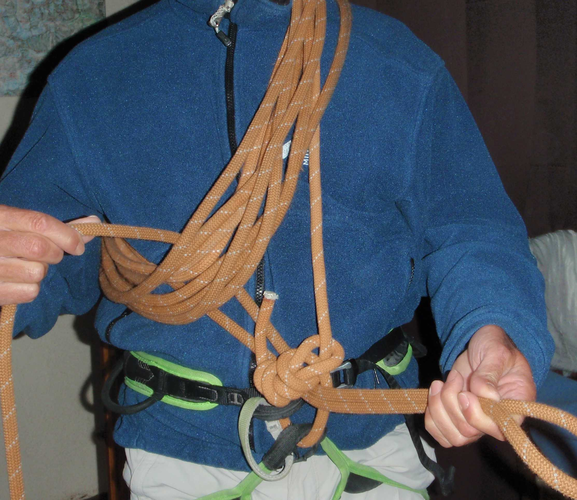
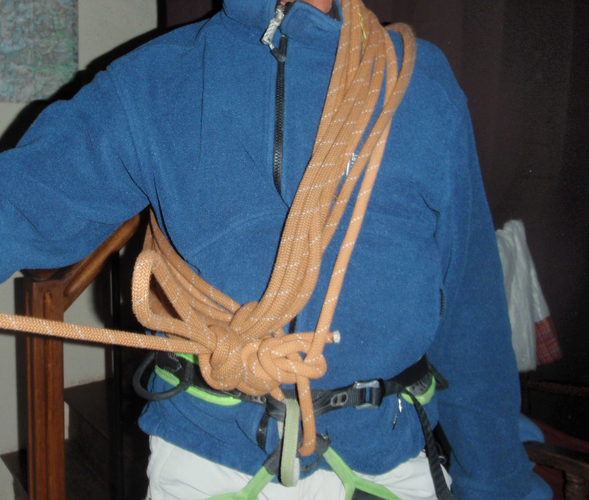

# Techniques d'assurage et d'encordement selon type de progression

- [Techniques d'assurage et d'encordement selon type de progression](#Techniques-dassurage-et-dencordement-selon-type-de-progression)
  - [Considérations générale sur l'assurage](#Consid%C3%A9rations-g%C3%A9n%C3%A9rale-sur-lassurage)
  - [En bref](#En-bref)
  - [Anneaux de buste - Technique classique](#Anneaux-de-buste---Technique-classique)
  - [Assurage en mouvement avec encordement COURT (3-4 mètres) sans anneaux à la main, sans pose de protection](#Assurage-en-mouvement-avec-encordement-COURT-3-4-m%C3%A8tres-sans-anneaux-%C3%A0-la-main-sans-pose-de-protection)
  - [Assurage en mouvement avec encordement LONG et pose de PROTECTION (ou usage du terrain)](#Assurage-en-mouvement-avec-encordement-LONG-et-pose-de-PROTECTION-ou-usage-du-terrain)
  - [Encordement COURT AVEC ANNEAU A LA MAIN](#Encordement-COURT-AVEC-ANNEAU-A-LA-MAIN)
  - [ENCORDEMENT EN N pour assurage sur glacier crevassé](#ENCORDEMENT-EN-N-pour-assurage-sur-glacier-crevass%C3%A9)
  - [Encordement d'un troisième sur la corde](#Encordement-dun-troisi%C3%A8me-sur-la-corde)
  - [Assurage par longueurs](#Assurage-par-longueurs)
  - [L'assurage dynamique - à relativiser](#Lassurage-dynamique---%C3%A0-relativiser)

## Considérations générale sur l'assurage

* L'assurage en mouvement est assez long à acquérir. Il faut engranger beaucoup de courses de rocher PD et AD pour devenir vraiment efficace.
* En pratique, il ne faut pas hésiter à changer de méthode en fonction des circonstances et utiliser des [mini-relais](#mini-relais)
* Vous placez un friend ou deux dans le passage que vous surmontez en un éclair puis vous faites relais juste au-dessus. Ça ne prend pas des heures : une sangle sur un becquet, un demi-cabestan : C'est bon, tu peux venir.
* En pratique, on passe d'un mode d'assurage à un autre sans interruption. On cherche à être débrouillard, non académique.
* Connaître parfaitement le niveau d'escalade de son compagnon, ses points forts et ses points faibles (fissures en verrous, dalles friction, ou surplombs...) permet d'aller aux limites de l'assurage en mouvement sans se mettre en danger outre mesure. 
* Ce qui compte n'est pas la rapidité réelle des mouvements mais la fluidité de la progression. Passer sans temps mort d'un encordement court à un encordement long, à une mini-longueur, à une parade ou une petite courte-échelle, est la clef.
* Pour s’encorder en bout de corde, la FFME préconise le nœud en 8 avec nœud d’arrêt. Pour s'encorder en N, utilisation d'un noeud de vache et d'un noeud d'arrêt

## En bref

1. L'escalade est elle DIFFICILE ?
   
   Oui => [Assurage par longueur](#assurage-par-longueurs)

2. Y a t'il présence de CREVASSE ?
   
   Oui => Progression avec [encordement en N](#encordement-en-n-pour-assurage-sur-glacier-crevass%C3%A9), distance de 15 à 20 mètres

3. Y a t il un risque de GLISSADE (pente de neige raide, arêtes de neige) ?

   A - Oui avec arête non corniché => [Progression avec encordement COURT 3-5 mètres, sans anneaux à la main, sans pose de protection](#Assurage-en-mouvement-avec-encordement-COURT-3-4-m%C3%A8tres-sans-anneaux-%C3%A0-la-main-sans-pose-de-protection)

   B - Oui avec arête corniché ou pente de neige raide => [Progression avec encordement COURT 2-3 mètres + anneaux à la main pour le premier](#Encordement-COURT-AVEC-ANNEAU-A-LA-MAIN)

4. Pas de DIFFICULTE, de risque de GLISSADE, pas de CREVASSE ?

   A - Terrain moyennement difficile & Facilement protégeable (naturellement ou pose matériel), avec mini-relais ou assurage à l'épaule régulier:

    * [Assurage en mouvement avec encordement LONG et pose de PROTECTION (ou usage du terrain)](#Assurage-en-mouvement-avec-encordement-LONG-et-pose-de-PROTECTION-ou-usage-du-terrain) (15-30 mètres)
   
   B - Facile, régulier, ne demandant pas trop de variation de corde:

    * [Assurage en mouvement avec encordement COURT sans anneaux à la main, sans pose de protection](#Assurage-en-mouvement-avec-encordement-COURT-3-4-m%C3%A8tres-sans-anneaux-%C3%A0-la-main-sans-pose-de-protection) 

## Anneaux de buste - Technique classique

* Chaque membre de la cordée est encordé à une extrémité de la corde par un nœud en huit ou un nœud de chaise assorti de son double nœud d'arrêt, selon sa préférence.
* La corde est en tas, posée au sol. Chacun va raccourcir la corde en prenant des anneaux de buste.
* On place sa main droite, paume ouverte vers bas, devant et légèrement au-dessus du pontet de son baudrier. La main gauche, en glissant le long de la corde depuis le nœud d'encordement, va amener la corde derrière la nuque, de gauche à droite. On fait plusieurs tours, jusqu'à obtenir la bonne longueur entre les grimpeurs, en tenant compte de la longueur nécessaire pour les nœuds d'arrêt.
* Une fois le dernier anneau formé, on enfile le bras droit puis l'épaule droite dans la totalité des anneaux. On a donc ces anneaux en bandoulière sous l'aisselle droite, et derrière l'épaule droite.
* Le dernier anneau passe sous tous les anneaux puis DANS LA BOUCLE d'encordement que forme le premier nœud d'encordement (et non pas le pontet du baudrier).

* Il reste à nouer le tout. On fait une boucle avec le dernier anneau qu'on enfile sous tous les anneaux (c'est à dire entre le paquet d'anneaux et la poitrine) de haut en bas. Cette boucle est ensuite repassée dans la boucle du nœud d'encordement initial (ou dans le pontet), puis est nouée sur elle-même par un nœud simple qui emprisonne la corde allant à l'autre grimpeur. En tendant alors cette corde, la tension est transmise à la boucle d'encordement.

* On place enfin un mousqueton entre la boucle et le pontet pour prévenir le lâchage progressif du nœud simple.
* On sécurise généralement la boucle en la mousquetonnant au pontet.

Voir l'animation gif pour [l'encordement](https://lh3.googleusercontent.com/FEAnKLzNz53SD9RLwirZFPnapS-s2OACA07PSG2JZQVhBvhBAx_Qu4iMlFuynBuq68BGLPbfhMF0i51Le-CyfTp8EYOsCN3SqHPrqF4U3iglEaJRbxX5mxz3DyERCPUzh0jR1NLUHTHF6mwasDThNmKn833yISm6IY1KiYJ2uzhP-Ai7ZixMLS3do-RBhxrO6bvPS0QsV_ByOabfjNsgC4ucS_6w_mwoCnkGqs7HDfNL9seFyDKWzLhgvZrlJ3u9jKf9KwG1oMPSlZtuAV_f9VJqdrQaXOIBwt0QTZ2RrYvcBElSVQ2H1t7wjU8vQrdOPW62enGIBoRqpBWrL9RW5H4oAgW0bIzHLySVLcgcPho14YpuxzVPrJRW9gPaVF6GBcTh82n3Cz9J9_5f-VtzvJKu3SH4ET-G00XxLY89Gd8I-2a2vipo8HexS1BqAIhfaRTEpWJvMdtIwhcz-SwVlfHzOhHZyUDaM0Kg-6bwBg1Uq7ANYFJZ0SgqM9IUvT5YWflyCB-FyjDP983CLE7hhkDhNxlHQcUDX19GPV0KKae6XP4CHzbSr1j2pOvgn1j0QZeB_IEsU2qEXG3k1XF57BsTQjDgqp1ghVl_-K85WAEnCC6SXxyHsc2sKJMz8lR1G9mccAFBOpkQnnFWZAsBKpkByIWW7xaElQbMZiWrPBfqcYz8KL_303kuIm1MrnM2hZvDNSnqak-ktTEUaP9bc2ewfw=w690-h919-no)

Note: il existe d'autres techniques d'anneaux de buste, utilisable sur glacier en remplacement de l'encordement en N, comme celle d'EMHM Chamonix (mais pas réussi à la faire): Voir [ici](https://www.randonneepyrenees.com/Images/rando/escalade/docs/Encordement.pdf), ou [ici](https://forum.camptocamp.org/t/anneaux-de-buste-new-school/114158/9)

## Assurage en mouvement avec encordement COURT (3-4 mètres) sans anneaux à la main, sans pose de protection

PRINCIPE:

  * Les membres de la cordée progressent ensemble en cherchant à maintenir la corde à peu près tendue. Si l'un glisse, il est retenu par l'autre.
  * Pas de pose de protections
  * La distance entre grimpeurs est de 3 à 4 mètres.
  * Le premier de cordée est TOUJOURS PLUS HAUT que le second: devant à la montée, derrière à la descente.
  * Personne ne tient d'anneaux à la main.
  * En cas d'obstacle court, le premier de cordée le franchit, paré voire poussé par le second, se cale derrière un recoin du rocher, et assure son compagnon [à l'épaule](#assurage-%C3%A0-l%C3%A9paule) ou directement sur un becquet rocheux avec un [mini-relais](#mini-relais). Le second le rejoint, puis les deux repartent corde tendue.

AVANTAGES:

  * Technique d'assurage qui permet la progression la plus rapide sur un terrain uniforme. 
  * Le second de cordée est bien assuré, sauf dans les traversées. Le leader peut avoir intérêt pour gérer celles-ci à traverser en amont de son second pour éviter un pendule.
  * Le premier de cordée a les deux mains libres. En neige, il peut donc manier deux piolets et être capable en permanence de retenir une glissade du second. En rocher, les deux mains libres lui donnent une grande sûreté.
  * Le risque de faire tomber des pierres est minimum. Les pierres qu'enverrait le leader n'auraient pas le temps de prendre de la vitesse avant d'atteindre le second.
  
INCONVENIENTS:

  * L'assurage en mouvement est rudimentaire et apporte nettement moins de sécurité aux grimpeurs que l'assurage par longueurs. Mais la sécurité en montagne ne se réduit pas à la sécurité d'une longueur. Il s'agit aussi de descendre au plus tôt la pente de neige raide avant que le soleil ne la rende dangereuse, de quitter le sommet avant l'orage, de rentrer avant la nuit, et tout simplement de réduire la durée totale de la course afin d'épargner la fatigue de la cordée
  * Le premier de cordée n'est assuré que par la proximité du second qui peut le parer ou caler ses pieds sur des adhérences précaires. Le leader doit donc être très sûr.

A UTILISER SI:

  * Terrains faciles pour la cordée - neige, glace, mixte ou rocher - à l'exception des glaciers enneigés en raison du risque de chute en crevasse
  * Pentes de neige raides, en montée et en descente
  * Gradins rocheux sans possibilité d'assurage, en montée et en descente
  * Arêtes de neige délicates non cornichées, en progressant de part et d'autre du fil, ce qui assez pénible mais sûr

A NE PAS/PLUS UTILISER SI:

  * Nécessité fréquente de franchir des obstacles, si ceux-ci excèdent en hauteur la longueur d'encordement. Pour de tels obstacles, la marche aux anneaux est plus indiquée.
  * Le leader n'a plus la capacité de retenir une glissade du second.

## Assurage en mouvement avec encordement LONG et pose de PROTECTION (ou usage du terrain) 

PRINCIPE:

  * La distance entre les deux grimpeurs est de 12 à 15 mètres environ.
  * Le premier de cordée est devant à la montée.
  * A la descente, celui qui va devant est celui qui place le plus efficacement les protections. Celui qui va derrière est celui qui désescalade le mieux.
  * Personne ne tient d'anneaux à la main.
  * La tension de la corde est toute relative. Elle chemine à droite et à gauche des différents reliefs que présente le parcours. On en joue, afin que le passage de la corde suffise parfois à protéger la cordée
  * Celui qui va devant place des protections régulièrement avec trois objectifs :
    * Conserver au moins deux bonnes protections entre les deux grimpeurs. Si le terrain est un tantinet avare en possibilités, quand le compagnon de cordée arrive à une protection, il le signale avant de la démonter. Ceci permet au premier de cordée de vérifier si la cordée sera toujours protégée où s'il doit poser sans tarder une nouvelle protection.
    * A la montée, placer la protection juste avant le pas difficile, pour se protéger soi, comme on le fait classiquement quand on grimpe en tête.
    * A la descente, placer la protection juste après le pas difficile, pour protéger son compagnon de cordée qui va descendre ensuite. 
  * Quand le premier de cordée a épuisé son matériel, le second le rejoint pour soit lui rendre le matériel soit passer en premier de cordée.

AVANTAGES:

  * La méthode est rapide, mais moins que les deux méthodes précédentes.
  * Les deux grimpeurs sont efficacement protégés à la condition que le second soit suffisamment discipliné pour ne pas laisser un mou se créer entre les deux grimpeurs. Il ne doit pas non plus bloquer dans un pas d'escalade sans prévenir le premier de cordée qui pourrait se trouver stoppé au plus mauvais moment.
  
A UTILISER SI:

  * Voie rocheuse assez difficile mais facilement protégeable
  * Arête rocheuse (encordement à douze mètres maximum pour s'entendre, éviter un tirage excessif et réduire le risque de chute de pierres).
  * Pente de glace (encordement à vingt mètres minimum pour éviter de brocher et débrocher sans arrêt).
  * Terrain mixte assez difficile ;
  * Arêtes de neige faciles.

A NE PAS/PLUS UTILISER SI:

  * Risque grandissant de chute du second. S'il chute, il risque d'entraîner le leader dans un vol en premier de cordée.
  * Quand le second se trouve trop limite dans la plupart des passages : relais.

## Encordement COURT AVEC ANNEAU A LA MAIN

* Progression sur une arête de neige effilée horizontale: La distance entre les deux grimpeurs est de 5 à 6 mètres, le leader tenant deux ou trois mètres d'anneaux à la main. Il se place derrière son second pour le garder à vue si la trace est faite. En cas de chute sur un versant, le leader doit lâcher les anneaux et sauter de l'autre côté en tâchant de ne pas se blesser. Les anneaux lâchés donnent le temps nécessaire pour réagir.
* Inconvénients: Le leader est non seulement mal assuré, mais doit maintenir en permanence la tension de la corde. Sa main occupée est un handicap non seulement pour grimper mais aussi pour rattraper une glissade du second. 

## ENCORDEMENT EN N pour assurage sur glacier crevassé

* encordement long avec anneaux de buste: utilisé plutôt l’été lors des raids glaciaires, mais principal inconvénient est qu'en cas de chute en crevasse, les anneaux de corde ne sont pas mobilisables rapidement, pour terrain régulier, demandant peu de variations de corde par Petzl
* C'EST CELUI QUI EST RECOMMANDE => encordement en N avec réserve de corde: utilisé plutôt en ski de montagne, recommandé par la FFME pour les traversées glacières, pour marche longue (car configuration figée) par Petzl
  
PRINCIPE:

  * L'encordement pour glacier enneigé est l'encordement dit en N, c'est à dire en divisant la corde en trois parties.
  * Chaque alpiniste réalise son nœud d'encordement au tiers de la corde.
  * Pour trouver le bon endroit sur la corde, soit on a marqué les tiers au feutre, soit chaque grimpeur place provisoirement un mousqueton à son pontet, dans lequel il place une boucle de la corde. Tout en tenant chacun une extrémité de la corde, les deux grimpeurs s'éloignent l'un de l'autre, la corde coulissant dans les deux mousquetons, jusqu'à tendre la corde. On obtient ainsi les tiers.

* Le nœud d'encordement est le nœud de chaise avec double nœud d'arrêt. On peut également réaliser un nœud en huit au lieu du nœud de chaise, mais il présente l'inconvénient d'être très volumineux quand, comme ici, on le réalise avec deux épaisseurs de corde, puisqu'on s'encorde dans le cours de la corde et non à son extrémité.
* Après la réalisation du nœud de chaise, on love le tiers libre en un petit écheveau qu'on place dans le sac (voir note ci-après). C'est la réserve de corde. Elle va servir à faciliter les manœuvres de sauvetage en crevasse le cas échéant : confection d'un mouflage ou jet de cette réserve au compagnon tombé dans le pot afin qu'il s'en serve pour remonter sur corde fixe, car la portion de corde reliant les deux grimpeurs peut avoir pénétré profondément dans la lèvre de la crevasse et être difficilement utilisable.
* La progression se fait corde tendue. L'idéal est que la corde ne touche pas le sol. La tension est cependant fatigante pour le grimpeur de tête car elle le freine. On peut donc détendre légèrement dans les zones peu suspectes de crevasses et tendre à la perfection dès qu'un doute se présente.
* Si un grimpeur perce un pont de neige fragile recouvrant une crevasse, la corde déjà tendue empêche la chute.
* Chacun doit donc progresser en gardant à l'esprit qu'il peut être tiré brusquement vers l'autre à tout instant, et qu'il lui appartiendra de ne pas se laisser entraîner.
* Pour cet encordement, on peut utiliser un seul brin d'une corde à double car il s'agit d'enrayer une glissade plus que de stopper une véritable chute. Mais on peut aussi bien entendu utiliser une corde à simple : qui peut le plus peut le moins. L'idéal est d'avoir un brin de 50 mètres de façon à disposer d'une quinzaine de mètres entre les grimpeurs.
* Si la corde est plus courte, on privilégie la longueur de l'encordement par rapport à la réserve de corde, qui sera alors plus courte. L'encordement n'est donc plus rigoureusement au tiers
* Quand le risque de chute dans d'immenses crevasses, bien larges et bien profondes, existe, on recommande de créer plusieurs [nœuds de freinage](Noeuds_%26_Mouglages.md#autres-noeuds-utiles-alouette-mule-tour-mort-et-deux-demi-clés-noeud-de-freinage) (au moins trois : à 4-5 mètres du nœud d'encordement puis à 2-3 mètres de distance) sur l'encordement afin qu'ils se bloquent dans la lèvre de la crevasse, ce qui facilite le travail de celui resté à l'air libre puisqu'il n'est plus tiré (ou moins) par le poids de son compagnon. Ces nœuds de freinage ne fonctionnent réellement qu'avec une lèvre decrevasse faite de neige épaisse et molle, ce qui est justement le genre de terrain où le risque de percer un large pont de neige est élevé.

Nœud de freinage : un nœud de huit pour commencer, puis piéger un brin avec la boucle qui repart dans le nœud.

NOTE: La réserve en vrac dans le sac

* L'encordement en N préconisé pour un glacier enneigé (crevasses masquées) prévoit originellement de placer un tiers de la corde plié en écheveau sous le rabat de son sac à dos.
* Récemment, on préconise plutôt de placer cet excédent de corde en vrac à l'intérieur du sac. Ceci permet de tirer la longueur de corde utile à une remontée sur corde ou à un mouflage sans devoir nécessairement ôter son sac à dos, et ce de façon plus rapide.
* La corde doit être soigneusement introduite dans le sac en commençant par son extrémité, pour qu'elle puisse sortir sans nœud. Certains appellent cela enkiter la corde.

## Encordement d'un troisième sur la corde

* La FFME recommande l'encordement à double noeud d'arrêt en randonnée et en randonnée glaciaire. Noeud de huit en bout. Voir [ici](https://www.ffme.fr/fiches-ffme-techniques/page/encordement-avec-le-double-noeud-d-arret.html)

## Assurage par longueurs

* Avec une corde à double, on ne mousquetonne qu'un brin à la fois pour diminuer la force de choc exercée sur les ancrages et réduire le tirage. On peut très bien mousquetonner plusieurs fois de suite le même brin, sans obligation d'alterner scrupuleusement, l'essentiel étant que les brins ne se croisent pas. En gros, un brin à gauche et un à droite. Aux changements de direction, on passe systématiquement le brin qu'on mousquetonne sous l'autre brin pour ne pas croiser.
* Des longueurs courtes
* Retaper les pitons: A chaque piton rencontré dans la voie : le marteau, deux coups sur le piton pour le tester, davantage s'il faut le renfoncer. 

## L'assurage dynamique - à relativiser

* Assurage dynamique: sauter vers le haut, avancer d'un pas ou lâcher un grand mou lorsque le copain s'envole.
* L'argument est la diminution de la force de choc afin que la réception du vol se fasse dans la douceur... à la condition que cela ne finisse pas par terre ou par un télescopage du grimpeur avec son assureur comme on le voit plus souvent qu'on ne voudrait.
* Il est vrai qu'un coulissement, même faible, de la corde dans le système d'assurage amortit le choc et permet une grande dissipation d'énergie. Mais est-il indispensable de sauter jusqu'à la première dégaine et pour éviter quoi au juste ? Les cordes dynamiques sont conçues et normées pour ne pas pouvoir transmettre une force de choc supérieure à 1200 daN (800 daN pour un brin d'une corde à double) lors d'une chute de facteur 1,77 d'un poids rigide guidé.
* Or, cette situation défavorable n'existe pas en salle d'escalade. Une fois le premier point clippé, la chute au niveau de la seconde dégaine va soit provoquer un facteur de chute proche de 1 si le mou strictement nécessaire a été donné, soit une chute au sol si le mou est excessif.
* La force de choc est donc d'emblée très inférieure aux 1200 daN qui sont pourtant déjà sans dommage pour le corps humain. Une fois les dégaines suivantes clippées, elle diminuera encore.
* En montagne, prendre d'emblée l'habitude d'assurer de manière dynamique, soit en sautant vers le haut quand on le peut, soit en donnant un bon mètre de mou pendant le vol, risque de conditionner un réflexe préjudiciable dans beaucoup de circonstances quand une chute trop longue ferait rencontrer directement une proéminence du terrain : terrasse, vire, écaille saillante, becquet, pieux métallique,
* S'il est bon de savoir comment assurer de manière dynamique, ce qui peut être utile parfois sur un relais en neige, en glace avec des broches douteuses, en rocher au-dessus d'un mauvais piton, on se gardera d'en faire une habitude. L'élasticité du système d'assurage peut se parfaire en montagne moins dangereusement avec l'emploi du nœud de demi-cabestan, l'utilisation pour les points douteux de dégaines-explose (dégaines à absorption d'énergie), la bonne gestion du tirage (un tirage important augmente la force de choc transmise au dernier ancrage) ou le mousquetonnage d'un seul brin de la corde à double.
