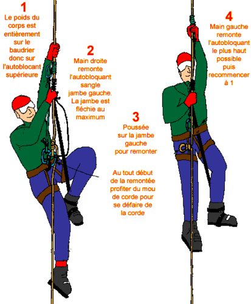
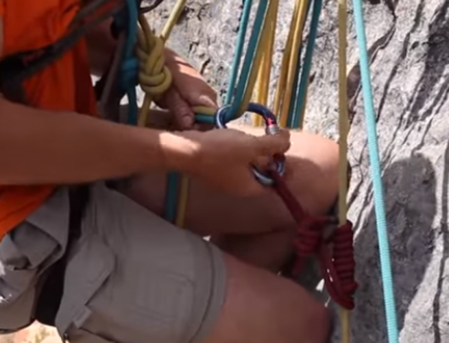
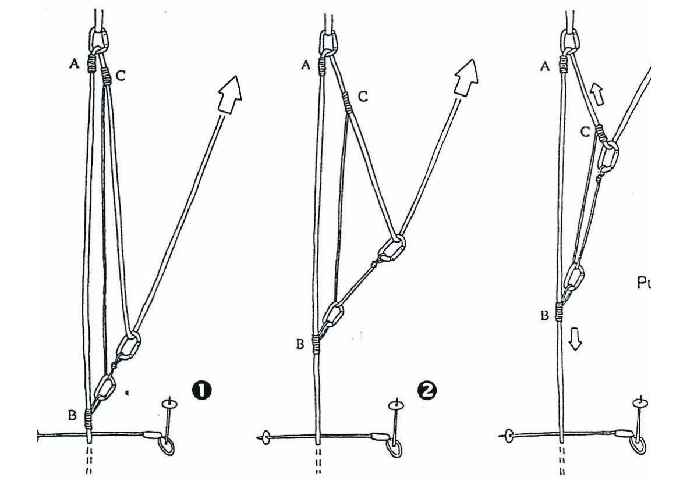

# Autres techniques en glace ou neige - Autosauvetage et glissade

- [Autres techniques en glace ou neige - Autosauvetage et glissade](#Autres-techniques-en-glace-ou-neige---Autosauvetage-et-glissade)
  - [Stopper glissade en pente raide - Position de réchappe](#Stopper-glissade-en-pente-raide---Position-de-r%C3%A9chappe)
  - [Creuser un corps mort pour assurage en neige](#Creuser-un-corps-mort-pour-assurage-en-neige)
  - [Remontée sur corde fixe - autosauvetage](#Remont%C3%A9e-sur-corde-fixe---autosauvetage)
    - [Deux petits prussik, une longe et une sangle](#Deux-petits-prussik-une-longe-et-une-sangle)
    - [Une cordelette + sangle et deux mousquetons pour pédales avec anneau de coeur](#Une-cordelette--sangle-et-deux-mousquetons-pour-p%C3%A9dales-avec-anneau-de-coeur)
    - [Autres méthodes à regarder (Points de chute)](#Autres-m%C3%A9thodes-%C3%A0-regarder-Points-de-chute)
      - [Descendeur type Reverso et ficelou](#Descendeur-type-Reverso-et-ficelou)
      - [Noeud de coeur et noeud autobloquant](#Noeud-de-coeur-et-noeud-autobloquant)
    - [Avec deux ficelous](#Avec-deux-ficelous)
    - [Deux autobloquants mais avec un ficelou et une sangle.](#Deux-autobloquants-mais-avec-un-ficelou-et-une-sangle)
    - [Remontée sur rappel](#Remont%C3%A9e-sur-rappel)
    - [Remontée en crevasse](#Remont%C3%A9e-en-crevasse)
    - [Avec poignée jumar et minitraction](#Avec-poign%C3%A9e-jumar-et-minitraction)
  - [Sauvetage en crevasse - cas où remontée pas possible](#Sauvetage-en-crevasse---cas-o%C3%B9-remont%C3%A9e-pas-possible)
  - [Franchir la rimaye](#Franchir-la-rimaye)
  - [Sortie de goulotte en neige : danger.](#Sortie-de-goulotte-en-neige--danger)
  - [Piolet en tant que relais récupérable](#Piolet-en-tant-que-relais-r%C3%A9cup%C3%A9rable)
  - [Mouflages (simple, simple de surface, Mariner)](#Mouflages-simple-simple-de-surface-Mariner)
    - [Mouflage boucle](#Mouflage-boucle)
    - [Mouflage simple](#Mouflage-simple)
    - [Mariner simple](#Mariner-simple)
    - [Mariner double](#Mariner-double)
    - [Le Grand Balancier (pour l'escalade)](#Le-Grand-Balancier-pour-lescalade)

## Stopper glissade en pente raide - Position de réchappe

* Il n'est pas possible de stopper la glissade du compagnon de cordée si celui-ci est passif.

* Le plus tôt possible, il tente de se retourner sur le ventre en conservant la tête à l'amont.
* PIOLET:
    * Il pèse de sa poitrine sur la tête de piolet tenue d'une main tandis que la seconde main tient le bas du manche, c'est à dire avec la même saisie que la technique du piolet-ancre.
    * Ainsi, la lame raye la neige à la manière d'un soc de charrue et freine progressivement.
    * On s'arrange pour que la pique ne s'enfonce pas dans la neige en relevant soigneusement le bas du manche, sinon, le piolet pourrait se bloquer d'un coup.
* PIEDS
    * En neige dure, on relève les pieds pour éviter de rebondir sur les pointes avant des crampons.
    * En neige molle, on écarte les pieds et on s'en sert pour freiner davantage, mais avec d'infinies précautions si l'on a chaussé les crampons pour ne pas risquer un arrêt brutal des pieds et une bascule tête en bas, et seulement après avoir déjà ralenti franchement par l'action du piolet. 

## Creuser un corps mort pour assurage en neige

* Technique avec un piolet
  * Creuser une tranchée profonde perpendiculaire à la corde, à l'aide de la panne de votre piolet, puis une seconde dans l'axe de la corde.
  * Dans ces tranchées, vous placerez votre piolet flanqué d'une sangle en corps-mort.
  * Tasser de la neige au dessus du piolet

## Remontée sur corde fixe - autosauvetage

* Différentes techniques existent
* La plus simple: remontée avec deux cordelettes, une de 60 fermée avec des double noeuds de pêcheur et une de 120 cm non fermée

Voir la vidéo [Self rescue with prussiks](https://www.youtube.com/watch?v=E6Mbl1QiQ_E)  

* Installation:
  * Faire un noeud de prussik avec la cordelette de 60 cm bien au dessus de sa tête
  * Plier la cordelette en deux et faire un noeud de vache au niveau de la boucle
  * Faire un noeud de prussik sous le précédent, avec la boucle créée
  * Faire une boucle pour le pied
    * Première méthode: avec l'un des bouts libres du second prussik, faire une petite boucle (noeud de vache) puis passer le même bout de corde dans la boucle: un noeud coulant tres bien si on a des chaussures rigides
    * Seconde méthode: avec l'un des bouts libres du second prussik, faire une boucle de taille moyenne pour passer directement le pied
  * Attacher le premier prussik sur le pontet du baudrier avec un mousqueton à vis.
  * Attacher le deuxième brin libre du second prussik sur le pontet sur le mêmemousqueton à vis, en faisant un noeud de vache (laisser du mou, car ce n'est que la sécurité)
  
* Usages:
  * Se mettre debout sur la pédale, tout en faisant coulisser le prussik du haut
  * S'assoir dans son baudrier
  * Remontée la pédale
  * Recommencer

NOTA: si encordement en N avec un mousqueton à vis, possible d'avoir un second backup en faisant des noeuds réguliers sur la corde initiale et en les mousquetonnant dans le mousqueton d'encordement (si absent le rajouter).

Regarder également [ce tutoriel vidéo](https://www.youtube.com/watch?v=a4N96Ct7oKw) où la cordelette de 120 cm est remplacée par une pédale classique raccourci clipée dans un second prussik court.

### Deux petits prussik, une longe et une sangle

 * Mettre un autobloquant A sur la corde au dessus de soit.
  * Se vacher dessus avec sa longe.
  * Placer un deuxième autobloquant B entre le premier et son nœud d’encordement.
  * Réaliser à l’aide d’une sangle C une pédale que l’on placera sur le dernier autobloquant B.
  * S’élever sur la pédale et déplacer le premier autobloquant sur lequel on est vaché.
  * Se remettre en tension dans le baudrier après avoir bougé le 1er autobloquant.
  * Déplacer le 2ème autobloquant vers le haut en gardant le pied dans la pédale.
  * Répéter les actions 5 à 7 jusqu’à la sortie de la crevasse. 

### Une cordelette + sangle et deux mousquetons pour pédales avec anneau de coeur

* Anneau de 60cm pour le baudrier, et un nœud de cœur en remplacement de l'anneau de 120cm.
     

        
* La corde forme un nœud de cœur autour des deux mousquetons côte à côte. Une sangle est fixée dans le bas des deux mousquetons. Cette sangle forme une tête d'alouette autour du pied pour réaliser une pédale bien serrée.
* L'avantage de cette technique est une grande rapidité pour une fatigue réduite, mais elle nécessite de ne pas démarrer pendu en bout de corde. Vous ne pourrez donc  utiliser cette technique qu'après avoir amorcé la remontée par la première technique pour avoir un peu de corde libre, ou bien sur glacier, en utilisant la réserve de corde d'un encordement en N.

### Autres méthodes à regarder (Points de chute)

* Comment remonter sur corde en escalade ou canyoning ? - Chap 1: [voir la vidéo de Points de Chute](https://www.youtube.com/watch?v=o1-IIsGOboc)

* Ch.2 - Le MODE DEBROUILLE de la remontée sur corde en escalade et canyonisme: [voir la vidéo de Points de Chute](https://www.youtube.com/watch?v=IHYqOQLduwo)

#### Descendeur type Reverso et ficelou

* On aura comme bloqueur de poing un autobloquant fait avec le ficelou et, comme bloqueur ventral, le Reverso.
* Dans un premier temps, je confectionne un autobloquant avec le ficelou, je le verrouille avec MS, je me longe dedans et je clippe ma pédale.
* Ensuite, pour installer le Reverso en mode autobloquant, je l’installe comme pour une utilisation au relais mais ici le relais, ce sera le point d’attache de mon harnais.
* Enfin, j’installe normalement la corde dans le descendeur et je clippe un MS comme quand je vais assurer quelqu’un sauf que le mousqueton connecté à la corde ne sera pas cette fois relié au harnais.
* Et je pense bien à verrouiller le MS.

Voilà, le Reverso est en mode autobloquant. La suite, normalement on la connaît: monte/pousse/ravale/monte/pousse/raval/…

#### Noeud de coeur et noeud autobloquant

* pour l'autobloquant il te faut un ficelou et pour le nœud de cœur, il te faut deux mousquetons qui ont la même forme.
* C’est mieux si les deux mousquetons n’ont pas de virole et pas de grosse bague.
* Le nœud de cœur va nous servir comme bloqueur ventral. Pour le confectionner, je vais connecter au point d’attache de mon harnais deux mousquetons identiques et clipper la corde dans les deux mousquetons (dans les deux brins si on est sur corde à double bien sûr).
* Puis, je vais clipper le brin aval de la corde, dans le mousqueton supérieur en faisant une boucle de manière à ce que la corde passe entre les deux mousquetons et qu’elle sorte vers l’avant.
* Le nœud de cœur est loin d’être infaillible et, je vais obligatoirement appliquer le principe de redondance en me longeant dans un second bloqueur plus fiable, comme ici dans un nœud autobloquant. Et aussi, en cours d’utilisation, je vais régulièrement contrôler que la corde reste bien en place dans les mousquetons et que ces derniers sont bien positionnés (pas de chevauchement, vrille, retournement, etc.).

### Avec deux ficelous

* Donc là, on se fait un p’tit Machard comme bloqueur ventral avec un anneau de cordelette.
* Ensuite, comme bloqueur de poing, on va faire ici un Souabe avec un ficelou monobrin. Je connecte un Mousqueton de Sécurité (MS) au ficelou et j’y clippe ma longe et ma pédale.
* Alors la galère quand on a un nœud autobloquant en ventral, c’est que pendant la phase de poussée sur la pédale, et bien cet autobloquant est autobloqué ! C’est à dire que, le bloqueur ventral, ici un Machard, ne va pas coulisser seul sur la corde au fur et à mesure que je monte. Et en plus de ça, si je tire sur le nœud d’une main pour le faire coulisser vers le haut ça ne va pas le faire, parce qu’il n’y a pas assez de poids dans la corde en dessous de moi. Non en fait, ça va juste faire remonter la corde mais pas le nœud !
* Donc la solution c’est de :
  * Bien caler la corde dès le début dans ses pieds pour pouvoir par la suite bien la bloquer. Attention : il faut bien caller les deux brins de la corde sinon, quand je vais faire remonter le nœud, il peut y avoir un décalage des brins dans le nœud et alors là, l’autobloquant ne va pas fonctionner;
  * Pendant la poussée du pied sur la pédale, je serre bien les pieds pour bloquer la corde et, une fois la corde bloquée tendue, je fais remonter d’une main le nœud ventral;
Tout au long de la remontée, je fais coulisser la corde entre mes pieds sans la perdre histoire d’être un peu efficace et d’éviter d’avoir à re-caller la corde à chaque fois;
Et ainsi de suite.

NOTA: la méthode sélectionnée tout en haut est une variante plus simple.

### Deux autobloquants mais avec un ficelou et une sangle.

* Dans notre cas, on utilise une sangle en dyneema.
* Il faut être vigilant sur l’utilisation d’un autobloquant fait avec une sangle dyneema principalement parce que cette matière a tendance à être plus glissante. Ça demande donc, en fonction de la configuration, corde à simple/corde à double etc., d’ajuster le nœud avec un peu plus de tour ou de tresse, de contrôler régulièrement la bonne tenue du nœud et, pourquoi pas, de réserver ce nœud à une position comme bloqueur de poing afin de garantir le meilleur blocage avec l’autre ficelou pour le ventral.
  
### Remontée sur rappel

* Le rappel ne se remonte évidemment qu'à la condition qu'on ait encore à sa disposition les deux extrémités.
* Si on ne les a pas, on grimpe en s'assurant en premier de cordée avec la portion de corde qu'on a pu rappeler, jusqu'à la seconde extrémité qui pend en l'air, puis on démarre la remontée sur corde à cet endroit.
* On remonte en emprisonnant les deux brins à la fois dans les autobloquants.

### Remontée en crevasse

* Sur un glacier, une fois dans la crevasse, retirer votre sac sera souvent la première chose à faire.
* Accrochez votre piolet à un porte-matériel du baudrier
* Mettez une sangle à votre pontet en tête d'alouette, accrochez-y votre sac à dos pour gagner un peu de liberté et avoir accès à votre matériel
* retirez vos lunettes de glacier et mettez-les dans la poche du rabat, sortez une fourrure polaire et enfilez-la
* Récupérer frontale
* Installer votre matériel de remontée
* Votre remontée doit être efficace et sans à coup,il ne s'agit pas d'arracher le méchant piolet qui fait office de relais de fortune et de l'entraîner avec vous. Répétez ces techniques et peaufinez-les. 

### Avec poignée jumar et minitraction

A REGARDER

## Sauvetage en crevasse - cas où remontée pas possible

NOTE: décrit pour encordement en N (pas conseillé de faire encordement en long sur glacier car pas facile de libérer du mou)

* Enrayer la chute et se stabiliser avec les pieds.
* Le second se sécurise en installant une broche à glace et en se vachant pour éviter de tomber plus bas.
* Réaliser un amarrage (broches, corps mort selon la qualité de la neige ou de la glace).
* Se longer sur l’amarrage (cela évitera de glisser vers la crevasse.
* Transfert du poids sur le corps mort
  * Réaliser un autobloquant sur la corde et le relier à l’amarrage.
  * Il est possible d'utiliser une Microtraction ([Voir video How To XV](https://youtu.be/Ukhnzlh22qQ?t=175))
  * S’assurer qu’il ne glisse pas avant de libérer la tension de la corde pour la transférer sur le corps mort.
  * Il est possible de faire un noeud de mule avec le brin de réserve sur le relais ([voir la vidéo de l'ENSA](https://youtu.be/z93_oX7fjM8?t=229) et d'autres à coller ici)
* On utilise dans ce cas le reste de corde pour réaliser le sauvetage du second.
* Le premier de cordée installe un autobloquant (cordelette ou tibloc) sur le reste de corde. Afin de se déplacer en sécurité, i faut garder une tension dans cette corde
* Il libère ses anneaux de buste s'il en a et se désencorde.
* On vérifie l'ancrage et on le double éventuellement.
* Si la corde a pénétré profondément dans la lèvre de la crevasse, vous allez lui renvoyer votre réserve de corde pour qu'il fasse sa remontée sur ce brin.
* On installe un ski, une pelle, un piolet sur la levre pour éviter que la réserve de corde subisse le même sort
* Réalisation d'un [Mouflage boucle, simple ou mariner double](#Mouflages-simple-simple-de-surface-Mariner)

Exemple vidéo:
* Building an anchor: https://www.youtube.com/watch?v=VbJ2Y3t_NkA
* Transfer Load / Escape System: https://www.youtube.com/watch?v=Z07LXfplRNs
* Check Victim / Drop loop: https://www.youtube.com/watch?v=EhlanzaBtp4
* The Z pulley: https://www.youtube.com/watch?v=sF4kETlz3kk

Voir Petzl (avec matériel)
* https://www.petzl.com/FR/fr/Sport/Secours-crevasse-n%C2%B0-1---transfert-du-poids-de-la-victime-sur-un-ancrage?ActivityName=Alpinisme
* https://www.petzl.com/FR/fr/Sport/Secours-crevasse-n%C2%B0-2---acces-au-bord-de-la-crevasse-pour-evaluer-la-situation?ActivityName=Alpinisme
* https://www.petzl.com/FR/fr/Sport/Secours-crevasse-n%C2%B0-3---mouflages-pour-le-secours-en-crevasse?ActivityName=Alpinisme

## Franchir la rimaye

Voir: https://www.petzl.com/FR/fr/Sport/Franchir-une-rimaye-pendant-une-course-de-neige?ActivityName=Alpinisme

L'état de la rimaye fait partie des conditions à vérifier pour préparer une course. Certaines courses sont réputées ne pouvoir se faire que jusqu'en milieu de saison pour cette raison.

* En bonne condition, la rimaye est bouchée et forme simplement une fente ou une petite marche. Un grand pas et l'affaire est faite.
* Quand elle est plus ouverte, un pont de neige solide peut avoir été construit par la dernière coulée ayant purgé la pente. On passe rapidement, puis on dégage vite de la goulotte d'avalanche, car plus haut que le halo de la frontale, plusieurs centaines de mètres de dénivelée organisés en entonnoir ne demandent qu'à passer par là au moindre appel de la pesanteur.
* Quand le pont de neige est douteux, on en fait un examen approfondi, en allant voir du côté gauche puis du côté droit. La glace, la neige, sont solides à la compression, pas à la traction. Aussi, on cherche à savoir si les piliers sont compacts de chaque côté du pont. La neige du milieu doit reposer sur une sorte de voûte soumise à la compression.
* Si vous n'avez pas de chance, la rimaye se présente comme un mur, la lèvre supérieure étant très au-dessus de la lèvre inférieure.
* Franchir le mur peut ne pas être facile car il est généralement en neige plus ou moins molle, qui supporte mal le poids du grimpeur sur les seules pointes avant des crampons.
* Il faut d'abord choisir l'endroit le moins difficile, donc éliminer les endroits où la lèvre supérieure est surplombante ou trop à distance de la lèvre inférieure. Le second assure depuis la lèvre inférieure qui forme généralement une partie horizontale, sans trop s'approcher du trou. Il est simplement calé dans la neige si la pente est débonnaire, vaché à un corps-mort sinon. Il n'est pas dans l'axe de chute du premier de cordée car réceptionner son copain équipée de crampons est moins agréable que de l'accueillir avec ses chaussons d'escalade.
* Ensuite on cherche à progresser en piolet traction et cramponnage frontal. Si la lèvre est trop molle et à tendance à s'effondrer, il va falloir l'aménager. Trois solutions :
  * On creuse des marches au piolet. C'est une des dernières circonstances où l'alpiniste contemporain s'emploie à ce genre d'exercice. Il faut souvent commencer par déblayer avec la panne du piolet la neige non adhérente et en cours de fonte qui pend de la lèvre supérieure. On tâche de se mouiller le moins possible. Une fois le déblayage accompli, on taille des marches profondes en tachant de trouver une ligne de faiblesse, pas forcément en ligne directe.
  * On prend les gros bâtons en bois qui ont servi pour l'approche et qu'on a prévu d'abandonner, et on les enfonce horizontalement dans le mur vertical pour en faire des échelons. On monte le pied sur le premier bâton, on ancre le piolet plus haut en enfonçant le manche obliquement jusqu'à la tête, et on enfonce le deuxième bâton pour avoir un second échelon. De là, on part en libre avec les deux piolets et en se ménageant de profondes marches pour les pieds si la neige est toujours inconsistante. Si on n'a pas de bâton, le premier de cordée emprunte les piolets du second pour les planter à l'horizontale comme les bâtons.
  * On creuse jusqu'à atteindre la glace pour placer une bonne broche, puis on mousquetonne un étrier en sangle sur la broche en tâchant de ne pas coincer une pointe de crampons dans le tissu de la sangle. On se vache très court sur la broche avec une dégaine.

* Après avoir franchi la rimaye, le premier de cordée se met un peu à distance pour ne pas tomber bêtement dedans, et fait relais sans attendre. Une longueur courte permet de mieux assurer le second car la corde n'est pas encore élastique. Le relais est fait d'un corps-mort ; classiquement, le deuxième piolet dans une tranchée horizontale, très haut par rapport à l'assureur qui se vache en tension dessus. Si vous trouvez de la glace, vous êtes le roi du pétrole : deux broches reliées par une grande sangle nouée. Si vous trouvez le rocher du bord du couloir avec fissure ou becquet : trop facile. Attention toutefois à ces immenses becquets inspirant confiance mais dont la base disparaît dans la neige. Testez-le en le bousculant un peu avant de lui confier la cordée.
  
## Sortie de goulotte en neige : danger.

* Les sorties de longueur en neige, on ne sait jamais à l'avance si on va avoir affaire à une neige compacte qui rend la sortie plus facile ou à une poudreuse inconsistante. Dans le raide, avec la corde qui tire en arrière en fin de longueur, on se fait vite peur.
* La glace bien sûr, c'est technique, mais c'est la sécurité.
* L'idéal est de progresser sur la neige compacte parce que ça va vite, et de s'assurer sur la glace parce que c'est solide.
* A la fin de la goulotte de glace, avant de prendre pied sur la neige, on commence par visser une broche au dernier emplacement solide possible. Puis on regarde attentivement la suite. Y-a-t-il un becquet ou une fissure de rocher dans la pente de neige pour faire relais ? A quelle distance ? Ai-je assez de corde pour y aller ? On demande au second. Il sait répondre car il vient de voir passer le milieu qu'on a marqué au feutre. Il crie : « Il reste vingt mètres. » C'est largement, vous y allez. Si en vous rapprochant de ce que vous avez pris de loin pour un becquet, mais qui n'en est pas un, vous regrettez de vous être aventuré dans la neige raide, vous redescendrez plus sereinement en sachant qu'une broche vous protège en sortie de glace. Maintenant, si le copain vous crie « il reste cinq mètres », ne tentez pas le diable : une deuxième broche superposée à l'autre, une sangle qui les relie ; relais !

## Piolet en tant que relais récupérable

Le piolet 1 est enfoncé dans la neige, la cordelette 4 fixée à la pointe (noeud de cabestan n'entravant pas la sortie). Lors de la récupération du rappel, la corde 3 entraîne l'autobloquant de la cordelette 4, qui fait sortir le piolet 1. Le piolet 1 entraîne le piolet 2 par la sangle 5, qui doit être assez longue pour ne pas bloquer la sortie de 1.

Ce système fonctionne aussi avec des skis.

## Mouflages (simple, simple de surface, Mariner)

[Voir la vidéo source](https://www.youtube.com/watch?time_continue=1&v=UjrFtLTYyNY)

### Mouflage boucle

* Simple et efficace, il faut être en visuel et disposer de suffisamment de corde pour atteindre son second par une boucle.
* Le leader utilise la corde déjà avalée en amont du système d'assurage.
* Avant de descendre la corde a son second, le leader y place un mousqueton de sécurité que le second fixe à son pontet
* Le second se tracte sur le brin relié au système d'assurage pour aider à la manoeuvre

### Mouflage simple

[La video](https://youtu.be/UjrFtLTYyNY?t=140)

* Lorsque le second est trop bas pour un mouflage boucle.
*  Cette technique démultiplie la force par trois mais exisge de tirer 3 fois plus de cordes.
*  Le leader construit un noeud autobloqant à l'aide d'un anneau de cordelette d'environ 7mm de diamètre.
*  Il le place sur l'une des deux cordes du second.
*  Il y fixe un mousqueton qui fera office de point e renvoi pour la corde en amont de la plaquette (le mieux est de faire passer la corde dans une poulie accrochée au mousqueton)
*  Pour huisser le second, il suffit de tirer vers le haut la corde ainsi placée

* Il est possible de rajouter un mousqueton au niveau du relais et de faire passer le brin mou de la corde pour augmenter la démultiplication et tirer vers le bas plutôt que vers le haut

[Voir la video de How to XV](https://youtu.be/Ukhnzlh22qQ?t=372)

### Mariner simple

[La video](https://youtu.be/UjrFtLTYyNY?t=231)

* Si les frottements sont trop important ou le second trop lourd, une démultiplication plus importante des forces est nécessaire.
* Le Mariner simple démultiplie par 5 les forces exercées, mais la mise en place est plus longue et il y a une perte sur le débattement en contrepartie de la démultiplication.
* Le point de renvoi n'est plus fixé directement au noeud autobloquant, mais à l'extrémité d'une cordelette de 2 ou 3 mètres qui est fixée par son autre extrémité au relais.
* Cette cordelette coulisse via un mousqueton dans le noeud autobloquant.
* En aval de ce mousqueton, le leader fixe un mousqueton de renvoi sur la cordelette avec un noeud de cabestan.
* Comme pour le mouflage simple, après avoir renvoyé la corde dans le mousqueton de renvoi, tire vers le haut.

### Mariner double

Principe: lors de la traction, l'autobloquant 2 vient contre1, tandis que 4 et 3 se rapprochent. L'autobloquant 1 prend le blessé en charge, et le sauveteur peut replacer 2 et 3 pour poursuivre la manoeuvre

### Le Grand Balancier (pour l'escalade)

* Dans le cas où le second est trop loin, où les frottements sont trop importants ou qu'il est nécessaire, on ne peut réaliser les mouflages classiques.
* On réalise dans ce cas une manoeuvre de synthèse et d'exception le grand balancier

[Voir la vidéo explicative du Grand Balancier](https://www.youtube.com/watch?v=UU6EFqwLIYY)