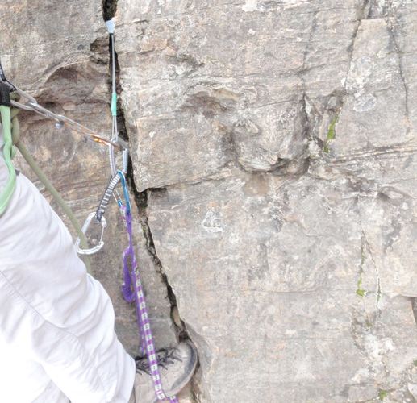
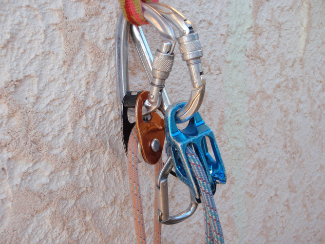
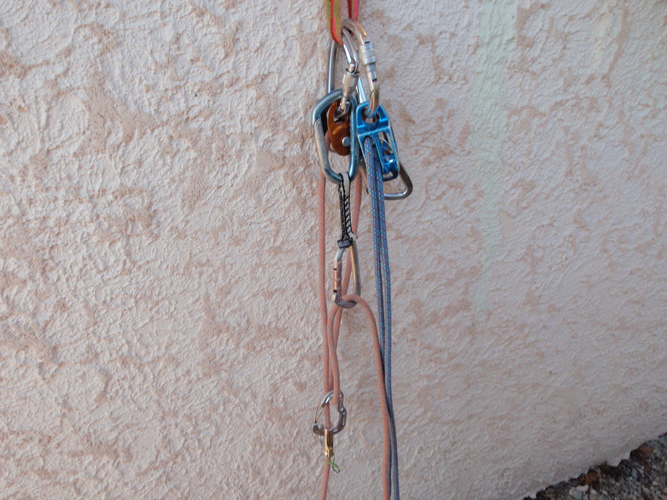

# Techniques générales - Rappel, réchappe, ...

- [Techniques générales - Rappel, réchappe, ...](#Techniques-g%C3%A9n%C3%A9rales---Rappel-r%C3%A9chappe)
  - [Le rappel](#Le-rappel)
  - [La réchappe](#La-r%C3%A9chappe)
  - [Pas d'artif](#Pas-dartif)
  - [Pliage de corde](#Pliage-de-corde)
  - [Hissage de sac](#Hissage-de-sac)
  - [Poser une main courante](#Poser-une-main-courante)

## Le rappel

* En cas de descente lourdement chargé ou corde très lisse, on peut avoir avantage à entourer plusieurs fois la jambe (pantalon de rigueur) avec la corde libre pour augmenter le freinage, ou bien utiliser un renvoi sur mousqueton
* Le nœud de jonction des deux brins est le nœud de huit. Le nœud de vache est maintenant abandonné.
  * Moins durable qu'un double nœud de pêcheur qui demeure le nœud d'aboutement de référence dans l'industrie, quand deux cordes reliées doivent servir toute une journée de travail. Ceci veut dire que l'utilisation du nœud de jonction en huit pour de nombreux rappels successifs suppose qu'on vérifie de nouveau le nœud à chaque rappel et qu'on le réajuste s'il a glissé.
* On recommande de laisser 30cm minimum de brins libres après le nœud. Les brins doivent rester parallèles dans le nœud pour pouvoir le serrer intimement jusqu'à former une boule et non un huit à plat.
* Il peut être utile de rajouter un ou deux noeuds d'arrêt
* Les brins doivent être soigneusement pliés en écheveaux avant d'être lancés, le premier descendu installe le relais suivant en changeant la cordelette, se vache, crie « libre ».
* Pendant la descente du second, le premier installe déjà le brin à tirer dans l'anneau en pensant que le nœud d'aboutement doit se trouver contre le rocher, ceci pour éviter l'effet de la plaquette réverso: le brin du dessus plaqué contre le brin du dessous bloque celui-ci.
* Quand la longueur du rappel est inconnue et qu'on a aucune visibilité sur l'extrémité basse de la corde, on peut être tenté de réaliser d'emblée un nœud en bout de corde qui relie les deux brins mais problématique en cas de coincement.
* On recommande actuellement de lancer les deux brins dépourvus de nœud en bout de corde, de réaliser l'essentiel de la descente, puis, arrivé à une dizaine de mètres de l'extrémité, de se laisser bloquer par son autobloquant, de ramener la corde restante à soi pour faire à ce moment seulement le nœud de sécurité rassemblant les deux brins en bout de corde.

## La réchappe

* Si vous êtes à un piton infaillible
  * Vous n'avez pas dépassé la moitié de la longueur => vous laissez un mousqueton et vous vous faites mouliner jusqu'au relais. 
  * Vous êtes plus près de vos sous => vous vous vachez au piton, vous passez un anneau de cordelette dans son œil, et vous installez un rappel avec un autobloquant qui fonctionne dans les deux sens.
* Si vous êtes à un piton inspirant peu confiance sans possibilité de renforcer l'ancrage et ous avez dépassé le milieu de la corde
  * Le mieux est d'abandonner un mousqueton, de vous faire mouliner par le second très doucement sur un seul brin tandis qu'il ravale le deuxième brin au fur et à mesure de votre descente. Ainsi, vous ne risquez pas plus qu'un vol en premier de cordée.
  * On peut objecter que se faire mouliner sur un point fragile n'est pas judicieux en raison de l'effet poulie qui double la charge sur l'ancrage par rapport à un rappel. Ceci est vrai. Mais installer un rappel est beaucoup plus long à réaliser, on sera donc plus longtemps sur le point douteux.
  * Avec une corde à simple
    * il faudra placer un autobloquant costaud entre votre pontet et la corde qui monte, que vous ferez coulisser pendant votre descente.
    * Dès que vous arrivez à un ancrage solide de la longueur, vous vous vachez, vous vous décordez du brin qui passe dans le mousqueton du haut, vous rappelez la corde et vous vous encordez de nouveau.
    * Vous êtes revenu dans le premier cas de figure plus favorable.
  * Avec une corde double
    * on peut installer un rappel sur un seul brin, tandis que le second continue d'assurer sur le second brin pendant toute l'installation du rappel puis pendant toute la descente.
    * Tout ceci va être bien chronophage et disproportionné si le piton n'est pas franchement minable et qu'il suffit de quelques mètres de moulinette pour atteindre un ancrage sûr.

## Pas d'artif

Voici les étapes pour franchir un pas en artif :

  * On pose le coinceur, on mousquetonne la dégaine On se pend dessus, d'abord doucement pour le tester, puis on y met franchement tout son poids.
  * On mousquetonne alors seulement la corde.
  * On mousquetonne l'étrier en sangle sur le mousqueton du haut de la dégaine.
  * On se vache très court avec une dégaine entre le pontet et ce mousqueton du haut, du côté opposé au doigt.
  * On passe un pied dans une marche de l'étrier et on se lève. La dégaine qui sert de vache aide à se redresser dans un mouvement d'opposition avec le pied et pivote vers le haut.
  * Une fois debout sur l'étrier, on pose un autre coinceur plus haut et on recommence l'opération.
  * On récupère l'étrier dès qu'on a mousquetonné la corde sur le nouveau point en se laissant descendre à la corde.
  * On se rapproche de nouveau du coinceur du haut en se tirant à la corde, comme à la salle quand on remonte après un vol.

La dégaine sur laquelle on est vaché, très courte, est accrochée au mousqueton du haut de la dégaine d'assurage, côté opposé au doigt.

## Pliage de corde

* En montagne, vous allez plier et déplier la corde de nombreuses fois, pour changer l'encordement, sortir un brin pour grimper une longueur avec la corde à double, en ranger un quand vous continuez à corde tendue, préparer un rappel, etc.
* Il n'est pas besoin d'envoyer les ganses derrière la nuque. Les brassées se prennent dans la paume en écartant les deux bras pour augmenter l'amplitude. Puis on finit en formant une poupée, et non en saucissonnant le milieu de l'écheveau, afin d'avoir un objet compact facile à fourrer dans le sac à dos.
  
* Pliage en écheveau:
  * Le pliage en écheveau toronne moins la corde que le pliage en couronne, il est donc préférable avant de lancer un rappel.

* Pliage en couronne
  * Le pliage en couronne est plus rapide et permet de porter le brin en bandoulière.
  * Sa meilleure indication est au pied du dernier rappel qu'il faut fuir le plus vite possible sous peine de recevoir les pierres des cordées suivantes.
  
* Tandis que l'un tire la corde puis préparera le brin qui permet de se ré-encorder avec les anneaux de buste, l'autre plie déjà, au fur et à mesure de sa récupération, le premier brin qui vient, puis le passe en écharpe sans besoin d'ouvrir le sac. 

## Hissage de sac

* La poulie autobloquante micro-traction de Petzl (85g) est l'outil idéal pour le hissage du sac. Elle sera aussi d'un grand secours en cas de mouflage. La combinaison tibloc (39g) et poulie oscillante P02 de Petzl (42g), convient aussi.

Le brin du sac est sur la poulie autobloquante, le brin du second sur la plaquette:

Tête de mouflage faite de la poulie autobloquante, renvoi inférieur sur mousqueton et tibloc, renvoi supérieur sur mousqueton. On peut ainsi tirer vers soi en étant positionné sous le relais:

## Poser une main courante

A regarder:

* https://www.ffme.fr/fiches-ffme-techniques/page/poser-une-main-courante.html
* https://www.ffme.fr/fiches-ffme-techniques/page/utiliser-une-main-courante-en-assurance-risque-de-chute-mortelle.html