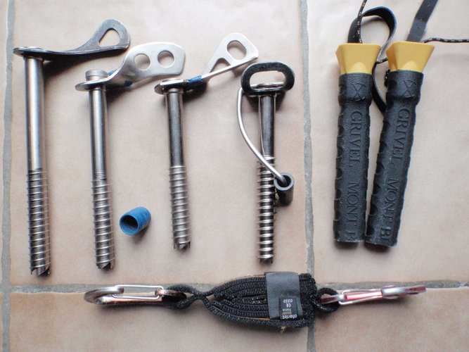
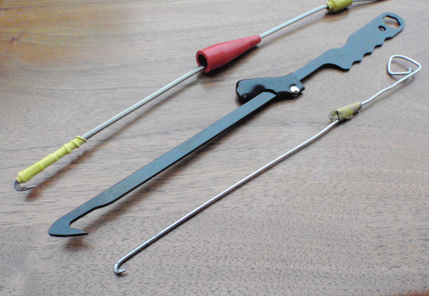
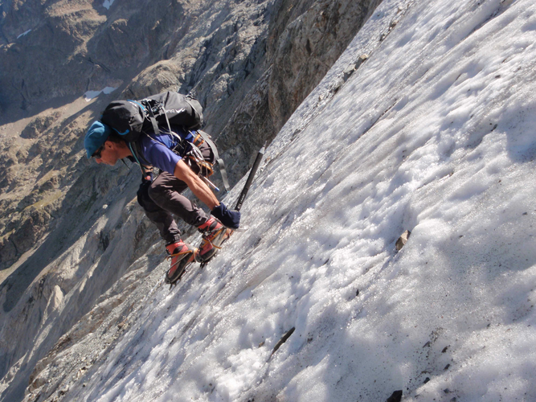
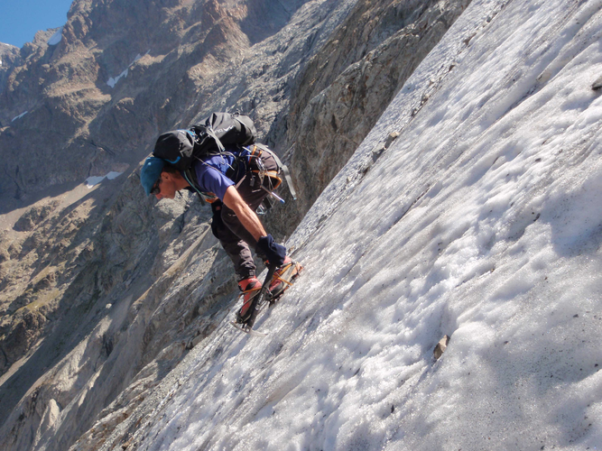
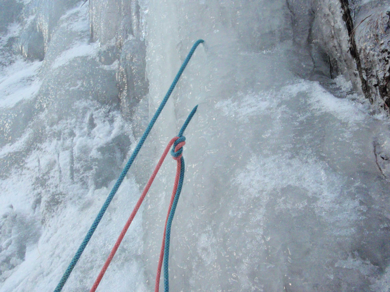
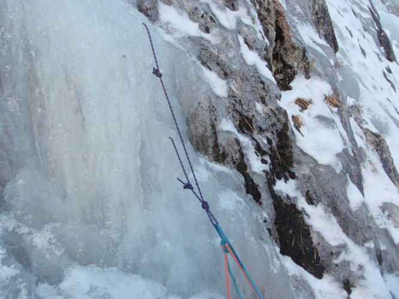
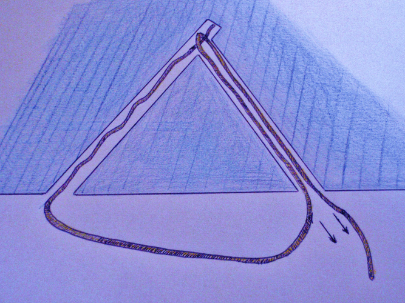
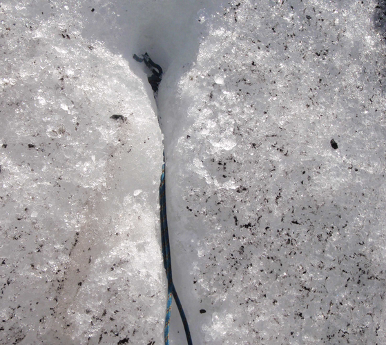
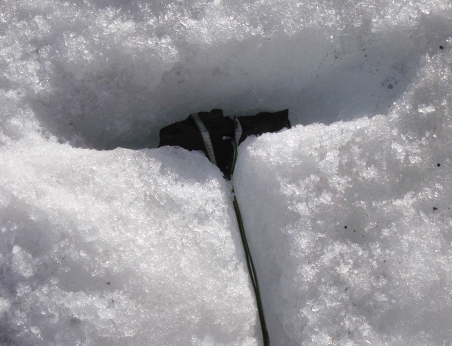

# Fiche Encordement & Progression sur GLACE

* MATERIEL:
    * 2 Broches à glace chacun (broche longue et courte, cette dernière pour la glace mince)
    * Dégaine explose
    * Crochet à Abalakov: on peut confectionner le crochet à abalakov soi-même à partir d'un rayon de bicyclette. 

    
    
    

* PROGRESSION
    * Cramponnage dix pointes est identique à celui décrit en neige.
    * La seule différence est que la surface n'est plus du tout malléable.
    * En pente plus raide, le piolet-appui ou le piolet-panne ne sont pas utilisables en glace car pousser simplement la lame en tenant le piolet par la panne ou en haut du manche ne suffit pas pour la faire mordre.
    * La technique du piolet-ancre est la technique royale quand on ne dispose que d'un piolet.
    * Le piolet-ramasse convient tout à fait pour de courtes traversées horizontales, ascendantes ou descendantes.
    * Dès que la pente se redresse, on utilise la technique du piolet-traction, avec un ou deux piolets (cf. p.102).
    * Sur cramponnage frontal, on garde les talons bas pour faire mordre les quatre pointes avant de chaque crampon, les deux pointes les plus basses servant à stabiliser la position. Si la section est longue, on peut préférer la technique mixte, un pied en technique frontale, un pied à plat, pour épargner les mollets.
    * En descente, le piolet-rampe est très efficace à condition de ne pas avoir choisi une lame banane qui ne tient pas à l'envers. On ancre très bas le piolet puis on se sert du manche comme d'une rampe en cherchant à l'exploiter le plus bas possible.

    

    

  * Points d'assurage
      * Broches tubulaires qu'on visse à la main perpendiculairement à la surface de la glace.
      * La qualité de celle-ci est évidemment primordiale. La consistance de la carotte sortant de la broche pendant le vissage nous renseigne :
          * des copeaux épars, trop d'air dans la glace
          * de l'eau, glace trop chaude.
      * Une dégaine « explose » dont les coutures se déchirent pour amortir le choc peut être utilisée dans le cas d'une glace douteuse.
      * On peut aussi nettoyer au piolet cette mauvaise glace pour accéder à un matériau solide.
      * Une vieille glace fossile mise à nue dans une pente de haute-montagne en fin d'été peut interdire le brochage par sa dureté extrême. On est alors heureux d'avoir entretenu avec soin les dents d'amorçage et l'état de surface du corps de ses broches, pour réussir à se protéger néanmoins un minimum.
      * Quelques broches courtes pour la glace mince plaquée sur du rocher afin d'éviter le porte-à-faux d'une broche incomplètement vissée. 

  * Relais de progression
   * Simple et sûr si la glace est suffisamment épaisse et solide.
   * On visse deux broches tubulaires l'une au-dessus de l'autre, suffisamment éloignées pour qu'elles ne sollicitent pas le même cône de glace, et on les relie avec une grande sangle.
   * On fait un nœud (simple ou en huit selon la longueur disponible) en bas de la sangle pour éviter qu'un choc ne se produise sur une broche si l'autre venait à céder.
   
  * Relais de rappel - Abalakov
      * Pour éviter d'abandonner une coûteuse broche à glace, on confectionne une lunule artificielle, dite abalakov, en vissant deux broches inclinées de façon qu'elles se rencontrent en profondeur. Il faut savoir viser juste. 
      * Après avoir retiré les broches, on enfile une cordelette dans un tunnel pour la ressortir du second tunnel en la piquant avec un crochet métallique pointu.
      * On conseille actuellement un diamètre de 7mm pour la cordelette, ce relativement gros diamètre sciant moins facilement une glace de consistance douteuse. En glace compacte, rien n'empêche de descendre à 6 ou 5mm.
      * La cordelette est fermée en anneau par un double nœud de pêcheur.
      * On recommande une angulation des broches avec la surface de 45°, de façon qu'elles se rencontrent à 90°.
      * On recommande que les deux broches se rencontrent le plus profondément possible. Il nous semble opportun de proposer un triangle équilatéral, afin d'obtenir autant d'épaisseur que de largeur à la lunule, donc des angles de 60°, les broches se rencontrant à... 60°.
      * En pratique, vous verrez que vous serez déjà bien content de voir vos deux tunnels se rejoindre, surtout en glace dure où on ne peut pas récupérer un mauvais angle de départ, et que vous n'ergoterez pas sur quelques degrés pourvu que l’œuvre semble solide.
      * Les fractures naturelles de la glace se produisant la plupart du temps horizontalement, on conseille aujourd'hui de réaliser une lunule verticale plutôt qu'horizontale.
      * Quand la glace est bien sèche, on peut même économiser la cordelette en passant la corde directement. Le nœud doit alors se situer en dessous, pour avoir à tirer sur le brin sortant du tunnel inférieur. On parle de lunule sèche.

      

       
      
      

      

  * En l'absence de broche à glace , on peut confectionner comme en neige un corps-mort (un caillou trouvé sur le glacier par exemple), un champignon de glace, ou un coin de glace. Un gros nœud vient alors se coincer dans la fente en V creusée avec la lame du piolet.

  

  