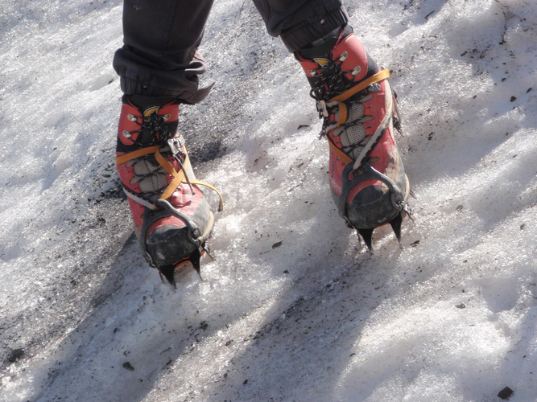

# Fiche Encordement & Progression sur GLACIER ENNEIGE

## MATERIEL MINIMUM

Pouvoir se sortir d'une crevasse ou réaliser un relais + mouflage, voir [fichier "Materiel"](../Materiel.md#course-sur-glacier)]

## INSTALLATION DU MATERIEL

* Utiliser une des sangles pour accrocher une broche à glacer, la relier avec tête d'alouette au pontet du baudrier
* On s'encorde en N (voir ci-après)
* Pour la réserve de corde
* On la love en un petit écheveau qu'on place sous le rabat de son sac à dos.
* On peut faire des anneaux de buste avec la réserve de corde. A la fin de la corde, faire une boucle, la passer dans la boucle du baudrier, la faire passer à l'intérieur des anneaux de buste et la faire passer dans la boucle ainsi formée et la fixer au baudrier avec un mousqueton à vis.
* Il peut être utile d'installer déjà un système autobloquant sur la corde en prévision d'une chute. Dans ce cas, laisser du mou pour que l'encordement principal joue son role Plusieurs possibilités:
    * Machard français non relié au baudrier qui sert de poignée en progression normale et d'ancrage temporaire en passant le piolet dedans
    * Autobloquant relié à un mousqueton et une sangle fixés au porte matériel du baudrier (donc non tendus). 

* Voir les vidéos suivantes pour un bon aperçu général:
  * [Vidéo ENSA Chamonix](https://www.youtube.com/watch?v=z93_oX7fjM8)
  * [Video How To XV](https://youtu.be/sS9Rg_3EItc?t=243)

## ENCORDEMENT

Encordement dit en N (long), c'est à dire en divisant la corde en trois parties (quinze à vingt mètres).

* Chaque alpiniste réalise son nœud d'encordement au tiers de la corde.
* Pour trouver le bon endroit sur la corde, soit on a marqué les tiers au feutre, soit chaque grimpeur place provisoirement un mousqueton à son pontet, dans lequel il place une boucle de la corde. Tout en tenant chacun une extrémité de la corde, les deux grimpeurs s'éloignent l'un de l'autre, la corde coulissant dans les deux mousquetons, jusqu'à tendre la corde. On obtient ainsi les tiers.
* Le nœud d'encordement:
    * nœud de chaise avec double nœud d'arrêt.
    * Nœud en huit au lieu du nœud de chaise, mais il présente l'inconvénient d'être très volumineux quand, comme ici, on le réalise avec deux épaisseurs de corde, puisqu'on s'encorde dans le cours de la corde et non à son extrémité.
    * Possibilité de s'encorder sur noeud en huit avec un mousqueton (mais avec mousqueton à vis unidirectionnel ou un mousqueton à vis et un mousqueton simple) => globalement plutôt déconseillé ([Vidéo d'exemple](https://www.youtube.com/watch?v=-ZqGO3JyztQ&feature=youtu.be))

## PROGRESSION

Progression en corde tendue.

* Il peut être intéressant de faire quelques noeuds sur la corde pour ajouter de la friction
* L'idéal est que la corde ne touche pas le sol.
* La tension est cependant fatigante pour le grimpeur de tête car elle le freine. On peut donc détendre légèrement dans les zones peu suspectes de crevasses et tendre à la perfection dès qu'un doute se présente.
* Si un grimpeur perce un pont de neige fragile recouvrant une crevasse, la corde déjà tendue empêche la chute.
* Chacun doit donc progresser en gardant à l'esprit qu'il peut être tiré brusquement vers l'autre à tout instant, et qu'il lui appartiendra de ne pas se laisser entraîner.
* Les pieds sont un peu écartés pour éviter d'accrocher une jambe de pantalon avec un crampon, d'un écartement similaire à la position de base du ski moderne : la largeur du bassin.

## TYPE DE MARCHE

CRAMPONNAGE OU MARCHES - dépend de la dureté de la glace/neige
  
* Marche en canard (pieds en V) pour faible pente, passage au cramponnage 10 pointes lorsque pente se redresse.

* GLACIER OU GLACE DURE: cramponnage dix pointes (technique française).
    * Il s'agit de faire mordre les dix pointes inférieures de chaque crampon dans la neige, un crampon classique en comptant deux de plus dirigées vers l'avant qui ne sont d'aucune utilité sur pente faible. En conséquence, on tord la cheville au gré de l'inclinaison de la pente. Contrairement au ski, on ne prend pas de « carre ».
    * A la montée, pour éviter d'allonger dangereusement le tendon d'Achille, on progresse de côté, voire presque à reculons, dans une sorte de traversée ascendante. C'est à dire qu'on présente une hanche vers l'amont, une autre vers l'aval.
        * Le pied amont se positionne de travers à la pente, voire pointe légèrement dirigée vers l'aval sur une pente plus importante.
        * Le pied aval, lors du pas, va passer devant le tibia amont, se placer en avant et en amont du pied amont, pointe nettement dirigée vers l'aval d'autant plus que la pente est grande.
        * On a donc à cet instant les jambes croisées, l'équilibre étant maintenu grâce au piolet tenu comme une canne par la main amont posée sur la panne, lame orientée vers l'avant : c'est la technique du piolet-canne.
        * On reporte le poids du corps sur le nouveau pied amont, puis l'ancien pied amont, devenu aval, passe derrière le mollet du nouveau pied amont (c'est à dire entre la pente de neige et la jambe, espace de plus en plus réduit à mesure que la pente s'accentue), et se pose de nouveau de travers à la pente, mais plus haut sur la pente.
        * Plus la pente est forte, plus l'ensemble du corps se tourne vers l'aval, donnant alors l'impression de progresser à reculons.
        * La progression forme donc des lacets. En bout de lacet, le changement de direction se fait pour le premier de cordée en se tournant vers l'aval, ce qui lui évite de devoir enjamber la corde qui relie les deux membres de la cordée, car la corde doit rester du côté de la hanche aval du leader pour l'empêcher d'être soumis à une rotation qui le déséquilibrerait lors d'une glissade du second.

        Technique dix pointes, au moment du croisement de jambes.
        
        

    * A la descente, les deux pieds sont en canard. Pour éviter la prise de carres, on porte le poids sur l'avant du pied. On peut s'aider à conserver la bonne position du corps vers l'avant en pente soutenue en plaçant la main libre, celle qui ne tient pas le piolet, sur le genou.

    * Si la pente est encore plus forte, le cramponnage frontal s'impose, de préférence à réserver pour de courtes sections, à moins d'un entraînement sérieux.

* NEIGE MOLLE ET EPAISSE - imprimer des marches
    * A la montée, on marche alors normalement, comme on monte un escalier.
    * A la descente, on attaque franchement du talon. Mais dès que la couche de neige devient insuffisamment malléable, on revient au poids du corps porté sur l'avant du pied car une glissade sur le talon est une glissade sans filet.
        * Derrière le talon, il n'y a en effet plus rien pour retenir la chute, tandis que derrière l'avant-pied qui glisse, il y a encore toute la longueur du crampon pour se rattraper.

* Quand la pente se redresse se posent trois questions :
    * La longueur d'encordement est-elle encore adaptée à enrayer une glissade ?
    * Dois-je ranger mon bâton télescopique pour mieux manier mon piolet ?
    * Le cramponnage dix pointes est-il encore possible ?

## CONSEILS

* Toujours essayer de traverser une crevasse à 90 degrés
* Eviter de s'arrêter dans des zones en creux et choisir plutôt des zones en dôme pour le faire.
* Rester espacé en cas d'arrêt
* Les crevasses sont en général sur les zones convexes de changement de pente ou lorsque le glacier s'élargit ou se rétrécit.

