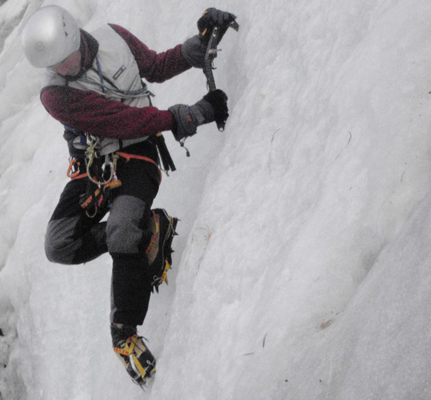

# Fiche Encordement & Progression sur PENTE & ARETE DE NEIGE

- [Fiche Encordement & Progression sur PENTE & ARETE DE NEIGE](#Fiche-Encordement--Progression-sur-PENTE--ARETE-DE-NEIGE)
  - [USAGE DU PIOLET](#USAGE-DU-PIOLET)
    - [Piolet-appui ou piolet panne](#Piolet-appui-ou-piolet-panne)
    - [Piolet-ancre](#Piolet-ancre)
    - [Piolet traction](#Piolet-traction)
    - [Piolet Manche](#Piolet-Manche)
    - [Piolet Ramasse](#Piolet-Ramasse)
  - [PENTE RAIDE NEIGE](#PENTE-RAIDE-NEIGE)
    - [ENCORDEMENT](#ENCORDEMENT)
    - [PROGRESSION](#PROGRESSION)
  - [ARETE DE NEIGE](#ARETE-DE-NEIGE)
    - [Arête sans corniche importante qui empêcherait de parcourir le fil](#Ar%C3%AAte-sans-corniche-importante-qui-emp%C3%AAcherait-de-parcourir-le-fil)
    - [Arête fortement cornichée](#Ar%C3%AAte-fortement-cornich%C3%A9e)

## USAGE DU PIOLET

### Piolet-appui ou piolet panne

La main tient le piolet en haut du manche très près de la tête, ou bien par la panne, mais c'est cette fois la lame du piolet qui est plantée en la poussant simplement devant soi dans la pente raide, tandis que la main libre est posée sur la neige pour parfaire l'équilibre.

### Piolet-ancre

* une main sur la tête, l'autre main en bas de manche.
* On ancre la lame en tenant le piolet d'une seule main comme on le pratique en cascade de glace tel un smash de tennis, puis on s'y tient à deux mains.

### Piolet traction
### Piolet Manche

* planter le manche verticalement et entièrement dans la neige.
* On se tient au piolet dont seule la tête dépasse comme en piolet-canne.
* Si la neige est encore plus molle, on peut poser son piolet à plat horizontalement, tenu à deux mains devant soi en l'enfouissant comme un corps mort à chaque pas, mais ce cas de figure se rencontre plutôt en poudreuse 
* On peut aussi utiliser les bâtons télescopiques réunis ensemble avec la même technique. 

### Piolet Ramasse

* Piolet est tenu sensiblement horizontalement au niveau de la hanche amont, pique posée ou plantée dans la neige, une main en pronation en bas du manche (très proche de la pique) appuyant vers la pente, l'autre main en supination sur la tête du piolet tirant vers le haut. 

## PENTE RAIDE NEIGE

### ENCORDEMENT

=> Encordement Court

* Le risque de glissade remplace le risque de chute en crevasse.
* L'encordement en N devient trop long car très trompeur en neige du fait de l'élasticité de la corde. C'est quand l'assureur croit avoir enrayé la glissade de son compagnon que la corde transmet avec une relative douceur sa force de choc maximale et le décroche de la pente à la façon d'une catapulte.
* On réduit la longueur de l'encordement en prenant des anneaux de buste. Il s'agit de l'encordement montagne classique. 
* Il faut donc s'encorder très court, environ trois mètres, afin d'enrayer la glissade dès son début, avant toute prise de vitesse dans la pente.
* Le leader peut conserver quelques anneaux de corde à la main, le dernier serré en tour mort autour de la paume.
* La corde est bien tendue de façon à sentir le second par la corde, un coup de poignet énergique le remettant en selle en cas de déséquilibre.
* Si le leader a besoin de ses deux mains, on progresse sans anneaux à la main, à corde tendue, en conservant cette même distance très courte.
* Dans les deux cas, la corde ne touche pas le sol.
  
* Changement d'encordement:
  * Si on vient du glacier crevassé avec un encordement en N, que la portion raide et non crevassée sera suivie d'une nouvelle portion de glacier crevassée, on peut prendre ces anneaux de buste à partir de l'encordement en N pour ne pas tout défaire. Puis on relâchera ces anneaux de buste quand le risque de crevasse reprendra.
  * Mais si le risque de chute en crevasse a définitivement disparu et qu'on aborde un terrain plus complexe, neigeux puis rocheux, où on devra peut-être changer encore la distance d'encordement, on peut préférer, pour plus de simplicité, défaire l'encordement en N puis réaliser l'encordement montagne classique à partir des extrémités de la corde.

### PROGRESSION

Note: Important de débotter en neige collante: on tape régulièrement un ou deux coups de piolet sur l'extérieur du crampon au moment où le pied est levé pour faire tomber le sabot de neige éventuel qui s'est formé dessous. 

* EN MONTEE - dépend de la qualité de la neige
  * Neige idéale (à la fois solide et malléable):
    * PIOLET: [Piolet appui ou panne](#Piolet-appui-ou-piolet-panne)
    * PIED:
      * On progresse face à la pente avec la moitié du pied qui pénètre à chaque pas dans la neige.
        * Cramponnage mixte (moins éprouvant) : un pied en cramponnage frontal, en faisant mordre face à la pente les quatre pointes avant du crampon, l'autre pied à plat pour soulager le mollet.
        * Rapidité et économie de mouvement, mais on ne peut ancrer profondément que si la neige est relativement molle. Sur neige plus dure, l'ancrage est superficiel et risque de ne pas pouvoir enrayer une glissade.
  * Pentes plus raides ou  neiges plus dures:
    * PIOLET: [piolet-ancre](#Piolet-ancre)
    * PIED
      * Cramponnage frontal.
      * Cramponnage mixte
      * Pied assis (anciennement utilisé):
        * Pieds à plat, avec le corps vrillé, le bas tourné vers l'aval, le haut vers l'amont ou de travers.
        * Au moment critique du désancrage, l'équilibre était résolu par un pas intermédiaire dit du pied-assis: avant que le pied devenu aval ne passe de nouveau devant le tibia du pied amont, on le posait à plat contre la pente, orteils dirigés vers le bas, assez haut sous la fesse arrière, genou plié bien sûr, comme si on allait s'asseoir dans un étrier.
        * Ceci donne la stabilité nécessaire pour désancrer puis ancrer de nouveau plus haut.
  
        

      * Plus lent et fatiguant

  * Pentes très raides:
    * PIOLET: [piolet traction](#Piolet-traction) comme en glace, avec souvent second piolet
    * PIED: cramponnage frontal

  * Neige molle:
    * PIOLET: [piolet-manche](#Piolet-Manche)

* EN DESCENTE OU TRAVERSEE - dépend de la pente
  * Traversée et descentes raides: [piolet-ramasse](#Piolet-Ramasse).
  
  * Pentes très raides:
    * PIOLET: [piolet traction](#Piolet-traction) comme en glace, avec souvent second piolet
    * PIED: cramponnage frontal et descente à reculon 

## ARETE DE NEIGE

### Arête sans corniche importante qui empêcherait de parcourir le fil

=> Encordement moyen avec anneaux à la main

* on marche sur celui-ci en prenant garde à l'effondrement des marches formant la trace.
* L'encordement est réduit par des anneaux de buste à 7 mètres.
* Le membre de la cordée le plus à l'aise sur ce genre de terrain est derrière et tient à la main deux mètres de corde formant des anneaux. Les alpinistes progressent donc à cinq mètres l'un de l'autre.
* Si le grimpeur placé en arrière voit devant lui son compagnon chuter d'un côté, il doit lâcher ses anneaux et sauter de l'autre côté de l'arête. La réserve de corde permet de donner le temps d'agir.

### Arête fortement cornichée

* la trace se trouve très en contrebas du fil ce qui interdit la technique précédente.
* Inclinaison n'est pas trop forte et que la consistance de la neige rend la progression sûre => Encordement très court
* Si vous êtes très sûr et que vous emmenez un débutant, vous préférerez dans ce cas de figure particulier progresser sur une trace amont de votre second, afin d'éviter tout pendule. Il sera ainsi mieux assuré, et ne vous déstabilisera pas par ses pertes d'équilibre.
* Si la pente est délicate, on rallonge l'encordement de façon suffisante pour dépasser l'obstacle que constitue la portion cornichée en posant un relais avant et un après.