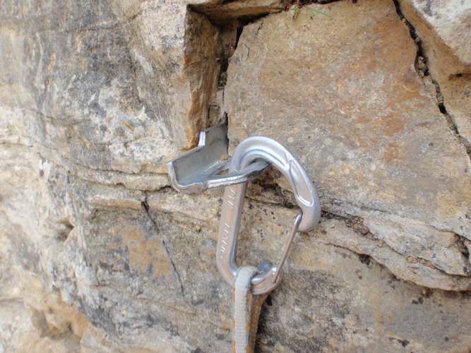

# Fiche Encordement & Progression sur ROCHER

- [Fiche Encordement & Progression sur ROCHER](#Fiche-Encordement--Progression-sur-ROCHER)
  - [EQUIPEMENT](#EQUIPEMENT)
  - [PROGRESSION](#PROGRESSION)
    - [CAS FACILE ou PROTECTION NATURELLE - ASSURAGE EN MOUVEMENT](#CAS-FACILE-ou-PROTECTION-NATURELLE---ASSURAGE-EN-MOUVEMENT)
    - [CAS PLUS DIFFICILE - ASSURAGE PAR LONGUEURS](#CAS-PLUS-DIFFICILE---ASSURAGE-PAR-LONGUEURS)
      - [Pose des sangles d'assurage](#Pose-des-sangles-dassurage)
      - [La pose des pitons](#La-pose-des-pitons)
      - [Pose des coinceurs](#Pose-des-coinceurs)
      - [RELAIS](#RELAIS)
    - [DESESCALADE](#DESESCALADE)

## EQUIPEMENT

* En montagne, on grimpe généralement en chaussons à partir du 4e degré.
* On pourra préférer grimper en grosses, si les fissures nécessite des coincements nombreux, si le rocher est partiellement enneigé, s'il y a alternance de roches et de mixte qui impose les crampons. Si les sections rocheuses sont courtes et peu difficiles, on conserve alors les crampons pour éviter de perdre du temps.

## PROGRESSION

### CAS FACILE ou PROTECTION NATURELLE - ASSURAGE EN MOUVEMENT

=> Encordement montagne classique pour encordement long ou court comme en neige
  
* Encordement long
    * les deux grimpeurs sont éloignés de 15 à 20 mètres.
    * Le premier de cordée place des protections que le second récupère en passant.
    * En présence d'obstacles rocheux sur une arête par exemple, le simple passage de la corde à droite puis à gauche de deux obstacles successifs peut suffire à créer l'assurage.
    * De la même façon, en traversée, on passe simplement la corde derrière une écaille saillante sans déposer de matériel.
    * Quand le premier de cordée ne dispose plus assez de matériel pour assurer convenablement la cordée, il fait venir le second à lui sur une protection sûre, et soit le second part en premier de cordée, soit le premier récupère son matériel.
    * On essaie de conserver au moins deux protections en permanence entre les deux grimpeurs pour plus de sécurité
  
* Encordement court, réservé aux sections faciles
    * on progresse à trois mètres l'un de l'autre, sans pose de protection entre les deux grimpeurs.
    * Il s'agit du mode d'assurage le plus rapide.
        
### CAS PLUS DIFFICILE - ASSURAGE PAR LONGUEURS

* La seule différence avec les voies équipées tiendra à la pose des coinceurs, des pitons, des sangles sur les becquets rocheux, dans les lunules de rocher ou autour de pierres coincées dans des fissures.
        
#### Pose des sangles d'assurage

* Les sangles sont un moyen d'assurage très fréquent dans les courses classiques.
* En falaise:
  * on les utilise autour des buis et des pins poussant en paroi. Si on veut assujettir la sangle à un endroit précis de la racine ou du tronc, on en fait une tête d'alouette avant de placer un mousqueton et de mousquetonner la corde, mais on sait que ce nœud fragilise la sangle.
  * Aussi, quand il est inutile de serrer la sangle autour du bois, on se contente de mousquetonner les deux boucles de la sangle, pour obtenir une meilleure résistance.
* En haute-montagne, point de végétation.
  * On utilisera les sangles pour coiffer les becquets et les écailles en tous genres qu'on rencontre quasiment partout sauf dans les parois vraiment dures.
  * On passe tout simplement l'anneau de sangle cousue en collier autour du bollard de rocher et on mousquetonne la corde avec un mousqueton. 
  * Par grand vent, pour éviter qu'elle ne quitte le becquet en s'envolant, on peut la forcer à frotter contre le rocher en faisant un nœud qui l'étrangle
  * Parfois on peut bloquer la sangle avec une pierre coincée en amont du becquet ou de l'écaille.
  * De même en bas d'une brèche qu'on vient de franchir, la tension de la corde entraîne les sangles vers le haut. Il faut donc trouver une astuce pour empêcher ce phénomène, un friend posé plus bas et retenant la sangle vers le bas par exemple, ou soit faire relais à la brèche, soit se passer de cette protection.
  * On utilise aussi fréquemment les sangles pour entourer une pierre coincée au fond d'une grosse fissure.
    * On mousquetonne les deux boucles.
    * On est souvent obligé de rallonger par une dégaine pour éviter le tirage car ces sangles, qui sont posées assez profondément dans les cheminées ou les dièdres, sont généralement surmontées par un surplomb.
    * Forcer la corde à suivre un angle à cet endroit tout en frottant contre le surplomb a de bonnes chances de provoquer un important tirage en fin de longueur.
  * Plus rarement, on trouve des lunules naturelles de rocher et on est alors heureux de posséder au moins une sangle très fine en dyneema car les trous peuvent être très étroits. Attention au coincement intempestif de la couture en double épaisseur au moment de la dépose. On tâche de tirer la sangle dans le sens qui ne va pas entraîner la couture dans un endroit inaccessible. 

  

      

  

  

#### La pose des pitons

* Il existe grosso deux types de pitons: 
  * acier doux écroui pour roches tendres comme le calcaire
  * acier au chrome et au molybdène traité à chaud, acier allié moins déformable, pour des roches dures comme le granit.  

* 5 formes principales :
  * Vertical: œil de mousquetonnage est dans le même plan que la lame (plus trop fabriqué), contre indiqué pour les fissures verticales
  * Horizontal : œil est dans un plan perpendiculaire à la lame, soit centré, soit plus souvent décentré. Contre indiqué pour les fissures horizontales sauf si oeil décentré et dans le cas, véritable piton universel.
  * Universel (qui ne l'est pas) : œil est dans un plan à 45° de la lame, tourné à droite ou à gauche
  * A anneau: anneau métallique passé dans l’œil qui permettait de faire passer directement la corde pour un rappel. Pas top car pas de couple de verrouillage.
  * Cornières: lame est repliée sur toute la longueur sur elle-même pour former un U épais, pour les larges fissures.

* Le principe du pitonnage est d'enfoncer, jusqu'à l’œil, le piton avec force, c'est à dire contre une résistance réelle du rocher, de telle façon que la traction vers le bas au niveau de l’œil engendre un effet de couple cherchant à tordre le piton dans la fissure, ce qui crée le verrouillage.
* Pour planter un piton:
  * on libère une main
  * on saisit un piton à son portematériel, on l'introduit à la main dans la fissure jusqu'à la moitié de la longueur environ,
  * on le coince par un coup sec de la paume. Là, il doit tenir tout seul son propre poids.
  * On sort son marteau d'une main, on tape très légèrement le premier coup surtout si c'est un piton dur qui a tendance à rebondir en début de frappe. S'il a du mal à tenir en place, on sort la petite ficelle qu'on a prévue pour assurer le piton dans ces cas de figure.
  * Puis on frappe de plus en plus fort au fur et à mesure que le piton rentre. Il faut vraiment taper très fort, surtout si on a choisi un marteau léger.
  * Si le piton rentre avec des coups de marteau dépourvus de force, c'est qu'il est trop fin pour la fissure.
  * Les coups de marteau produisent un son de plus en plus aigu : on dit que le piton chante, gage d'une bonne tenue.
  * Si le marteau rebondit violemment, c'est que la lame a rencontré un obstacle insurmontable. Soit on s'en contente (presque planté à fond, rien de mieux autour de cette fissure et pas d'autre piton), soit on recommence avec un piton de dimensions différentes ou le même piton dans une autre fissure.
* S'il est impossible de planter le piton à fond, on cherche à annuler le bras de levier défavorable, soit en cravatant la lame du piton avec une cordelette qu'on mousquetonne à la place de l’œil (nœud en tête d'alouette ou nœud coulant), soit s'il s'agit d'un piton mou en rabattant la partie du piton hors du rocher contre celui-ci  la force de la paume ou avec le poids du corps plutôt qu'au marteau.

   

* Dans tous les cas, piton trouvé en place ou piton qu'on a planté soi-même, on reste critique vis à vis de sa tenue, ce qui ne signifie pas qu'on ne puisse pas utiliser un piton très moyen, comme point de progression par exemple. 
* Pour ôter un piton, on se sert du crochet à dépitonner du marteau. On tape d'abord latéralement sur la tête du piton pour l'incliner, puis on fait levier avec le crochet à dépitonner passé dans l’œil du piton jusqu'à l'incliner dans l'autre sens, et on recommence l'opération jusqu'à l'extraction totale. On peut aussi utiliser une chaîne ou un câble à dépitonner. On fixe une extrémité au piton par un maillon rapide et l'autre extrémité à l’œil du marteau, puis on donne des coups de marteau vers le vide. On maintient son visage hors de l'axe d'éjection car on a payé la porcelaine de son incisive centrale suffisamment cher. Parfois, on peut utiliser son poids pour achever un piton affaibli.

#### Pose des coinceurs

* Matériel habituel
  * jeu de coinceurs câblés du n°1 au n°8 pour les fissures étroites qui présentent des étranglements (très utilisé outre manche sur granit très fracturé avec numéros courants au moins triplés)
  * jeu de friends du n°1 au n°3 voire 3,5 pour les fissures larges. Les bons topos précisent s'il faut prévoir aussi le volumineux friend n°4.

* Pour placer un coinceur câblé
  * on sort le jeu entier monté sur un mousqueton.
  * On présente le numéro correspondant à la largeur de la fissure juste au-dessus d'un resserrement.
  * Si la taille ne convient pas, on en sélectionne un autre.
  * On l'introduit dans la fissure, et en tenant la grappe des autres coinceurs, on tire un ou deux coups secs vers le bas pour le coincer.   
  * On détache ensuite le coinceur du mousqueton portant les autres qu'on range à son porte-matériel et on mousquetonne la dégaine.
  * Dans les cas difficiles, on peut coupler plusieurs coinceurs, l'un coincé vers le bas, l'autre coincé vers le haut et dont le câble passe dans la boucle du précédent afin que les deux se contrarient. On obtient ainsi un ancrage qui peut être multi-directionnel.
  
* Pour placer un friend,
  * on sélectionne le numéro correspondant à la taille de la fissure en sachant que le friend doit tenir avec les cames presque entièrement refermées. Cames trop ouvertes, le friend ne résistera pas à un choc. Cames totalement fermées, on ne pourra peut-être pas le récupérer.
  * On tache de ne pas l'installer à proximité d'un élargissement de la fissure car le friend se déplace comme un crabe quand il est sollicité par les mouvements de la corde. Il faut alors choisir un numéro de plus grosse taille qui convient à cet élargissement et le mettre à cet endroit. Ainsi, s'il se déplace, il va vers le rétrécissement et reste coincé.
  * On place la queue du friend dans la direction de la chute (même si cette recommandation est moins cruciale que naguère pour les friends à tige rigide) car le choc risquerait de provoquer une rotation dont l'issue n'est pas forcément favorable. 
  * Il est préférable de porter les friends avec un mousqueton pour chacun, ce qui évite l'emploi systématique d'une dégaine et permet leur mise en place plus rapide. 

  

  

  

  

#### RELAIS

* Voir [Relais](./Relais.md) pour des informations sur les relais.

### DESESCALADE

* Face au vide, les paumes prenant appui le plus bas possible, les bras un peu écartés, les jambes écartées. On plie une jambe tandis que l'autre jambe tendue va chercher une prise très en aval.
* Quand la pente est trop raide ou que la difficulté est trop grande, on se retourne face au rocher.