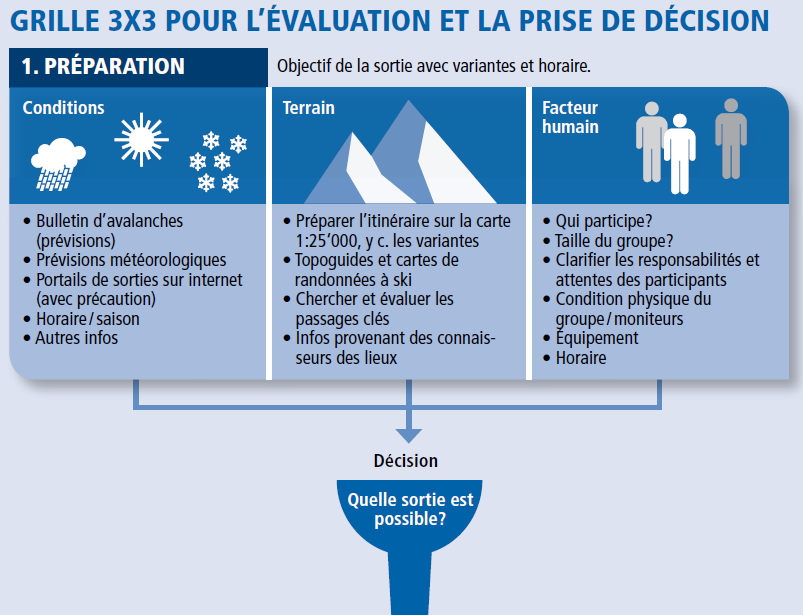
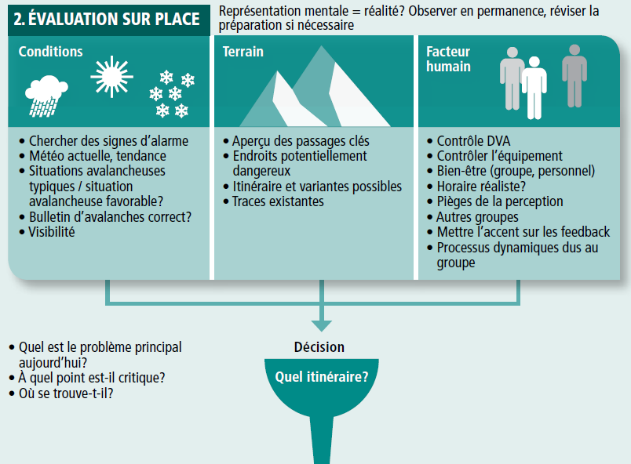
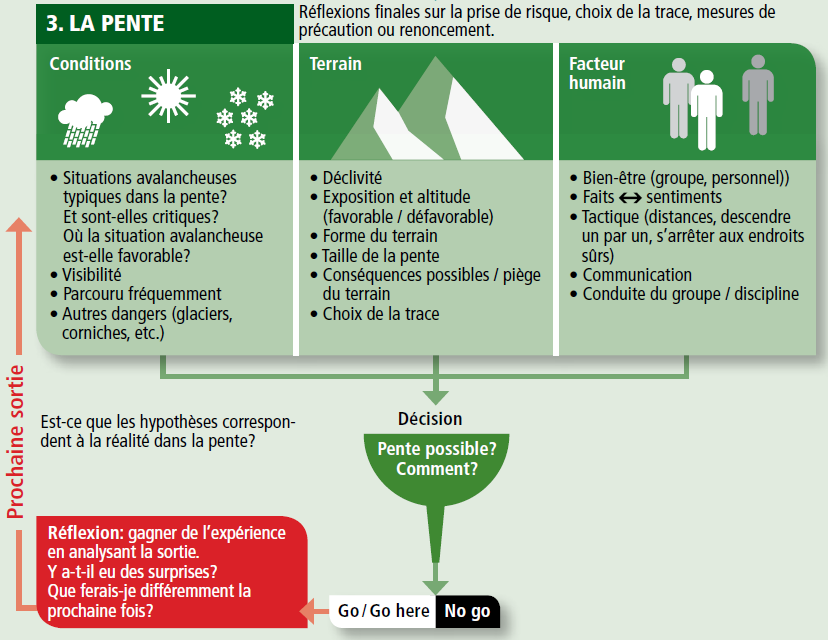

# EVALUATION ET PRISE DE DECISION EN MILIEU NEIGEUX

Plusieurs outils existent, la plus simple à mettre en oeuvre reste la grille 3x3

3 dimensions permettent de mesurer le risque:
* CONDITIONS: conditions nivo-météorologiques
* TERRAIN: données topographiques
* FACTEUR HUMAIN: caractéristiques du groupe (soi-même et les autres)

Cette mesure doit se faire à 3 moments:
* Au moment de la PREPARATION
* EVALUATION SUR PLACE
* Dans LA PENTE

## Notes de la formation Faire la Trace

* Il est important de déterminer des moments dans l'ascension / descente pour prendre des décisions (noeuds décisionnels): changer d'itinéraire en fonction de la fraicheur du groupe, de la météo ...

### Autres outils

#### Méthode de réduction de Munter

Formule de calcul permettant d'éviter les erreurs grossières d'appréciatin du risque.

#### Méthode dite élémentaire

* Croiser l'angle de la pente (le plus raide du secteur parcouru) et l'indice de danger du bulletin (de 1 à 5)
* Adaptée au débutant ou en première approche d'une préparation pour situer la cohérence d'un projet

#### Méthode de réduction pro

* Traduction en chiffre du danger sur la base du BERA et mise en rapport avec des facteurs de réduction du risque (terrain: raideur / orientation et comportement)
* Méthode peu utilisée en France mais enseignée en Suisse
* Contraignant

#### Nivotest

* Aide à l'estimation du risque d'avalanche au niveau local
* 25 questions
* Règle à calcul de poche qui comporte un disque gradué et  listes de questions portant l'une et l'autre sur les 3 catégories de variables permettant de déterminer le risque: conditions nivo-météorologiques, données topographiques, caractéristiques du groupe.

### Modes de vigilance

4 modes de vigilance:
* Détendu: pas de signe de danger, vigilance normale, pas d'avalanche possible dans le secteur
  * Pentes inférieure à 30°
  * Vigilance normale et choix multiples de progresson
* Méfiant: signe(s) de danger identifié(s), éviter le danger, avalanche possible là-bas
  * Distinguer clairement sur un itinéraire les sections qui ne sont pas exposées aux avalanches, de celles qui le sont
  * Option appropriée est l'évitement du danger
* Alerté: signe(s) de danger identifié(s), diminuer le risque, avalanche possible ici
* Hasardeux: signe(s) de danger identifié(s), impossible de diminuer le risque, avalanche possible ici

6 panneaux de danger

### Facteurs humains

* Facteur poudre: votre capacité de réflexion peut s'effacer devant 40 cm de poudreuse
* Facteur soleil: au soleil, rien n'est effrayant. Ne vous laissez pas endormir par l'aspect rassurant du ciel bleu.
* Facteur groupe: le groupe peut engendrer une prise de risque et un faux sentiment de sécurité.
* Facteur confiance: les années de pratique sans accidents rendent souvent moins vigilant.

* Avant de vous engager dans une pente, faites une petite introspection et demandez-vous: "suis-je à ma place ?"

### Terrain de jeu

* 30° + OMBRE + PEU TRACEE = VIGILANCE HAUTE !
* Considérer l'inclinaison sur l'ensemble du secteur skié et pas seulement la ligne à tracer: des déclenchements à distance sont possibles.
* La grande majorité des accidents d'avalanches en hors-piste survient dans des pentes à l'ombre. Ces expositions froides retardent la stabilisation du manteau neigeux et favorisent la création de couches fragiles.
* Quelques traces dans une pente ne stabilisent pas le manteau neigeux et ne préjugent pas de sa stabilité
* Pièges de terrain (arbre, barres rocheuses, ...): avant de vous engager dans une pente, estimez toujours les conséquences physiques d'une simple coulée.