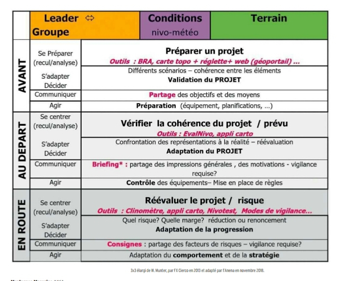
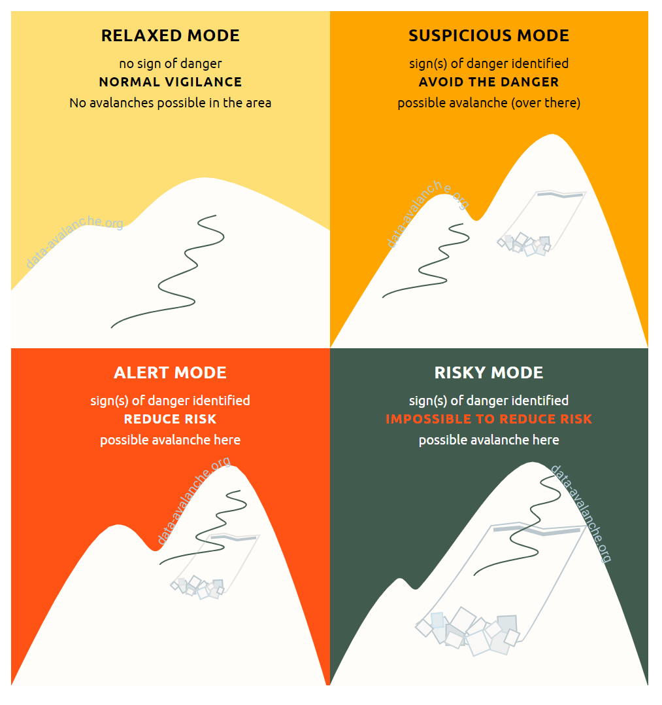
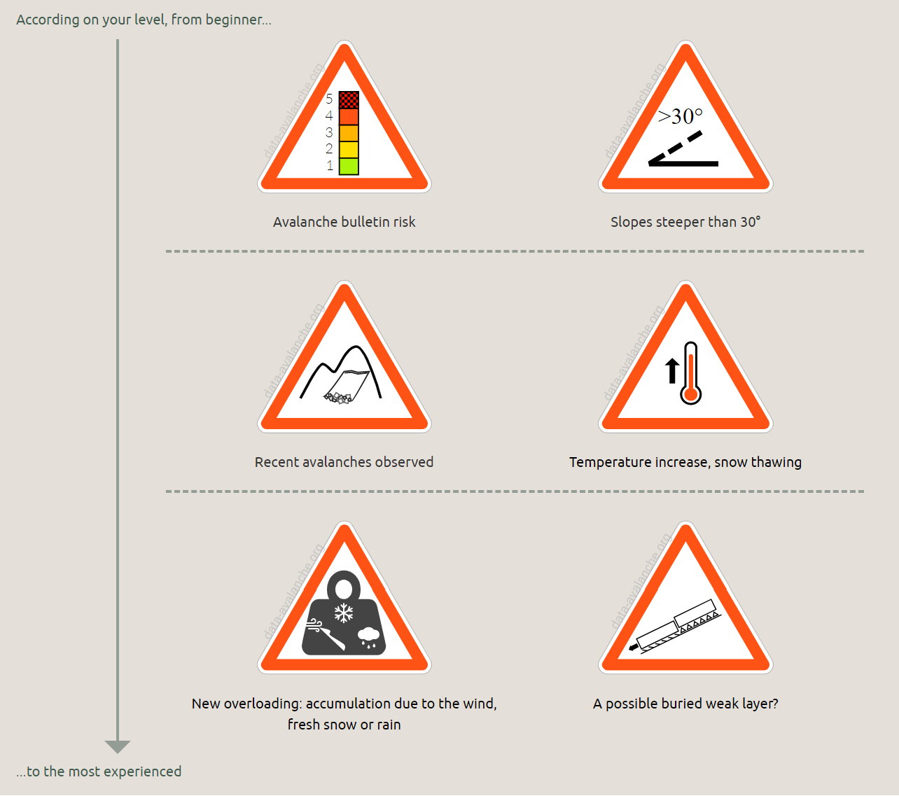
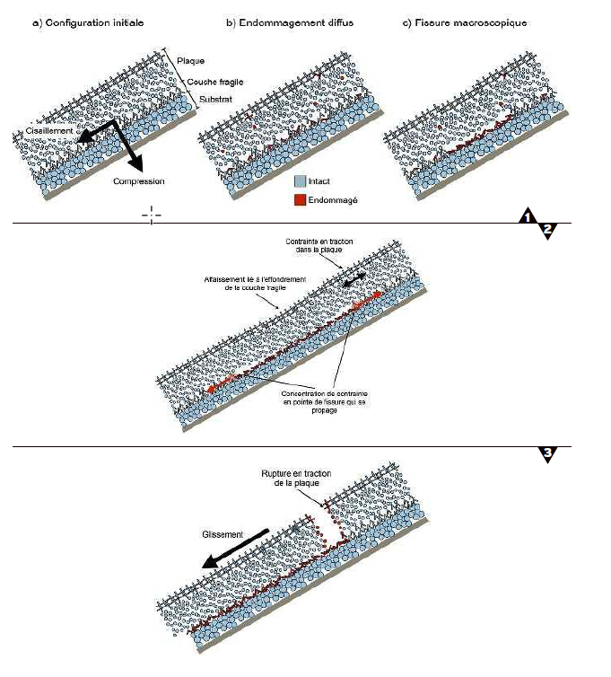
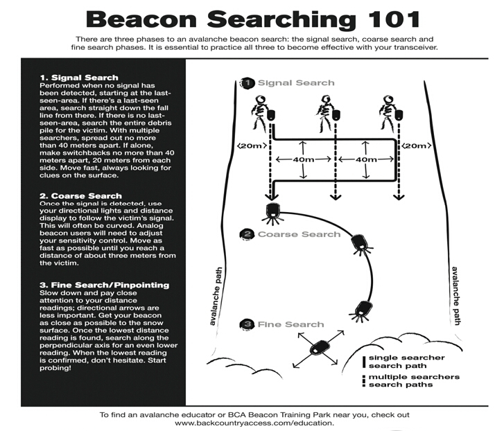

# EVALUATION ET PRISE DE DECISION EN MILIEU NEIGEUX

3 catégories de variables permettent de déterminer le risque:
* conditions nivo-météorologiques
* données topographiques
* caractéristiques du groupe.

## Méthodes d'évaluation du risque, démarche globale et prise de décision

Démarche globale:
* Observation
* Analyse
* Décision (choix d'un projet, adaptation, réduction du risque)
* Communication (partage autour d'un projet, briefing, consignes)
* Actions (stratégies)

### 3x3 de Munter

* Dans cette approche, une place centrale est donnée au leader vis-à-vis du groupe
* Autour d'une démarche cartésienne, des mécanismes de notre inconscient interfèrent avec nos décisions
  * Pièges inconscients: habitude, obstination, position sociale, rareté de la situation et aura de l'expert
  * Rôle central de l'intuition: système de pensée très rapide mobilisant nos expériences vécues qui prend souvent le pas sur l'approche rationnelle, gourmande en énergie.
* Les différentes postures de meneur
  * Le fonceur: il va au bout de son projet, dès lors qu'il a décidé d'y aller
  * Le cartésien: il se base sur la science et aimerait tout vérifier en permanence, chose irréalisable. Il fait donc un pari ou ne décide pas.
  * L'expérimenté, l'intuitif: il joue sur l'affect et l'expérience. Cela peut être efficace mais parfois pervers car il joue sur l'émotionnel ou s'appuie sur des perceptions vécues faussées.
  * Le procédurier: il s'appuie surtout sur une méthode ou un outil d'analyse qu'il suit, jusqu'à ne pas s'écouter
  * Le vigilant "encadré": il identifie des alertes (ou critères de dangers) au fi de sa progression et se place dans un mode de vigilance particulier
* Les deux premiers profils sont plutôt dangereux et seraient plus efficaces. Le dernier est enseigné aux guides français, il est moins lourd que des check-lists ou calculs chiffrés mais plus cadrant que l'intuition.

### Outils chiffrés

#### Méthode de réduction de Munter

Formule de calcul permettant d'éviter les erreurs grossières d'appréciatin du risque.

#### Méthode dite élémentaire

* Croiser l'angle de la pente (le plus raide du secteur parcouru) et l'indice de danger du bulletin (de 1 à 5)
* Adaptée au débutant ou en première approche d'une préparation pour situer la cohérence d'un projet

#### Méthode de réduction pro

* Traduction en chiffre du danger sur la base du BERA et mise en rapport avec des facteurs de réduction du risque (terrain: raideur / orientation et comportement)
* Méthode peu utilisée en France mais enseignée en Suisse
* Contraignant

#### Nivotest

* Aide à l'estimation du risque d'avalanche au niveau local
* 25 questions
* Règle à calcul de poche qui comporte un disque gradué et  listes de questions portant l'une et l'autre sur les 3 catégories de variables permettant de déterminer le risque: conditions nivo-météorologiques, données topographiques, caractéristiques du groupe.

### Modes de vigilance

4 modes de vigilance:
* Détendu: pas de signe de danger, vigilance normale, pas d'avalanche possible dans le secteur
  * Pentes inférieure à 30°
  * Vigilance normale et choix multiples de progresson
* Méfiant: signe(s) de danger identifié(s), éviter le danger, avalanche possible là-bas
  * Distinguer clairement sur un itinéraire les sections qui ne sont pas exposées aux avalanches, de celles qui le sont
  * Option appropriée est l'évitement du danger
* Alerté: signe(s) de danger identifié(s), diminuer le risque, avalanche possible ici
* Hasardeux: signe(s) de danger identifié(s), impossible de diminuer le risque, avalanche possible ici

6 panneaux de danger

## NIVOLOGIE - METEOROLOGIE

## Sources
* Formation ANENA - Nivologie Pratique - 16 Décembre 2019
* Hors Série Montagne Magazine - Avalanches - https://drive.google.com/open?id=1X1wxQnKlqGK90NAQaMYB23SSe1goK41E
* Nivologie Pratique - Editions ANENA (à regarder)
* Elements de nivologie - Meteo France

## Outils
* https://www.geoportail.gouv.fr/donnees/avalanches-temoignages
* CamptoCamp / YETI - https://www.camptocamp.org/yeti
* http://www.skitourenguru.ch/
* http://www.data-avalanche.org/danger
* https://projects.listic.univ-smb.fr/cime/vigilance/

## Général

* En termes d'avalanche, on ne peut pas batir ses décisions sur ses expériences
* L'avalanche est un phénomène rare et incertain
* On peut déclencher au plat
* Pour une même situation, on peut ou pas déclencher l'avalanche

## Méchanisme de plaque

### Structure de plaque

* Plaque avec une certaine cohésion, au dessus
* D'une couche fragile, présentant peu de cohésion sur
* Un substrat en pente

### Déclenchement

* Déclenchement de plaques de neige seiche (80% des cas)
* inclinaison > 30° (limite reconnue) => 30° c'est une pente dans laquelle on commence à devoir faire des conversions en ski de randonnée
* Cause de déclenchement
  * Pression sur la neige brise la couche fragile
  * Initiation progressive du fait de dépot de neige, pluie, vent ... 
* Mécanisme: la plque s'effondre sur la couche fragile puis glisse (rupture en traction)

### Couche fragile

* Si la couche fragile se situe à > 1,20m en dessous de la surface, et que la neige est dure, il faudra beaucoup d'effort pour briser la couche fragile
* Mais dans une même condition d'enfouissement, si la neige est molle, la contrainte sera plus importante sur la couche fragile (à sollicitation égale au niveau de la surface)

## Situations météo typiquement avalancheuses

* Conditions sont clés sur le risque

### Facteurs de risque

* Quantité de précipitations / neige fraiche
* Vent
* Température et changement de température
* Surface sur laquelle tombe la neige

### Effet de la quantité de neige

* A partir de 30 cm de dépot, le risque devient important
* Plus il y a de neige, plus le risque est important
* 40-50cm de neige fraiche un peu la limite
     * Moins => on est + tranquille
     * Plus => on est - tranquille
* Cette quantité de neige "limite" dépend d'autre facteur comme l'évolution de température, voire plus bas

### Effet de la température sur la neige

* Froid => pas de transformation de la neige => neige légère
* Chaud => transformation de la neige => neige lourde
* Froid puis chaud => 10 à 20 cm vont devenir critique (épaisseur avec cohésion qui se met sur une couche fragile)
* Chaud puis froid => 30 à 60 cm de neige deviennent critique

### Effet du vent

* CHANGEMENT DE CONSISTANCE DE LA NEIGE
  * Neige qui tombe sans vent => poudreuse, peu dense
  * Le vent donne de la cohésion si pas trop fort => plus facilement création de plaque
* TRANSPORT
  * Vent modéré à fort => endroit avec accumulation de neige (accumulation au côté opposé au vent mais pas que, car flux complexe en montagne)
  * Neige fraiche soufflée => plaque friable se met en place 
* CREATION DE PLAQUE A VENT
  * Du côté où le vent souffle, si très fort, tasse la neige côté vent
* Un vent est modéré jusqu'à 30 km/h

### Effet de la surface

* Surface meuble / lisse: départ plus facile
* Surface travaillée (trafolée ...) => plus de cohésion de cette surface (stable)

## Situation

* TRANSPORT PAR LE VENT avec zones accumulées et transformation de la neige (vent + éventuellement changement de température)
* PLAQUES A VENT NATURELLES: éviter les zones accumulées, éviter pentes raides et pieds de pente
* SOUS COUCHE FRAGILE PERSISTENTE:
  * grains granuleux, sans cohésion, plaque fragile (consitence de gros sel => gobelet), plutot dans les orientations froides
  * Anticyclone après chute de neige (beau temps) => transformation de la neige en plaque
  * Vieille poudreuse, OK à skier, danger lorsqu'elle est recouverte
  * Souvent en secteur nord (mais pas tout le temps), altitude, début d'hiver peu enneigé
  * Les grains ont du mal à se tranformer (d'où le nom persistent)
  * Ce n'est pas la chaleur qui pose problème, c'est le froid et la différence de température avec la couche en profondeur: -8° en surface (ombre et froid), -1° en bas de la couche => échange vapeur/glace en profondeur qui traverse la couche, transformation des grains avec vapeur qui se condense sur les grains
  * Eviter versant et pied de pente (départ à distance)
* HUMIDIFICATION DU MANTEAU NEIGEUX
  * Réchauffement solaire => met de l'humidité uniquement
  * Pluie => met de l'humidité et de la charge => on ne sort pas
  * Facile à anticiper => escargots visibles (boules de neige qui descendent ou glissent naturellement)
  * Attention au pluie juste après des chutes de neige => eau rentre facilement dans le manteau neigeux (danger temporaire)

## Observables

* Départs naturels, coulées
* Surface scintillante

* Topographie
  * Pentes

* Effets de la température
  * Limite pluie-neige

* Effets du vent à prévoir
  * Transport en cours
  * Relief éolien
    * Corniche:
      * Peuvent rester très longtemps
      * Donc cela ne veut pas dire forcément grand chose après un certain temps
    * Sillage: rochers suivis de congères
    * Crêtes de coqu: indice d'érosion (côté d'où vient le vent) => signe d'accumulation de l'autre côté
    * Vagues, dunes
  * Neige dans les arbres => pas de vent

* Type de neige
  * Quantité de dépot de neige
  * Profondeur de la trace
  * Dureté de la neige => on peut enfoncer un poing = peu de cohésion
  * Tests de fragilité:
    * test du baton sur grosses couches fragiles

## Evolution des structures de plaque

* Au fur et à mesure, la couche fragile se tasse et tout s'homogénéise
* On dit que au bout de 3 jours une situation avalancheuse se stabilise

## BERA - Bulletin d'Estimation du Risque d'Avalanche

* Echelle de 1 à 5: de 1 à 4 (risque humain), 5 est un risque naturel
* Attention, ce n'est pas une échelle linéaire !
* 3 est déjà un risque important

### Que mesure le BERA

* Risque = type de charge, nombre d'avalanches

### Niveaux

* 1 - Très peu de pentes avalancheuses, forte surchage nécessaire pour déclencher (plusieurs personnes au même endroit), favorable à la pratique
* 2 - Attention aux pentes raides, favorable à la pratique
* 3 - On peut déjà avoir du déclenchement à distance, une faible surcharge peut déclencher (une personne)
* 4 - Toutes les pentes sont avalancheuses, attention aux pentes raides et pieds de pente, non favorable à la pratique

### Lecture

1. Quel est le grand problème de la journée ?
   * Se référer au cartouche
   * Déclenchement skieurs => type de plaque, localisation
   * Altitude concernée
2. Quelle sont les pentes problématiques ?
   * Se référer à la rosace
   * Vérifier l'itinéraire et les pentes associées
3.  Quelle est la localisation de ces problèmes ?
    * Lecture dans le détail du bulletin pour la localisation (près des sommets, hors forêt, ...)
4. Quels sont les observables permettant de vérifier sur le terrain que la situation est bien celle décrite ? (ils peuvent se tromper)

## Conduite à tenir sur pente > 30° avec conditions avalancheuses

* Attente 2-3 jours
* Vigilance
* Règle de déplacement
  * En règle générale, il vaut mieux passer tous au même endroit lorsque l'on est en groupe (mais il y a des contre-exemples)
* Anticiper l'effet du soleil (sur l'humidification du manteau neigeux) et adapter son trajet: pente est -> pente sud -> pente ouest au fur et à mesure de la journée

## Glossaire

* Coulée = petite avalanche
* Aérosol = avalanche déplacant beaucoup de matériaux avec effet de souffle. Extremement dangereux, peut se déplacer sur du plat et remonter les pentes

## Recherche Avalanche

