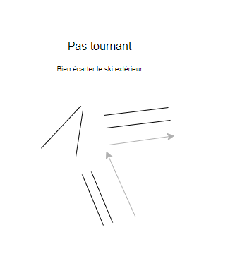
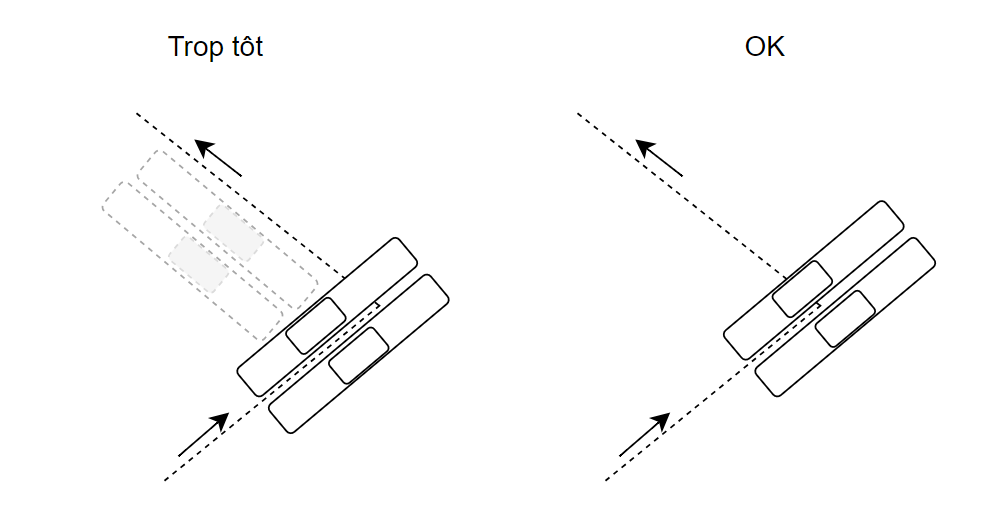

# PREPARATION D'UNE SORTIE SKI

## GENERAL

* Ne jamais sortir seul: seul, sur des itinéraires peu fréquentés, le moindre incident peut se transformer en drame.
* Un par un: chaque fois que la pente dépasse 30°, descendez un par un. Il s'agit de skier léger et de limiter le nombre d'emportés en cas d'avalanche.
* D'abris en abris: ne stationnez jamais en pleine pente, ni même au pied et dans l'axe de la pente skiée.
* Une trace: Limitez au maximum votre action sur l'ensemble du secteur en skiant au plus près de la première trace
* Renoncement: Selon les conditions, sachez renoncer: à une trace directe, à passer au plus raide, aux orientations froides, à dépasser les jalons, etc ...

## Préparer l'itinéraire

* Consulter le BERA pour prendre en compte l'historique nivo-météo
* Consulter les topos. Dans l'ordre décroissant
  * Skitour (mais attention à la date lorsque l'on vérifie les sorties)
  * Camp to Camp
  * Topo Volopress - https://www.volopress.net/
* Repérer les pentes supérieures à 30° grâce aux outils (=> 30° c'est une pente dans laquelle on commence à devoir faire des conversions en ski de randonnée + risque d'avalanche accru)
* Ne pas rester bloquer sur un objectif, même pendant la course (préparer des plans B)
* Distance / Dénivelé / qualité de la neige / météo / moral et forme (voir aussi 3x3)

## BERA - Bulletin d'Estimation du Risque d'Avalanche

* Echelle de 1 à 5: de 1 à 4 (risque humain), 5 est un risque naturel
* Attention, ce n'est pas une échelle linéaire !
* 3 est déjà un risque important

### Que mesure le BERA

* Risque = type de charge, nombre d'avalanches

### Niveaux

* 1 - Très peu de pentes avalancheuses, forte surchage nécessaire pour déclencher (plusieurs personnes au même endroit), favorable à la pratique
* 2 - Attention aux pentes raides, favorable à la pratique
* 3 - On peut déjà avoir du déclenchement à distance, une faible surcharge peut déclencher (une personne)
* 4 - Toutes les pentes sont avalancheuses, attention aux pentes raides et pieds de pente, non favorable à la pratique

### Lecture

1. Quel est le grand problème de la journée ?
   * Se référer au cartouche
   * Déclenchement skieurs => type de plaque, localisation
   * Altitude concernée
2. Quelle sont les pentes problématiques ?
   * Se référer à la rosace
   * Vérifier l'itinéraire et les pentes associées
3.  Quelle est la localisation de ces problèmes ?
    * Lecture dans le détail du bulletin pour la localisation (près des sommets, hors forêt, ...)
4. Quels sont les observables permettant de vérifier sur le terrain que la situation est bien celle décrite ? (ils peuvent se tromper)

### Stratégie de sortie

* Départ tôt: stratégie d'hiver pour bénéficier d'une neige froide
* Départ tardif:
  * stratégie de printemps d'habitude. On attend que ça décroute.
  * en hiver (lors d'une sortie avec grand beau temps et risque faible), le risque reste limité mais augmente avec le réchauffement

## Comment apprécier la qualité de la neige

* Regarder les traces des autres skieurs
* Traces marquées avec virages présentant des cassures/changements brusques sans gerbe => neige croutée/cartonnée potentielle
* Si neige croutée, chercher les zones où les traces sont les moins marquées
* Ski sur neige croutée/cartonnée
  * bien resserrer les skis
  * Se faire léger
  * S'espacer

## Montée

* Compter 250-300m/h pour un groupe moyen / nombreux
* Ne pas se mettre trop sur la pointe des pieds avec le ski: le poids du skieur doit être central afin que le cambre du ski soit réduit pour bénéficier de la surface d'accroche des peaux maximales
* Ne pas utiliser les cales: si trop dur, tracer plus doux (mais faut tout de même que cela monte)=> si utilisation des cales on risque de ne pas avoir le poids réparti de manière optimale (cf point sur le cambre du ski ci-dessus)
* Toujours commencer à faire du ski avec un léger frisson
* Privilégier le pas tournant tant que cela fonctionne
* Pas tournant: écarter le ski externe, puis tourner. bien garder la surface de contact des peaux

* Pour les conversions, ne pas la faire trop tôt: il faut que les milieux des pieds se trouvent au niveau exacte du changement de direction pour faire la conversion

* Position des skis en traversée si pas de trace et neige dure:
  * ski amont qui met le quart dans la pente
  * ski aval sur la surface
  * corps vers la pente
  * inverse pas top car tombe dans la pente

## Descente

* Appui languette
* Serrer les skis (sauf neige béton)
* Skier avec intention
* Regarder au loin et anticiper les virages
* Pas playmobil avec les mains: utiliser les articulations
* Pied bouge dans les chaussures pour corriger